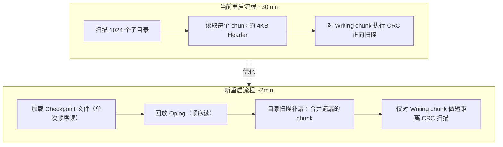
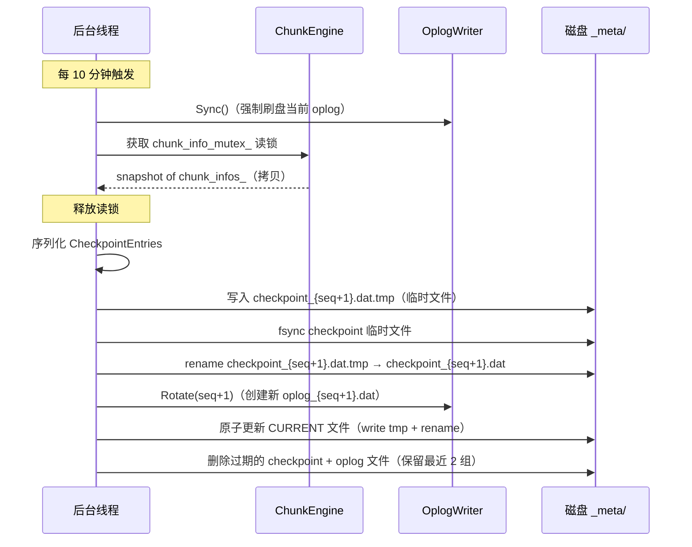
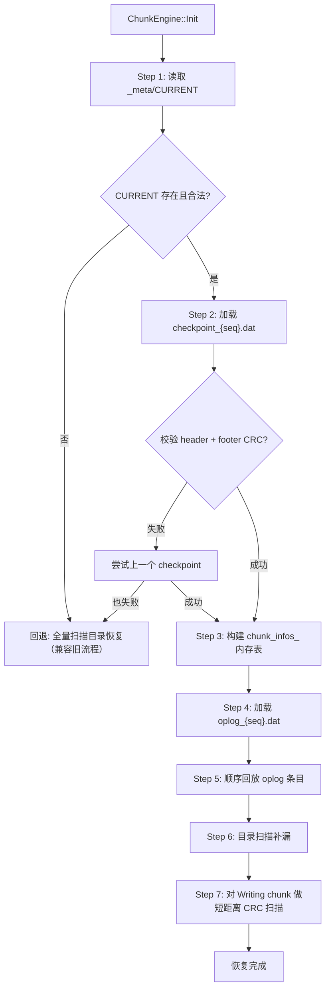

# ChunkStore Checkpoint + Oplog 设计文档

## 1. 背景与问题分析

### 1.1 当前恢复流程

ChunkStore 当前的崩溃恢复流程（参见 [chunkstore_design.md](chunkstore_design.md) 第 10 节）在 `ChunkEngine::Init()` 中执行：

1. 扫描 `num_dirs`（默认 1024）个子目录
2. 对每个 chunk 文件读取 4KB `ChunkHeader`，校验 magic + CRC
3. 根据 `ChunkStatus` 分类处理：
   - `kSealed` / `kCreated`：直接加入 `chunk_infos_`
   - `kWriting`：执行 `recoverChunk()` —— 从 `committed_size` 开始正向 CRC 扫描
   - Header CRC 校验失败：标记为 `kCorrupted`

### 1.2 性能瓶颈

| 瓶颈 | 原因 | 影响 |
|------|------|------|
| 元数据读取慢 | 100 万 chunk 需 100 万次 `open()` + `pread(4KB)` + `close()` 读 header，受限于磁盘 IOPS | 仅元数据加载即需 10–20 分钟 |
| Writing chunk 恢复慢 | 每个未 seal 的 chunk 从 `committed_size` 开始逐 sector CRC 扫描；`header_flush_interval_ms = 5000`（5 秒），高吞吐场景下 5 秒内可能写入数百 MB | 大量 Writing chunk 的扫描累加至数十分钟 |
| **总计** | | **~30 分钟** |

### 1.3 设计目标

1. 将 ChunkServer 重启恢复时间从 ~30 分钟缩减到 **< 2 分钟**
2. 不改变现有 chunk 文件的数据格式（ChunkHeader / SectorFooter 保持不变）
3. Checkpoint + Oplog 仅作为**加速手段**，磁盘上的 chunk 文件始终是 source of truth
4. 完全向后兼容：若 Checkpoint/Oplog 文件缺失或损坏，自动回退到全量目录扫描恢复

---

## 2. 设计概览

引入 **Checkpoint + Oplog** 双层加速机制：

- **Checkpoint**：每 10 分钟生成一次 `chunk_infos_` 的全量序列化快照
- **Oplog**（Operation Log）：记录两次 Checkpoint 之间的元数据增量变更（create / seal / delete / committed_size 推进）
- **目录扫描补漏**：恢复时以文件系统为准，对 Checkpoint + Oplog 中遗漏的 chunk 通过读取 ChunkHeader 补充

**核心原则：文件系统是 Source of Truth。** Checkpoint + Oplog 仅用于加速恢复，不是权威数据源。磁盘目录中存在但 Checkpoint/Oplog 中缺失的 chunk，恢复时通过读取其 ChunkHeader 合并到内存。这保证了即使 Checkpoint/Oplog 部分丢失或落后，也不会遗漏任何 chunk。



---

## 3. 文件存储与命名

所有 Checkpoint 和 Oplog 文件存放在数据目录下的 `_meta/` 子目录：

```
/mnt/disk0/
├── _meta/
│   ├── checkpoint_0000000042.dat    # Checkpoint 文件（序号单调递增）
│   ├── oplog_0000000042.dat         # 对应此 Checkpoint 之后的 Oplog
│   └── CURRENT                      # 文本文件，记录当前有效的 checkpoint 序号
├── 0/
│   └── ...chunk files...
├── 1/
│   └── ...
└── 1023/
    └── ...
```

- `CURRENT` 文件内容示例：`42`，表示当前有效 checkpoint 序号为 42
- Checkpoint 和 Oplog 以相同序号配对：`checkpoint_N.dat` 对应 `oplog_N.dat`
- 保留最近 2 组文件（当前 + 上一组），防止写 Checkpoint 过程中崩溃导致无可用快照

---

## 4. Checkpoint 文件格式

Checkpoint 是 `chunk_infos_` 的全量序列化快照，整体布局为 Header + Entries + Footer。

### 4.1 文件头

```cpp
struct CheckpointFileHeader {
    uint32_t magic;              // 0x434B5054 ("CKPT")
    uint32_t version;            // 格式版本，当前为 1
    uint64_t sequence;           // Checkpoint 序号，单调递增
    uint64_t create_time;        // 生成时间戳 (us)
    uint64_t chunk_count;        // 本文件包含的 chunk 条目数
    uint64_t oplog_tail_seq;     // 截止到哪条 oplog 序号（用于回放起点定位）
    char     reserved[4056];     // 填充至 4096 字节
    uint32_t header_crc32;       // Header 区域的 CRC32，计算范围: [0, 4092)
};
static_assert(sizeof(CheckpointFileHeader) == 4096);
```

### 4.2 条目

```cpp
struct CheckpointEntry {
    uint64_t      chunk_id;
    uint32_t      status;          // ChunkStatus
    uint64_t      chunk_size;      // 已写入的有效数据大小
    uint64_t      committed_size;  // 最后已知的 committed_size
    RedundantType redundant_type;  // 冗余编码参数
    uint64_t      create_time;
    uint64_t      last_modify_time;
    uint64_t      seal_time;
    char          reserved[16];    // 预留扩展
    uint32_t      entry_crc32;     // 本条目的 CRC32
};
// 固定 80 字节，支持顺序批量读写
```

### 4.3 文件尾

```cpp
struct CheckpointFooter {
    uint64_t chunk_count;        // 与 header 中的 chunk_count 交叉校验
    uint32_t file_crc32;         // 整个文件（不含 footer 自身 crc32 字段）的 CRC32
};
```

### 4.4 完整文件布局

```
┌─────────────────────────────────────┐  offset 0
│        CheckpointFileHeader         │  4096 字节
│  (magic, version, seq, count, ...)  │
├─────────────────────────────────────┤  offset 4096
│        CheckpointEntry[0]           │  80 字节
├─────────────────────────────────────┤
│        CheckpointEntry[1]           │  80 字节
├─────────────────────────────────────┤
│              ...                    │
├─────────────────────────────────────┤
│    CheckpointEntry[chunk_count-1]   │  80 字节
├─────────────────────────────────────┤
│        CheckpointFooter             │  12 字节
└─────────────────────────────────────┘

总文件大小 = 4096 + chunk_count * 80 + 12
```

---

## 5. Oplog 文件格式

Oplog 是追加写的操作日志，记录 Checkpoint 之后的增量元数据变更。

### 5.1 操作类型

```cpp
enum class OpType : uint8_t {
    kCreateChunk    = 1,   // 创建 chunk
    kSealChunk      = 2,   // seal chunk
    kDeleteChunk    = 3,   // 删除 chunk
    kUpdateCommit   = 4,   // committed_size 推进
};
```

### 5.2 条目格式

```cpp
struct OplogEntry {
    // 固定头部（40 字节）
    uint32_t magic;         // 0x4F504C47 ("OPLG")，用于在损坏时定位有效条目边界
    uint32_t entry_size;    // 本条目总大小（含固定头部 + 变长 payload + 尾部 crc32）
    uint64_t sequence;      // Oplog 条目序号，全局单调递增
    uint64_t timestamp;     // 操作时间戳 (us)
    OpType   op_type;
    uint8_t  reserved[3];
    uint64_t chunk_id;

    // 变长 payload，紧随固定头部之后：
    //   kCreateChunk:  { RedundantType redundant_type; }  — 8 字节
    //   kSealChunk:    { uint64_t chunk_size; }           — 8 字节
    //   kDeleteChunk:  { }                                — 0 字节
    //   kUpdateCommit: { uint64_t committed_size; }       — 8 字节

    // 尾部 4 字节: crc32，计算范围覆盖 magic 到 payload 末尾
};
```

### 5.3 各操作的 Payload 详情

| OpType | Payload 内容 | Payload 大小 | 条目总大小 |
|--------|-------------|-------------|----------|
| `kCreateChunk` | `RedundantType` | 8 字节 | 52 字节 |
| `kSealChunk` | `uint64_t chunk_size` | 8 字节 | 52 字节 |
| `kDeleteChunk` | 无 | 0 字节 | 44 字节 |
| `kUpdateCommit` | `uint64_t committed_size` | 8 字节 | 52 字节 |

### 5.4 写入与刷盘策略

**写入时机：**

- **create / seal / delete**：操作执行成功后立即追加一条 oplog
- **committed_size 推进**：每当某个 chunk 的 `committed_offset` 累计推进超过 **16MB** 时记录一条 `kUpdateCommit`

**刷盘策略（批量 sync）：**

Oplog 写入使用 `write()` 先写入用户态缓冲区，**累积 10 次写入后执行一次 `fdatasync()`**，以减少刷盘 IOPS。

```
Append #1  → write buffer
Append #2  → write buffer
...
Append #10 → write buffer → flushBuffer() → write() → fdatasync()
                             (重置计数器)
```

- 崩溃时最多丢失最近 10 条未 sync 的 oplog 记录
- 丢失的记录由恢复阶段的目录扫描补漏覆盖（文件系统是 source of truth）
- 当用户态缓冲区积满（64KB）时也触发 flush + sync，避免内存积压
- Checkpoint 生成前、进程 Shutdown 时调用 `Sync()` 强制刷盘

---

## 6. 运行时 Oplog 写入集成

在现有代码路径中嵌入 Oplog 写入调用：

### 6.1 集成点

| 触发位置 | 操作类型 | Payload |
|---------|---------|---------|
| `ChunkEngine::CreateChunk()` 成功后 | `kCreateChunk` | `redundant_type` |
| `ChunkEngine::SealChunk()` 成功后 | `kSealChunk` | `chunk_size` |
| `ChunkEngine::DeleteChunk()` 成功后 | `kDeleteChunk` | 无 |
| `ChunkHandle::onWriteComplete()` 中 `committed_offset` 累计推进 ≥ 16MB | `kUpdateCommit` | `committed_size` |
| `flushCommittedSizes()` 后台任务（每 5 秒）| `kUpdateCommit` | 批量写入所有 dirty chunk 的 `committed_size` |

### 6.2 committed_size 追踪

每个 `ChunkHandle` 新增一个字段 `last_oplog_committed_` 记录上一次写 oplog 时的 `committed_offset` 值：

```cpp
class ChunkHandle {
    // ... 现有字段 ...
    
    // Oplog 追踪：上一次写入 kUpdateCommit oplog 时的 committed_offset
    // 当 (committed_offset_ - last_oplog_committed_) >= oplog_commit_threshold_bytes 时
    // 触发一条 kUpdateCommit oplog
    uint64_t last_oplog_committed_ = 0;
};
```

`onWriteComplete()` 中的检查逻辑：

```
onWriteComplete(req, ec):
    // ... 现有逻辑: committed_offset_ += length ...

    if (committed_offset_ - last_oplog_committed_ >= config.oplog_commit_threshold_bytes):
        oplog_.Append(kUpdateCommit, chunk_id_, committed_offset_)
        last_oplog_committed_ = committed_offset_
```

---

## 7. Checkpoint 生成流程

由后台线程每 `checkpoint_interval_s`（默认 600 秒）触发一次。



**关键设计决策：**

- 快照 `chunk_infos_` 时持有**读锁**（`std::shared_mutex`），不阻塞正常读写
- Checkpoint 写入使用 tmp + rename 两步，保证文件完整性
- fsync 完成后才更新 `CURRENT` 文件，确保崩溃安全
- `CURRENT` 文件本身也使用 write-tmp + rename 原子更新

### 7.1 生成伪代码

```
generateCheckpoint():
    // 1. 强制刷盘当前 oplog
    oplog_.Sync()
    oplog_tail_seq = oplog_.CurrentSequence()

    // 2. 快照 chunk_infos_（持有读锁）
    chunk_info_mutex_.lock_shared()
    snapshot = copy(chunk_infos_)
    chunk_info_mutex_.unlock_shared()

    new_seq = current_checkpoint_seq_ + 1

    // 3. 序列化到临时文件
    tmp_path = meta_dir / "checkpoint_{new_seq}.dat.tmp"
    fd = open(tmp_path, O_WRONLY | O_CREAT | O_TRUNC)

    写入 CheckpointFileHeader {
        magic = 0x434B5054,
        version = 1,
        sequence = new_seq,
        chunk_count = snapshot.size(),
        oplog_tail_seq = oplog_tail_seq,
        header_crc32 = crc32(header[0..4092))
    }

    for (chunk_id, info) in snapshot:
        写入 CheckpointEntry {
            chunk_id, status, chunk_size, committed_size,
            redundant_type, create_time, last_modify_time, seal_time,
            entry_crc32 = crc32(entry 前 76 字节)
        }

    写入 CheckpointFooter {
        chunk_count = snapshot.size(),
        file_crc32 = crc32(整个文件内容)
    }

    fdatasync(fd)
    close(fd)

    // 4. 原子替换
    rename(tmp_path, meta_dir / "checkpoint_{new_seq}.dat")

    // 5. 切换 oplog
    oplog_.Rotate(new_seq)

    // 6. 原子更新 CURRENT
    write(meta_dir / "CURRENT.tmp", "{new_seq}")
    fdatasync(meta_dir / "CURRENT.tmp")
    rename(meta_dir / "CURRENT.tmp", meta_dir / "CURRENT")

    // 7. 清理旧文件（保留最近 max_checkpoint_keep 组）
    删除 seq < new_seq - max_checkpoint_keep + 1 的 checkpoint + oplog 文件

    current_checkpoint_seq_ = new_seq
```

---

## 8. 重启恢复流程

### 8.1 整体流程



### 8.2 各步骤详解

**Step 1：读取 CURRENT**

```
读取 meta_dir / "CURRENT" 文件内容
解析 checkpoint 序号 → current_seq
若文件不存在或解析失败 → 回退全量扫描
```

**Step 2：加载 Checkpoint**

```
读取 checkpoint_{current_seq}.dat
校验 CheckpointFileHeader: magic == 0x434B5054, header_crc32 通过
校验 CheckpointFooter: chunk_count 一致, file_crc32 通过
若校验失败 → 尝试 checkpoint_{current_seq - 1}.dat
若仍失败 → 回退全量扫描
```

**Step 3：构建 chunk_infos_**

```
for each CheckpointEntry:
    校验 entry_crc32
    若通过 → 插入 chunk_infos_[chunk_id] = ChunkInfo{...}
    若失败 → 跳过此条目（后续目录扫描会补漏）
```

**Step 4–5：回放 Oplog**

```
打开 oplog_{current_seq}.dat
从头开始逐条读取 OplogEntry:
    校验 magic == 0x4F504C47 且 entry_size 合理
    校验 crc32
    若校验失败 → 停止回放（后续条目不可信，由目录扫描兜底）

    根据 op_type 更新 chunk_infos_:
        kCreateChunk:
            chunk_infos_[chunk_id] = ChunkInfo{status=kCreated, ...}
        kSealChunk:
            chunk_infos_[chunk_id].status = kSealed
            chunk_infos_[chunk_id].chunk_size = payload.chunk_size
        kDeleteChunk:
            chunk_infos_.erase(chunk_id)
        kUpdateCommit:
            chunk_infos_[chunk_id].committed_size =
                max(current_committed_size, payload.committed_size)
```

**Step 6：目录扫描补漏（Reconciliation）**

这是保证 source-of-truth 语义的关键步骤：

```
reconcileWithFilesystem():
    // 正向：磁盘上存在但 chunk_infos_ 中缺失的 chunk
    disk_chunk_ids = {}
    for dir_idx in 0..num_dirs-1:
        for filename in readdir(mount_path / dir_idx):
            chunk_id = parseHexFilename(filename)
            disk_chunk_ids.insert(chunk_id)

            if chunk_id not in chunk_infos_:
                // Checkpoint/Oplog 中遗漏，读取 header 补充
                header = readChunkHeader(chunk_id)
                if header.crc32 校验通过:
                    chunk_infos_[chunk_id] = ChunkInfo{
                        从 header 中提取各字段
                    }
                else:
                    chunk_infos_[chunk_id] = ChunkInfo{status=kCorrupted}

    // 反向：chunk_infos_ 中存在但磁盘上已删除的 chunk
    for chunk_id in chunk_infos_:
        if chunk_id not in disk_chunk_ids:
            chunk_infos_.erase(chunk_id)
```

**目录扫描开销分析：**

- `readdir()` 是纯目录元数据操作，1024 个目录的文件名列表读取通常在秒级完成
- 正常情况下 Checkpoint + Oplog 覆盖了绝大多数 chunk，遗漏的 chunk 数量极少（仅 oplog 最近未 sync 的几条），需要读取 header 的 chunk 可能只有个位数
- 最坏情况（Oplog 全部丢失）：需读取 10 分钟内新增的 chunk header，通常几百到几千个，远小于百万级全量扫描

**Step 7：短距离 CRC 扫描**

对所有 `status == kWriting` 的 chunk 执行现有的 `recoverChunk()` 流程，但由于 `committed_size` 已通过 Oplog 中的 `kUpdateCommit` 记录推进到较新的位置，扫描距离从"5 秒写入量"缩减为**最多 16MB**（`oplog_commit_threshold_bytes`）。

对于通过目录补漏发现的 Writing chunk，其 header 中的 `committed_size` 由原有 5 秒 flush 机制保证，扫描距离同样有限。

### 8.3 恢复时间估算

| 步骤 | 数据量 | 预估耗时 |
|------|--------|---------|
| 加载 Checkpoint | 100 万 chunk × 80 字节 ≈ 80 MB | < 1 秒 |
| 回放 Oplog | 10 分钟内的操作，通常几千到几万条 | < 1 秒 |
| 目录扫描补漏 | readdir 1024 个目录 + 少量 header 读取 | < 5 秒 |
| Writing chunk CRC 扫描 | 每个最多 16 MB，假设 100 个 Writing chunk → ~1.6 GB | < 30 秒 |
| **总计** | | **< 2 分钟** |

---

## 9. 崩溃安全性分析

| 崩溃时刻 | 恢复策略 |
|---------|---------|
| 写 Checkpoint 过程中崩溃 | `CURRENT` 未更新，使用上一个有效 Checkpoint + 其 Oplog |
| 写 Oplog 过程中崩溃 | Oplog 末尾条目可能不完整，通过 magic + CRC 检测截断，丢弃不完整条目；丢失的 oplog 由目录扫描补漏恢复 |
| Oplog 最近未 sync 的条目丢失 | 最多丢失 10 条 oplog 记录（`oplog_sync_interval = 10`）；目录扫描补漏阶段发现遗漏的 chunk 并读取其 header 合并 |
| 更新 `CURRENT` 过程中崩溃 | 使用 write-tmp + rename 原子操作，要么成功要么不变 |
| 正常运行中崩溃 | 加载 Checkpoint + 回放 Oplog + 目录扫描补漏 + 短距离 CRC 扫描 |
| Checkpoint 和 Oplog 全部损坏 | 回退到全量目录扫描（兼容旧恢复流程） |

**Oplog 批量 sync 的安全性保证：**

```
                         Checkpoint N               Checkpoint N+1
                              │                          │
Timeline: ───────────────────┼──── oplog writes ────────┼──────
                              │      ▲     ▲     ▲       │
                              │   sync  sync  crash!     │
                              │                ~~~       │
                              │           丢失 ≤ 10 条     │
                              │                          │
Recovery: Load Ckpt N → Replay oplog (到最后一条完整的) → 目录扫描补漏 → CRC 扫描
```

由于文件系统是 source of truth，oplog 丢失只意味着恢复时需要多读几个 chunk header（从目录扫描中发现），不会导致数据丢失或不一致。

---

## 10. 新增配置参数

在 `ChunkStoreConfig` 中新增：

```cpp
struct ChunkStoreConfig {
    // ... 现有配置字段 ...

    // ======== Checkpoint + Oplog ========

    // Checkpoint 生成间隔（默认 600 秒 = 10 分钟）
    uint32_t checkpoint_interval_s = 600;

    // committed_size 累计推进超过此阈值时写 kUpdateCommit oplog
    // 此值决定了 Writing chunk 恢复时的最大 CRC 扫描距离
    // （默认 16MB = 16 * 1024 * 1024）
    uint32_t oplog_commit_threshold_bytes = 16 << 20;

    // 每 N 次 oplog 写入执行一次 fdatasync，减少刷盘 IOPS
    // 崩溃时最多丢失 N 条 oplog，由目录扫描补漏兜底
    // （默认 10）
    uint32_t oplog_sync_interval = 10;

    // 保留的 checkpoint + oplog 文件组数
    // 至少为 2，防止写新 checkpoint 过程中崩溃导致无可用快照
    // （默认 2）
    uint32_t max_checkpoint_keep = 2;
};
```

---

## 11. 核心接口设计

### 11.1 OplogWriter

```cpp
class OplogWriter {
public:
    explicit OplogWriter(const std::string& meta_dir,
                         uint32_t sync_interval = 10);

    // 初始化：打开或创建对应 checkpoint 序号的 oplog 文件
    ErrorCode Init(uint64_t checkpoint_seq);

    // 追加一条操作日志
    // 内部累计 sync_interval 次写入后自动触发一次 fdatasync
    ErrorCode Append(OpType type, uint64_t chunk_id,
                     const void* payload, uint32_t payload_size);

    // 强制刷盘（Checkpoint 生成前、Shutdown 时调用）
    ErrorCode Sync();

    // 切换到新的 oplog 文件（Checkpoint 完成后调用）
    ErrorCode Rotate(uint64_t new_checkpoint_seq);

    // 获取当前 oplog 最新序号
    uint64_t CurrentSequence() const;

private:
    std::mutex mutex_;
    int fd_ = -1;
    uint64_t next_seq_ = 0;
    std::string meta_dir_;

    // 批量 sync 控制
    uint32_t sync_interval_;          // 每 N 次 Append 执行一次 fdatasync
    uint32_t writes_since_sync_ = 0;  // 自上次 sync 以来的 Append 次数

    // 用户态写缓冲区，减少 write() 系统调用次数
    // 缓冲区满时也触发 flush + sync
    char write_buf_[64 * 1024];
    size_t buf_offset_ = 0;

    ErrorCode flushBuffer();        // write() 将缓冲区内容写入内核
    ErrorCode maybeSyncIfNeeded();  // 检查是否达到 sync 阈值，是则 fdatasync
};
```

**Append 流程：**

```
Append(type, chunk_id, payload, payload_size):
    mutex_.lock()

    // 1. 构造 OplogEntry 到临时 buffer
    构造 entry: magic, entry_size, sequence=next_seq_++, timestamp, op_type, chunk_id
    拷贝 payload
    计算 crc32 并追加

    // 2. 写入用户态缓冲区
    if buf_offset_ + entry_size > sizeof(write_buf_):
        flushBuffer()       // 缓冲区满，先 flush
        maybeSyncIfNeeded() // 顺便检查是否需要 sync
    memcpy(write_buf_ + buf_offset_, entry_buf, entry_size)
    buf_offset_ += entry_size

    // 3. 累计写入计数
    writes_since_sync_++
    if writes_since_sync_ >= sync_interval_:
        flushBuffer()
        fdatasync(fd_)
        writes_since_sync_ = 0

    mutex_.unlock()
```

### 11.2 CheckpointManager

```cpp
class CheckpointManager {
public:
    explicit CheckpointManager(const std::string& meta_dir,
                               const ChunkStoreConfig& config);

    // 加载最新 checkpoint + 回放 oplog，构建 chunk_infos
    // 不包含目录扫描补漏（由调用方执行）
    ErrorCode Load(std::unordered_map<uint64_t, ChunkInfo>* chunk_infos);

    // 生成新 checkpoint（由后台线程定期调用）
    ErrorCode Save(const std::unordered_map<uint64_t, ChunkInfo>& chunk_infos,
                   uint64_t oplog_tail_seq);

    // 清理过期的 checkpoint + oplog 文件
    void GarbageCollect();

    // 获取当前有效的 checkpoint 序号
    uint64_t CurrentCheckpointSeq() const;

private:
    // 加载指定序号的 checkpoint 文件
    ErrorCode loadCheckpoint(uint64_t seq,
                             std::unordered_map<uint64_t, ChunkInfo>* infos);

    // 回放指定序号的 oplog 文件
    ErrorCode replayOplog(uint64_t seq,
                          std::unordered_map<uint64_t, ChunkInfo>* infos);

    // 原子更新 CURRENT 文件
    ErrorCode atomicUpdateCurrent(uint64_t seq);

    std::string meta_dir_;
    ChunkStoreConfig config_;
    uint64_t current_seq_ = 0;
};
```

---

## 12. 与现有模块的集成

### 12.1 ChunkStore 结构变更

```cpp
class ChunkStore {
    // ... 现有字段 ...

    // 新增
    std::unique_ptr<CheckpointManager> checkpoint_mgr_;
    std::unique_ptr<OplogWriter> oplog_;
};
```

### 12.2 Init() 流程变更

```
ChunkStore::Init():
    // 1. 创建 _meta/ 目录（若不存在）
    mkdir_if_needed(config_.mount_path + "/_meta")

    // 2. 尝试通过 Checkpoint + Oplog 快速恢复
    checkpoint_mgr_ = make_unique<CheckpointManager>(meta_dir, config_)
    ec = checkpoint_mgr_->Load(&chunk_infos_)

    if ec == kOk:
        // 3. 目录扫描补漏
        reconcileWithFilesystem(chunk_infos_)

        // 4. 对 Writing chunk 执行短距离 CRC 扫描
        for (chunk_id, info) in chunk_infos_:
            if info.status == kWriting:
                recoverChunk(chunk_id, ...)  // 从 committed_size 开始，最多扫描 16MB
    else:
        // 回退到旧流程：全量扫描
        fullDirectoryScan(chunk_infos_)

    // 5. 初始化 OplogWriter
    oplog_ = make_unique<OplogWriter>(meta_dir, config_.oplog_sync_interval)
    oplog_->Init(checkpoint_mgr_->CurrentCheckpointSeq())
```

### 12.3 后台任务集成

当前 `backgroundLoop()` 已有的任务：

- `flushCommittedSizes()`：每 5 秒 flush header 中的 `committed_size`
- `runIntegrityScan()`：每 1 小时扫描 Sealed chunk CRC

新增任务：

- `generateCheckpoint()`：每 `checkpoint_interval_s` 生成 Checkpoint + 切换 Oplog

```
backgroundLoop():
    while running_:
        // 现有任务
        if 到达 flushCommittedSizes 时间:
            flushCommittedSizes()       // 仍保留 header 写入
            flushCommittedSizeOplogs()  // 同时批量写 kUpdateCommit oplog

        if 到达 integrity_scan 时间:
            runIntegrityScan()

        // 新增任务
        if 到达 checkpoint 时间:
            generateCheckpoint()

        sleep(100ms)
```

**`flushCommittedSizes()` 对 header 的写入仍然保留**，作为 defense-in-depth 机制。即使 Checkpoint + Oplog 全部损坏，依然可以通过 header 中的 `committed_size` 做 CRC 扫描恢复，回退到与现有流程完全一致的行为。

### 12.4 Shutdown 流程

```
ChunkStore::Shutdown():
    running_ = false
    background_thread_.join()

    // 确保 oplog 数据落盘
    oplog_->Sync()

    // 可选：shutdown 时生成一次 checkpoint，加速下次启动
    generateCheckpoint()
```

---

## 13. 监控指标扩展

在 `ChunkStoreMetrics` 中新增 Checkpoint + Oplog 相关指标：

```cpp
struct ChunkStoreMetrics {
    // ... 现有指标 ...

    // Checkpoint 指标
    std::atomic<uint64_t> checkpoint_count{0};            // 已生成的 checkpoint 次数
    std::atomic<uint64_t> checkpoint_duration_us{0};      // 最近一次 checkpoint 耗时 (us)
    std::atomic<uint64_t> checkpoint_size_bytes{0};       // 最近一次 checkpoint 文件大小

    // Oplog 指标
    std::atomic<uint64_t> oplog_append_count{0};          // oplog 追加总次数
    std::atomic<uint64_t> oplog_sync_count{0};            // oplog fdatasync 总次数
    std::atomic<uint64_t> oplog_bytes_written{0};         // oplog 累计写入字节数

    // 恢复指标
    std::atomic<uint64_t> recovery_checkpoint_load_us{0}; // checkpoint 加载耗时
    std::atomic<uint64_t> recovery_oplog_replay_us{0};    // oplog 回放耗时
    std::atomic<uint64_t> recovery_dir_scan_us{0};        // 目录扫描补漏耗时
    std::atomic<uint64_t> recovery_reconcile_count{0};    // 目录扫描补漏命中的 chunk 数
    std::atomic<uint64_t> recovery_crc_scan_us{0};        // CRC 扫描耗时
    std::atomic<uint64_t> recovery_total_us{0};           // 总恢复耗时
};
```

---

## 14. 完整恢复示例

假设场景：磁盘上有 100 万个 chunk，其中 50 个处于 Writing 状态。10 分钟前生成了 Checkpoint #42，此后发生了以下操作：

- 创建了 200 个新 chunk
- Seal 了 100 个 chunk
- 删除了 30 个 chunk
- 各 Writing chunk 持续写入

崩溃前最后 5 条 oplog 未 sync（`oplog_sync_interval = 10`），对应 3 个新创建的 chunk 和 2 条 committed_size 更新。

**恢复过程：**

```
1. 读取 CURRENT → seq = 42                                           < 1ms

2. 加载 checkpoint_0000000042.dat
   - 100 万条 × 80 字节 = 80 MB 顺序读                                 ~500ms
   - 构建 chunk_infos_ (1,000,000 条)

3. 回放 oplog_0000000042.dat
   - 10 分钟内约 5000 条 oplog（200 create + 100 seal + 30 delete
     + ~4670 committed_size updates）
   - 最后 5 条因未 sync 而丢失
   - chunk_infos_ 更新为: 1,000,170 条
     (1,000,000 + 200 - 30 = 1,000,170，但少了 3 个 create)            ~100ms

4. 目录扫描补漏
   - readdir 1024 个目录，收集文件名列表                                  ~3s
   - 发现 3 个磁盘上存在但 chunk_infos_ 中缺失的 chunk
   - 读取这 3 个 chunk 的 4KB header，合并到 chunk_infos_                ~5ms
   - 反向检查：无需移除（无未记录的 delete）
   - chunk_infos_ 最终: 1,000,173 条

5. 对 ~53 个 Writing chunk 执行 CRC 扫描
   - 50 个原有 Writing chunk + 3 个补漏发现的新 chunk
   - 每个最多扫描 16 MB
   - 53 × 16 MB = ~848 MB 顺序读                                      ~20s

总计: ~24 秒
```

---

## 附录 A. 配置参数速查

| 参数 | 默认值 | 说明 |
|------|--------|------|
| `checkpoint_interval_s` | 600 | Checkpoint 生成间隔（秒） |
| `oplog_commit_threshold_bytes` | 16 MB | committed_size 推进触发 oplog 的阈值 |
| `oplog_sync_interval` | 10 | 每 N 次 oplog 写入执行一次 fdatasync |
| `max_checkpoint_keep` | 2 | 保留的 checkpoint + oplog 文件组数 |

**参数调优指南：**

- **`checkpoint_interval_s`**：值越小，Oplog 越短，恢复越快，但 Checkpoint 生成有 I/O 开销。100 万 chunk 的 Checkpoint 约 80 MB，10 分钟生成一次对 SSD 影响可忽略
- **`oplog_commit_threshold_bytes`**：值越小，Writing chunk 的 CRC 扫描距离越短（恢复更快），但 oplog 写入频率越高。16 MB 在大多数场景下是较好的平衡点
- **`oplog_sync_interval`**：值越大，刷盘 IOPS 越少，但崩溃时丢失的 oplog 越多（目录扫描补漏的 header 读取量增加）。10 次是一个合理的平衡
- **`max_checkpoint_keep`**：至少为 2，保证写新 Checkpoint 崩溃时有旧的可用
