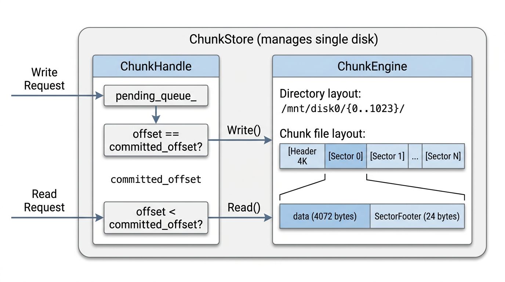
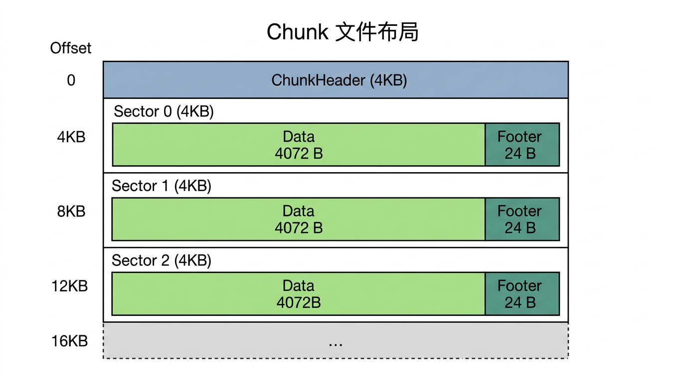

# ChunkStore 设计文档

## 1. 背景与设计目标

基于 GFS (SOSP 2003) 和 Pangu (FAST 2023) 论文的设计思想，设计一个分布式追加写存储系统的 ChunkStore 模块。

- **GFS** 提供了 chunk-based append-only 写入模型、per-block checksum 数据校验、串行化 mutation order 的基础框架。
- **Pangu** 提供了现代存储引擎的优化思路：统一的 append-only 持久化层 (FlatLogFile)、自包含 chunk 布局 (self-contained chunk layout) 将数据与元数据写入同一操作以降低延迟、sealed chunk 生命周期管理、用户态存储文件系统 (USSFS)、chasing等高可用机制。

ChunkStore 是单机存储节点的核心模块，管理**一块磁盘**上所有 Chunk 副本的存储与读写。

### 设计目标

1. **追加写语义**：只支持顺序追加写入，不支持随机覆盖写，对 SSD 友好
2. **字节级一致性**：同一 Chunk 的所有副本在相同 offset 处数据完全一致
3. **数据完整性**：每 4KB sector 内嵌 CRC32 校验，防止静默数据损坏
4. **崩溃安全**：通过 SectorFooter 中的 prev_size/curr_size 边界标记实现 partial write 检测与恢复
5. **高性能**：fd 缓存避免频繁 open/close、目录散列避免单目录 inode 瓶颈
6. **可观测性**：内置性能计数器，支持延迟、吞吐、错误率等核心指标的采集

---

## 2. 整体架构



**模块职责：**


| 模块              | 粒度             | 职责                                               |
| --------------- | -------------- | ------------------------------------------------ |
| **ChunkStore**  | 单块磁盘 1 个       | 顶层入口，管理所有 ChunkHandle、持有 ChunkEngine、后台任务调度、指标采集 |
| **ChunkHandle** | 每个活跃 Chunk 1 个 | 接收写入请求、按 offset 排序、串行下发写 I/O、维护可读边界（committed_offset）|
| **ChunkEngine** | 单块磁盘 1 个       | 管理磁盘目录布局、文件创建/读写/删除、物理 I/O、CRC 校验、fd 缓存、空间管理     |


---

## 3. 配置参数

```cpp
struct ChunkStoreConfig {
    std::string mount_path;                     // 磁盘挂载路径，如 "/mnt/disk0"

    // 目录布局
    uint32_t num_dirs = 1024;                   // 子目录数量，chunk_id % num_dirs 选择目录

    // fd 缓存
    uint32_t max_fd_cache_size = 4096;          // fd 缓存最大条目数（LRU 淘汰）

    // 崩溃恢复
    uint32_t header_flush_interval_ms = 5000;   // ChunkHeader 中 committed_size 刷盘间隔 (ms)

    // 后台任务
    uint32_t integrity_scan_interval_s = 3600;  // Sealed chunk 完整性扫描周期 (s)
    uint32_t integrity_scan_rate_mb_s = 50;     // 扫描限速 (MB/s)，避免影响前台 I/O

    // 磁盘健康
    uint32_t slow_io_threshold_ms = 500;        // 单次 I/O 超过此阈值视为慢 I/O
    uint32_t slow_io_report_count = 10;         // 累计慢 I/O 次数超过阈值后上报

    // 空间管理
    uint64_t reserved_space_bytes = 1ULL << 30; // 磁盘保留空间 (1GB)，低于此阈值拒绝创建新 Chunk
};
```

---

## 4. 核心数据结构

### 4.1 Chunk 元数据（文件头 4KB）



```cpp
// Chunk 冗余编码类型
enum class EncodeType : uint8_t {
    kReplica = 0,    // 副本模式
    kEC      = 1,    // Erasure Code 模式
    kLRC     = 2,    // Local Reconstruction Code 模式
};

// 冗余编码参数
struct RedundantType {
    EncodeType  encode_type;        // 冗余类型: Replica / EC / LRC
    uint8_t     replica_shards;     // 副本数（Replica 模式下有效，如 3 副本）
    uint8_t     data_shards;        // 数据分片数（EC/LRC 模式下有效）
    uint8_t     code_shards;        // 校验分片数（EC/LRC 模式下有效）
    uint8_t     local_shards;       // 本地校验分片数（LRC 模式下有效）
    uint8_t     padding[3];         // 对齐填充
};

// Chunk 状态
enum class ChunkStatus : uint32_t {
    kCreated   = 0,  // 刚创建，尚未写入数据
    kWriting   = 1,  // 正在接受追加写入
    kSealed    = 2,  // 已 seal，只读
    kCorrupted = 3,  // 数据校验失败，需上报 Master 修复
    kDeleting  = 4,  // 正在删除（异步清理中）
};

// 存储在每个 Chunk 文件头部的 4KB 元数据区
// crc32 放在结构体末尾，计算范围: [0, kChunkHeaderSize - sizeof(crc32))
struct ChunkHeader {
    uint32_t    magic;              // 魔数，固定为 0x43484E4B ("CHNK")
    uint32_t    version;            // 文件格式版本号，当前为 2
    uint64_t    chunk_id;           // Chunk 全局唯一 ID
    uint64_t    chunk_size;         // 已写入的有效数据大小（逻辑字节数，不含 header/footer）
                                    // 追加写系统中 chunk_size 单调递增，天然作为副本版本标识
                                    // 副本的 chunk_size 落后即为 stale，无需单独的 version 字段
    ChunkStatus chunk_status;       // Chunk 状态

    // 崩溃恢复关键字段
    // 定期（每 header_flush_interval_ms）将内存中的 committed_offset 持久化到此字段
    // 崩溃恢复时从此位置开始正向扫描，而非从 0 开始，加速恢复
    uint64_t    committed_size;     // 最后一次持久化时已确认的写入大小

    // 冗余编码信息
    RedundantType redundant_type;

    uint64_t    create_time;        // 创建时间戳 (us)
    uint64_t    last_modify_time;   // 最后修改时间戳 (us)
    uint64_t    seal_time;          // seal 时间戳，0 表示未 seal

    char        reserved[4004];     // 预留至 4096 字节对齐（末尾 4 字节留给 crc32）
    uint32_t    crc32;              // Header 的 CRC32 校验

    static constexpr uint32_t kMagic = 0x43484E4B;
    static constexpr uint32_t kCurrentVersion = 2;
    static constexpr size_t   kChunkHeaderSize = 4096;

    ChunkHeader() { memset(this, 0, sizeof(*this)); }
};
static_assert(sizeof(ChunkHeader) == ChunkHeader::kChunkHeaderSize);
```

### 4.2 Sector Footer（每 4KB 数据块尾部校验）

```cpp
// 每个 4KB Sector 末尾的校验信息
// 用户可写数据 = 4096 - sizeof(SectorFooter) = 4072 字节/sector
//
// CRC32 计算范围: sector 开头 4072 字节用户数据 + footer 中 crc32 之前的字段
// 即: [sector_start, sector_start + kSectorSize - sizeof(uint32_t))
struct SectorFooter {
    uint64_t chunk_id;     // 所属 Chunk ID（防止 misdirected write）
    uint32_t index;        // 本 sector 在 Chunk 中的序号（从 0 开始）
    int16_t  prev_size;    // 上一笔写入完成后，本 sector 的已用数据字节数
    int16_t  curr_size;    // 当前写入完成后，本 sector 的已用数据字节数
                           //   >= 0: 本笔写入在此 sector 结束，值为写入后的数据字节数
                           //   -1:   本笔写入跨过此 sector（未在此 sector 结束）
    uint32_t crc32;        // 本 sector 的 CRC32 校验

    static constexpr size_t kSectorFooterSize = 24;
    static constexpr size_t kSectorSize = 4096;
    static constexpr size_t kDataCapacity = kSectorSize - kSectorFooterSize;  // 4072

    // 默认全零初始化
    // 未写入的 sector 全零，chunk_id == 0 且 crc32 == 0 可作为"从未写入"的判定依据
    SectorFooter() { memset(this, 0, sizeof(*this)); }
};
static_assert(sizeof(SectorFooter) == SectorFooter::kSectorFooterSize);
```

**Partial Write 检测原理（prev_size / curr_size）：**

每笔写入可能跨越多个 sector。SectorFooter 中的 prev_size 和 curr_size 精确标记写入边界：

```
示例：一笔写入 10000 字节，起始逻辑 offset = 0

Sector 0: 数据填满 4072 字节
  footer: { index=0, prev_size=0, curr_size=-1 }     // 写入跨过此 sector
Sector 1: 数据填满 4072 字节
  footer: { index=1, prev_size=0, curr_size=-1 }     // 写入跨过此 sector
Sector 2: 数据写入 1856 字节 (10000 - 4072*2)
  footer: { index=2, prev_size=0, curr_size=1856 }   // 写入在此 sector 结束

下一笔写入 5000 字节，起始逻辑 offset = 10000:
Sector 2: 继续追加，填满剩余 4072-1856=2216 字节
  footer: { index=2, prev_size=1856, curr_size=-1 }  // prev=上次末尾，当前写入跨过
Sector 3: 数据写入 2784 字节 (5000 - 2216)
  footer: { index=3, prev_size=0, curr_size=2784 }   // 新 sector，写入在此结束
```

### 4.3 错误码

```cpp
enum class ErrorCode : int32_t {
    kOk                = 0,
    kInvalidArgument   = -1,
    kChunkNotFound     = -2,
    kChunkAlreadyExists = -3,
    kChunkSealed       = -4,
    kOffsetMismatch    = -5,
    kChecksumMismatch  = -6,
    kIOError           = -7,
    kCorrupted         = -8,
    kPartialWrite      = -9,
    kDiskFull          = -11,
    kReadBeyondCommit  = -12,  // 读取超出 committed_offset 的范围
};
```

### 4.4 写入请求与读取请求

```cpp
// Client 侧已分配好 offset 的写入请求
// 内嵌链表节点 (prev/next)，用于在 ChunkHandle 的 pending_queue_ 中按 offset 有序排列
struct WriteRequest {
    uint64_t chunk_id;
    uint64_t offset;           // 逻辑写入偏移（Client 侧分配）
    uint32_t length;           // 写入数据长度
    const char* data;          // 写入数据指针
    std::function<void(ErrorCode ec)> callback;

    // 嵌入式双向链表节点，链表按 offset 升序排列
    WriteRequest* prev = nullptr;
    WriteRequest* next = nullptr;
};

// 读取请求
struct ReadRequest {
    uint64_t chunk_id;
    uint64_t offset;           // 逻辑读取偏移
    uint32_t length;           // 期望读取长度
    char*    buf;              // 输出缓冲区
    uint32_t* read_bytes;      // 实际读取字节数
    std::function<void(ErrorCode ec)> callback;
};
```

### 4.5 Chunk 运行时信息

```cpp
// ChunkEngine 内部维护的每个 Chunk 的运行时信息（内存态）
// 在 Init() 时通过扫描 chunk 文件 header 构建
struct ChunkInfo {
    uint64_t       chunk_id;
    ChunkStatus    status;
    uint64_t       chunk_size;        // 当前有效数据大小（逻辑字节数）
    RedundantType  redundant_type;    // 冗余编码参数
    // fd 由 ChunkEngine 的 fd_cache_ 统一管理，无需在此存储
    // 文件路径通过 chunk_id 按固定格式生成: mount_path/{chunk_id % num_dirs}/{chunk_id_hex}

    uint64_t       create_time;
    uint64_t       last_modify_time;
};
```

---

## 5. ChunkHandle

每个活跃 Chunk 副本对应一个 ChunkHandle 实例。ChunkHandle 不直接执行 I/O，而是将排序好的请求委托给 ChunkEngine。

```cpp
class ChunkHandle {
public:
    ChunkHandle(const ChunkInfo& info, ChunkEngine* engine,
                uint64_t initial_committed_offset);
    ~ChunkHandle();

    // 提交写入请求（可能乱序到达）
    // 立即返回，请求进入等待队列，按 offset 排序后串行执行
    ErrorCode SubmitWrite(WriteRequest* req);

    // 读取数据（可与写入并发执行）
    // 只允许读取 [0, committed_offset) 范围内的数据
    ErrorCode Read(uint64_t offset, char* buf, uint32_t length, uint32_t* read_bytes);

    // Seal 当前 Chunk，不再接受写入
    ErrorCode Seal();

    // 获取当前已确认的写入末尾 offset（原子读取，无锁）
    uint64_t CommittedOffset() const;

    uint64_t chunk_id() const { return info_.chunk_id; }
    const ChunkInfo& chunk_info() const { return info_; }
    ChunkStatus status() const;

private:
    void tryDispatchNext();
    void onWriteComplete(WriteRequest* req, ErrorCode ec);

    ChunkInfo info_;
    ChunkEngine* engine_;

    mutable std::mutex mutex_;
    std::atomic<uint64_t> committed_offset_;
    bool writing_in_progress_ = false;

    // 按 offset 升序排列的嵌入式双向链表
    // 插入: 从 tail_ 向前查找插入位置（请求大多近似有序到达，尾部插入为常见路径）
    // 调度: 检查 head_->offset == committed_offset_，匹配则下发写入
    // 删除: 写入完成后（onWriteComplete）才从链表头摘除节点
    WriteRequest* head_ = nullptr;  // 链表头（offset 最小）
    WriteRequest* tail_ = nullptr;  // 链表尾（offset 最大）

    std::atomic<ChunkStatus> status_;
};
```

### 5.1 写入流程

```
SubmitWrite(req)
  │
  ▼
  mutex_.lock()
  ├── 状态检查: status_ != kWriting → 拒绝
  ├── req 按 offset 插入 pending_queue_ 链表（从 tail_ 向前查找插入位置）
  └── tryDispatchNext()
        │
        ▼
        head_ != nullptr
        && head_->offset == committed_offset_
        && !writing_in_progress_?
        ├── 否 → 等待（缺失的请求到来时再次触发）
        └── 是 → writing_in_progress_ = true
                  req = head_  // 记录当前要执行的请求（head_ 仍留在链表中）
                  mutex_.unlock()
                  engine_->Write(chunk_id_, req->offset, req->data, req->length)
                      │
                      ▼
                  onWriteComplete(req, ec)
                      │
                      ▼
                      mutex_.lock()
                      ├── ec == kOk → 从链表头摘除 req（更新 head_）
                      │               committed_offset_ += req->length
                      │               writing_in_progress_ = false
                      │               req->callback(kOk)
                      │               tryDispatchNext()  // 继续调度下一笔
                      └── ec != kOk → status_ = kCorrupted
                                      req->callback(ec)
                                      // 后续请求全部失败返回
```

**关键语义：写入完成后才从链表删除**

- `tryDispatchNext()` 检查 `head_->offset == committed_offset_`，保证写入的连续性——只有当链表首个请求的 offset 恰好接续已写入数据的末尾时，才能下发写入
- 下发写入时 head_ **仍留在链表中**，仅设置 `writing_in_progress_ = true` 防止重复调度
- 写入成功后 `onWriteComplete()` 才将 head_ 从链表摘除，推进 `committed_offset`_
- 若写入失败，请求仍在链表头部，chunk 被标记为 Corrupted，不再调度后续写入

### 5.2 读写并发控制

- **写入是串行的**：同一 ChunkHandle 内同一时刻最多一笔写入在执行
- **读取可与写入并发**：读取通过 `committed_offset`*（`std::atomic`）判断可读范围，无需获取 `mutex`*
- 读取只能读取 `[0, committed_offset_)` 范围内的数据。超出范围返回 `kReadBeyondCommit`
- 读操作直接调用 `ChunkEngine::Read()`，由 ChunkEngine 逐 sector 校验 CRC

---

## 6. ChunkEngine

```cpp
class ChunkEngine {
public:
    explicit ChunkEngine(const ChunkStoreConfig& config);
    ~ChunkEngine();

    // 初始化：创建 0~num_dirs-1 子目录，扫描已有 chunk 文件构建 ChunkInfo 表
    // 对 Writing 状态的 chunk 执行崩溃恢复
    ErrorCode Init();

    // Chunk 生命周期
    ErrorCode CreateChunk(uint64_t chunk_id,
                          const RedundantType& redundant_type);
    ErrorCode DeleteChunk(uint64_t chunk_id);
    ErrorCode SealChunk(uint64_t chunk_id);

    // 数据读写
    ErrorCode Write(uint64_t chunk_id, uint64_t offset,
                    const char* data, uint32_t length);
    ErrorCode Read(uint64_t chunk_id, uint64_t offset,
                   char* buf, uint32_t length, uint32_t* read_bytes);

    // 元数据
    ErrorCode GetChunkInfo(uint64_t chunk_id, ChunkHeader* header);

    // 持久化 committed_size 到 header（由后台定时任务调用）
    ErrorCode FlushCommittedSize(uint64_t chunk_id, uint64_t committed_size);

    // 后台完整性扫描：校验指定 chunk 的全部 sector CRC
    ErrorCode VerifyChunkIntegrity(uint64_t chunk_id);

    // 磁盘空间查询
    uint64_t AvailableSpace() const;

private:
    // 路径计算
    std::string getChunkDir(uint64_t chunk_id) const;
    std::string getChunkFilePath(uint64_t chunk_id) const;

    // 物理 I/O（含 SectorFooter 处理）
    ErrorCode writeWithFooter(int fd, uint64_t chunk_id, uint64_t logical_offset,
                              const char* data, uint32_t length);
    ErrorCode readAndVerify(int fd, uint64_t chunk_id, uint64_t logical_offset,
                            char* buf, uint32_t length, uint32_t* read_bytes);

    // 崩溃恢复：扫描 Writing 状态 chunk，定位最后一笔完整写入的边界
    ErrorCode recoverChunk(uint64_t chunk_id, ChunkHeader* header);

    // fd 管理（LRU 缓存）
    int acquireFd(uint64_t chunk_id);
    void releaseFd(uint64_t chunk_id);
    void evictFdIfNeeded();

    // CRC
    static uint32_t computeCRC32(const char* data, size_t len);

    ChunkStoreConfig config_;

    // chunk_id -> ChunkInfo 运行时信息
    std::shared_mutex chunk_info_mutex_;
    std::unordered_map<uint64_t, ChunkInfo> chunk_infos_;

    // fd LRU 缓存: chunk_id -> (fd, 最近访问时间)
    struct FdEntry {
        int fd;
        uint64_t last_access_time;  // 单调时钟 (ns)
    };
    std::mutex fd_cache_mutex_;
    std::unordered_map<uint64_t, FdEntry> fd_cache_;
};
```

### 6.1 磁盘目录布局

参考 GFS ChunkServer 将 chunk 存储为 Linux 本地文件的实践，以及 Pangu USSFS 的扁平化思路：

- 将磁盘挂载目录划分为 `num_dirs`（默认 1024）个子目录
- `chunk_id % num_dirs` 决定存储目录，均匀散列避免单目录 inode 过多
- 每个 Chunk 文件名使用 chunk_id 的十六进制表示

```
/mnt/disk0/
├── 0/
│   ├── 0x00000000001F0400    # chunk_id % 1024 == 0
│   └── ...
├── 1/
│   └── ...
├── ...
└── 1023/
    └── ...
```

### 6.2 fd 缓存（LRU 淘汰）

为避免每次读写都 `open()`/`close()` 文件，ChunkEngine 维护一个 fd 缓存：

- 最大缓存条目数由 `max_fd_cache_size` 控制（默认 4096）
- 当缓存满时，淘汰 `last_access_time` 最早的 fd
- `DeleteChunk` 和 `SealChunk` 后主动从缓存中移除对应 fd（Sealed chunk 的 fd 可保留供读取）
- 进程退出时关闭所有缓存的 fd

### 6.3 空间管理

- `Init()` 时通过 `statvfs()` 查询磁盘可用空间
- `CreateChunk()` 前检查可用空间是否大于 `reserved_space_bytes`，不足则返回 `kDiskFull`
- 新创建的 Chunk 文件采用 lazy allocation：仅写入 4KB header，后续数据按需追加，避免预分配浪费空间（参考 GFS 的 lazy space allocation）
- `AvailableSpace()` 提供当前可用空间查询，供上层调度（如 Master 选择磁盘创建新 Chunk）

---

## 7. ChunkStore（顶层入口）

```cpp
class ChunkStore {
public:
    explicit ChunkStore(const ChunkStoreConfig& config);
    ~ChunkStore();

    ErrorCode Init();
    void Shutdown();

    // Chunk 生命周期
    ErrorCode CreateChunk(uint64_t chunk_id);
    ErrorCode Seal(uint64_t chunk_id);
    ErrorCode Delete(uint64_t chunk_id);
    ErrorCode GetChunkInfo(uint64_t chunk_id, ChunkHeader* header);

    // 数据读写
    ErrorCode Write(WriteRequest* req);
    ErrorCode Read(uint64_t chunk_id, uint64_t offset,
                   char* buf, uint32_t length, uint32_t* read_bytes);

    // 监控
    const ChunkStoreMetrics& GetMetrics() const;

    // 磁盘空间
    uint64_t AvailableSpace() const;

private:
    ChunkHandle* getOrCreateHandle(uint64_t chunk_id);
    void removeHandle(uint64_t chunk_id);

    // 后台任务
    void backgroundLoop();                    // 后台线程主循环
    void flushCommittedSizes();               // 定期刷新所有 Writing chunk 的 committed_size
    void runIntegrityScan();                  // 扫描 Sealed chunk 的 CRC

    ChunkStoreConfig config_;
    std::unique_ptr<ChunkEngine> engine_;

    // chunk_id -> ChunkHandle
    std::shared_mutex handles_mutex_;
    std::map<uint64_t, std::unique_ptr<ChunkHandle>> handles_;

    // 后台线程
    std::thread background_thread_;
    std::atomic<bool> running_{false};

    // 监控指标
    ChunkStoreMetrics metrics_;
};
```

### 7.1 Chunk 生命周期状态机

```
                       CreateChunk()
                           │
                           ▼
                      ┌─────────┐
                      │ Created │
                      └────┬────┘
                           │ 首次 Write
                           ▼
                      ┌─────────┐
             ┌───────▶│ Writing │◀── 追加写入
             │        └────┬────┘
             │             │
             │        ┌────┴────────────────┐
             │        │                     │
             │        ▼                     ▼
             │   ┌─────────┐          ┌───────────┐
             │   │ Sealed  │          │ Corrupted │
             │   └────┬────┘          └─────┬─────┘
             │        │                     │
             │        ▼                     ▼
             │   ┌─────────┐          ┌───────────┐
             │   │Deleting │          │ Deleting  │
             │   └────┬────┘          └─────┬─────┘
             │        │                     │
             │        ▼                     ▼
             │     (文件删除)             (文件删除)
             │
             └── 崩溃恢复后继续写入
```

**状态转换规则：**


| 转换                   | 触发条件              | 动作                                               |
| -------------------- | ----------------- | ------------------------------------------------ |
| Created → Writing    | 首次收到 Write 请求     | header.status = kWriting                         |
| Writing → Sealed     | `Seal()` 调用       | 更新 header: status=kSealed, seal_time, chunk_size |
| Writing → Corrupted  | CRC 校验失败 / I/O 错误 | 标记 header.status=kCorrupted，上报 Master            |
| Sealed → Deleting    | `Delete()` 调用     | 异步删除文件，回收 fd                                     |
| Corrupted → Deleting | `Delete()` 调用     | 同上                                               |


---

## 8. 写入路径

完整的写入流程，从 `ChunkStore::Write()` 到磁盘落盘：

```
ChunkStore::Write(req)
  │
  ├─ 1. getOrCreateHandle(req->chunk_id)
  │     获取或创建 ChunkHandle
  │
  ├─ 2. handle->SubmitWrite(req)
  │     请求按 offset 插入 pending_queue_ 有序链表，触发 tryDispatchNext()
  │
  ├─ 3. ChunkHandle::tryDispatchNext()
  │     链表头 head_->offset == committed_offset_ → 下发 head_ 对应的写入（节点仍留在链表中）
  │
  ├─ 4. ChunkEngine::Write(chunk_id, offset, data, length)
  │     │
  │     ├─ 4a. acquireFd(chunk_id) 获取文件描述符
  │     │
  │     ├─ 4b. writeWithFooter(fd, chunk_id, offset, data, length)
  │     │      │
  │     │      ├── 计算起始 sector 和 sector 内偏移
  │     │      │   start_sector = offset / kDataCapacity
  │     │      │   offset_in_sector = offset % kDataCapacity
  │     │      │
  │     │      ├── 逐 sector 写入:
  │     │      │   对于每个涉及的 sector:
  │     │      │     1) 若此 sector 有旧数据（部分填充），先读取旧数据
  │     │      │     2) 拼接新数据到 sector buffer
  │     │      │     3) 构造 SectorFooter:
  │     │      │        - chunk_id = chunk_id
  │     │      │        - index = sector 序号
  │     │      │        - prev_size = 写入前 sector 已用大小
  │     │      │        - curr_size = 写入后 sector 已用大小 / -1(跨过)
  │     │      │     4) 计算 CRC32（覆盖用户数据 + footer 中 crc32 前的字段）
  │     │      │     5) 将 4096 字节写入文件对应物理位置
  │     │      │
  │     │      └── 每个 sector 的物理位置:
  │     │          physical = kChunkHeaderSize + sector_idx * kSectorSize + offset_in_sector
  │     │
  │     └─ 4c. 更新 chunk_info 中的 chunk_size 和 last_modify_time
  │
  └─ 5. onWriteComplete()
        从链表头摘除 req
        committed_offset_ += length
        req->callback(kOk)
        继续 tryDispatchNext()
```

**写入原子性：** 单个 sector（4KB）的写入在大多数现代文件系统和磁盘上是原子的。若崩溃发生在多 sector 写入中间，部分 sector 可能已落盘、部分未落盘，通过 SectorFooter 的 CRC 校验可以检测出 partial write。

---

## 9. 读取路径

```
ChunkStore::Read(chunk_id, offset, buf, length, read_bytes)
  │
  ├─ 1. getOrCreateHandle(chunk_id)
  │     若 handle 不存在，直接走 ChunkEngine::Read()（Sealed/只读 chunk 可能无 handle）
  │
  ├─ 2. 确定可读范围
  │     committed = handle ? handle->CommittedOffset() : chunk_info.chunk_size
  │     readable = min(length, committed - offset)
  │     若 offset >= committed → 返回 kReadBeyondCommit
  │
  ├─ 3. ChunkEngine::Read(chunk_id, offset, buf, readable, read_bytes)
  │     │
  │     ├─ 3a. acquireFd(chunk_id)
  │     │
  │     └─ 3b. readAndVerify(fd, chunk_id, offset, buf, readable, read_bytes)
  │            │
  │            ├── 计算起始 sector 和 sector 内偏移
  │            │
  │            ├── 逐 sector 读取并校验:
  │            │   对于每个涉及的 sector:
  │            │     1) 读取完整 4096 字节 sector
  │            │     2) 提取 SectorFooter
  │            │     3) 校验 chunk_id == 预期值（防止 misdirected read）
  │            │     4) 校验 index == 预期 sector 序号
  │            │     5) 计算 CRC32 并与 footer.crc32 比对
  │            │     6) 校验通过 → 拷贝用户数据到 buf
  │            │     7) 校验失败 → 返回 kChecksumMismatch，标记 chunk 为 Corrupted
  │            │
  │            └── *read_bytes = 实际拷贝的字节数
  │
  └─ 4. 返回结果
```

**读取特性：**

- 读取**不需要**获取 ChunkHandle 的 `mutex_`，通过 `committed_offset_`（atomic）确定可读边界
- 多个读取可以并发执行（ChunkEngine 层面 fd 是共享的，pread 是线程安全的）
- Sealed chunk 的读取无需 ChunkHandle 参与，直接通过 ChunkEngine 读取全部数据

---

## 10. 崩溃恢复

### 10.1 恢复时机

`ChunkEngine::Init()` 时扫描所有子目录，对每个 chunk 文件：

1. 读取 ChunkHeader，校验 magic 和 header CRC
2. 若 `status == kSealed`：加入 chunk_infos_，无需恢复
3. 若 `status == kWriting`：执行 `recoverChunk()` 恢复流程
4. 若 `status == kCreated`：加入 chunk_infos_（空 chunk），无需恢复
5. 若 header CRC 校验失败：标记为 kCorrupted

### 10.2 Writing 状态 Chunk 恢复算法

```
recoverChunk(chunk_id, header):
    // committed_size 是最后一次定期持久化的已确认写入大小
    // 实际可能有比 committed_size 更多的已写入数据（持久化间隔内的写入）
    scan_start = header->committed_size

    // === 阶段一：正向扫描，找到最远的有效 sector ===
    last_valid_sector = scan_start 对应的 sector 序号 - 1
    sector_idx = scan_start / kDataCapacity

    loop:
        physical_pos = kChunkHeaderSize + sector_idx * kSectorSize
        读取 4096 字节到 sector_buf

        若读取失败（文件末尾）→ 跳出循环

        提取 SectorFooter
        若 footer.chunk_id == 0 且全零 → 跳出循环（从未写入的 sector）
        若 footer.chunk_id != chunk_id → 跳出循环（misdirected write）
        若 footer.index != sector_idx → 跳出循环（序号不匹配）

        计算 CRC32 并与 footer.crc32 比对
        若不匹配 → 跳出循环（数据损坏或 partial write）

        last_valid_sector = sector_idx
        sector_idx++

    // === 阶段二：反向定位最后一笔完整写入的边界 ===
    // 从 last_valid_sector 往回找 curr_size >= 0 的 sector
    recover_offset = 0

    for idx = last_valid_sector; idx >= 0; idx--:
        读取 sector idx 的 SectorFooter
        若 footer.curr_size >= 0:
            // 此 sector 是某笔写入的结束 sector
            recover_offset = idx * kDataCapacity + footer.curr_size
            break
        // curr_size == -1 说明写入跨过此 sector，继续往前找

    // === 阶段三：截断文件并更新 header ===
    截断文件至 recover_offset 对应的物理位置
    header->chunk_size = recover_offset
    header->committed_size = recover_offset
    重新计算 header CRC 并写回

    返回 recover_offset 作为恢复后的 committed_offset
```

### 10.3 恢复示例

```
假设 committed_size = 10000，实际写入了 15000 字节后崩溃（最后 5000 字节只有部分 sector 落盘）

committed_size=10000 对应 sector 2（10000/4072=2，偏移 1856）

正向扫描:
  sector 2: CRC 校验通过 ✓ (footer: prev_size=1856, curr_size=-1)
  sector 3: CRC 校验通过 ✓ (footer: prev_size=0, curr_size=2784)
  sector 4: CRC 校验失败 ✗ → 停止

last_valid_sector = 3

反向定位:
  sector 3: curr_size=2784 (>= 0) → 找到!
  recover_offset = 3 * 4072 + 2784 = 15000

恢复结果: committed_offset = 15000，数据完整
```

---

## 11. 后台任务

ChunkStore 在 `Init()` 时启动一个后台线程 `backgroundLoop()`，执行以下周期性任务：

### 11.1 定期刷新 committed_size

- **频率**：每 `header_flush_interval_ms`（默认 5 秒）
- **动作**：遍历所有 Writing 状态的 ChunkHandle，将其 `committed_offset`_ 写入 ChunkHeader 的 `committed_size` 字段
- **目的**：崩溃恢复时缩小正向扫描范围，5 秒间隔意味着恢复时最多需要扫描 5 秒内写入的数据量
- **实现**：调用 `ChunkEngine::FlushCommittedSize()`，只更新 header 中 `committed_size` 和 `crc32` 两个字段，使用 `pwrite()` 原地写入，无需重写整个 header

### 11.2 Sealed Chunk 完整性扫描

参考 GFS Section 5.2：chunkserver 在空闲时扫描不活跃 chunk 的 checksum，检测静默数据损坏。

- **频率**：每 `integrity_scan_interval_s`（默认 1 小时）扫描一轮
- **限速**：以 `integrity_scan_rate_mb_s`（默认 50 MB/s）限速，避免影响前台读写
- **范围**：仅扫描 Sealed 状态的 chunk
- **动作**：对每个 sector 逐一读取并校验 CRC32 和 chunk_id
  - 校验通过：继续
  - 校验失败：标记 chunk 为 Corrupted，上报 Master 触发副本修复

### 11.3 磁盘健康监控

参考 Pangu 的黑名单机制（Pangu Section 3.3 Blacklisting）：

- 记录每次 I/O 操作的耗时
- 若单次 I/O 超过 `slow_io_threshold_ms`（默认 500ms），计入慢 I/O 计数
- 累计慢 I/O 次数超过 `slow_io_report_count`（默认 10 次），向上层上报磁盘异常
- 上层（ChunkServer）可据此将本磁盘从调度列表中降权或摘除

---

## 12. 监控指标

```cpp
struct ChunkStoreMetrics {
    // 写入指标
    std::atomic<uint64_t> write_count{0};          // 写入请求总数
    std::atomic<uint64_t> write_bytes{0};           // 写入总字节数
    std::atomic<uint64_t> write_latency_sum_us{0};  // 写入延迟累加 (us)
    std::atomic<uint64_t> write_error_count{0};     // 写入错误次数

    // 读取指标
    std::atomic<uint64_t> read_count{0};
    std::atomic<uint64_t> read_bytes{0};
    std::atomic<uint64_t> read_latency_sum_us{0};
    std::atomic<uint64_t> read_error_count{0};

    // 数据完整性
    std::atomic<uint64_t> crc_mismatch_count{0};    // CRC 校验失败次数
    std::atomic<uint64_t> corrupted_chunk_count{0};  // 损坏的 chunk 数量

    // 磁盘健康
    std::atomic<uint64_t> slow_io_count{0};         // 慢 I/O 次数
    std::atomic<uint64_t> io_error_count{0};        // I/O 错误次数

    // Chunk 统计
    std::atomic<uint64_t> total_chunk_count{0};     // 当前 chunk 总数
    std::atomic<uint64_t> writing_chunk_count{0};   // Writing 状态 chunk 数
    std::atomic<uint64_t> sealed_chunk_count{0};    // Sealed 状态 chunk 数

    // 空间
    std::atomic<uint64_t> used_space_bytes{0};      // 已用空间
    std::atomic<uint64_t> available_space_bytes{0}; // 可用空间
};
```

指标使用 `std::atomic` 保证多线程安全，无锁更新。上层可周期性拉取 `GetMetrics()` 上报至监控系统。

---

## 13. 逻辑 Offset 与物理 Offset 映射

### 映射公式

给定逻辑 offset `L`（相对于 chunk 数据起始的字节偏移）：

```
sector_idx     = L / kDataCapacity          // L / 4072
offset_in_sect = L % kDataCapacity          // L % 4072
physical       = kChunkHeaderSize + sector_idx * kSectorSize + offset_in_sect
               = 4096 + sector_idx * 4096 + offset_in_sect
```

### 映射示例

```
逻辑 offset 0       → sector 0, offset_in_sect 0    → 物理 4096
逻辑 offset 4071    → sector 0, offset_in_sect 4071  → 物理 8167
  (SectorFooter 位于物理 [8168, 8192))
逻辑 offset 4072    → sector 1, offset_in_sect 0    → 物理 8192
逻辑 offset 8143    → sector 1, offset_in_sect 4071  → 物理 12263
逻辑 offset 8144    → sector 2, offset_in_sect 0    → 物理 12288
...

通用:
  逻辑 [0, 4072)         → 物理 [4096, 8168)   + Footer [8168, 8192)
  逻辑 [4072, 8144)      → 物理 [8192, 12264)  + Footer [12264, 12288)
  逻辑 [8144, 12216)     → 物理 [12288, 16360) + Footer [16360, 16384)
```

### 逻辑长度与物理文件大小的关系

```
给定逻辑数据大小 S:
  total_sectors = ceil(S / kDataCapacity)     // 向上取整
  physical_file_size = kChunkHeaderSize + total_sectors * kSectorSize
                     = 4096 + ceil(S / 4072) * 4096
```

---

## 附录 A. 参考文献

1. Sanjay Ghemawat, Howard Gobioff, Shun-Tak Leung. *The Google File System*. SOSP 2003.
2. Qiang Li et al. *More Than Capacity: Performance-oriented Evolution of Pangu in Alibaba*. FAST 2023.

