# Client 设计文档

本文档详细描述了分布式追加写存储系统中 Client 的核心架构、数据结构、读写流程以及容错机制。Client 采用重客户端（Heavyweight Client）设计，承担副本/EC 编解码、一致性写入、故障重试、黑名单管理等核心逻辑。

[TOC]

---

## 1. 背景与设计目标

Client 是用户应用与存储系统之间的桥梁，分为 **ChunkClient** 和 **FileClient** 两层：

- **ChunkClient** 负责单个 Chunk 粒度的多分片读写，是数据一致性的核心保证者。它通过多态的 Chunk 类型（ReplicaChunk、ECChunk、LRCChunk）封装不同冗余编码策略下的读写差异
- **FileClient** 在 ChunkClient 之上构建文件语义接口，通过 **FileHandle** 数据结构维护文件与 Chunk 序列之间的映射关系，为上层服务（对象存储、块存储、文件存储）提供统一的文件读写 API

### 设计目标

1. **强一致性写入**：Chunk 所有分片写入成功才算成功，保证任意时刻所有健康分片在相同 offset 处数据完全一致
2. **读取容错**：通过 Backup Read 机制降低读取尾延迟，自动容忍部分分片超时或故障
3. **快速故障隔离**：维护读写黑名单，快速隔离异常节点，避免后续请求发往故障节点
4. **低交互开销**：缓存 Chunk 路由信息和 MetaServer Leader 地址，减少与 MetaServer 的交互次数
5. **编码透明**：上层通过统一接口读写，无需感知底层使用 Replica、EC 还是 LRC 编码

---

## 2. 整体架构

```
┌─────────────────────────────────────────┐
│             上层服务 / 用户应用            │
├─────────────────────────────────────────┤
│                FileClient                │
│  • 文件语义（Open/Close/Read/Write）      │
│  • FileHandle（File→Chunk 映射）         │
│  • Chunk 切换（写满自动创建新 Chunk）       │
│  • 命名空间操作（Create/Delete/Rename）    │
├─────────────────────────────────────────┤
│               ChunkClient                │
│  ┌─────────────┬──────────┬───────────┐ │
│  │ ReplicaChunk│ ECChunk  │ LRCChunk  │ │
│  │  (副本读写)  │(EC读写)  │(LRC读写)  │ │
│  └─────────────┴──────────┴───────────┘ │
│  • Seal 封存                             │
│  • Backup Read                          │
│  • 元数据缓存（RoutingCache）             │
├─────────────────────────────────────────┤
│            BlacklistManager              │
│  • 读黑名单（MetaServer 同步 + 错误累计） │
│  • 写黑名单（传给 AllocateChunk）         │
├─────────────────────────────────────────┤
│     MetaServerClient（BRPC 通信层）       │
│  • Leader 发现与缓存                     │
│  • Chunk 路由查询                        │
│  • 命名空间操作                           │
└─────────────────────────────────────────┘
```

### 模块关系

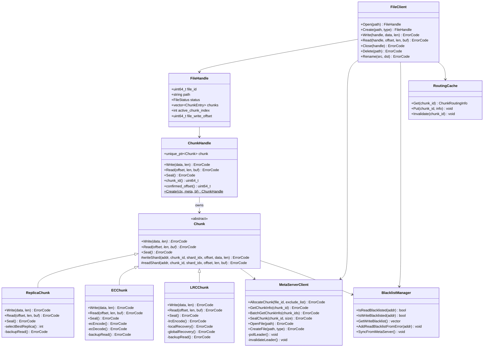

---

## 3. 配置参数

```cpp
struct ClientConfig {
    // ==================== MetaServer 通信 ====================
    std::string metaserver_addrs;             // MetaServer 集群地址, "ip1:port1,ip2:port2,ip3:port3"
    uint32_t metaserver_rpc_timeout_ms = 500; // 单次 RPC 超时
    uint32_t metaserver_poll_interval_ms = 1000; // Leader 轮询间隔
    uint32_t metaserver_max_retry = 3;        // RPC 最大重试次数

    // ==================== 元数据缓存 ====================
    uint32_t chunk_routing_cache_size = 100000; // LRU 缓存最大条目数
    uint32_t chunk_routing_cache_ttl_s = 300;   // 缓存 TTL (秒)

    // ==================== 黑名单 ====================
    uint32_t read_blacklist_timeout_s = 300;     // 读黑名单超时 (分钟级别，默认 5 分钟)
    uint32_t read_blacklist_error_threshold = 3; // 累计错误次数达到此阈值加入黑名单
    uint32_t blacklist_sync_interval_s = 60;     // 从 MetaServer 同步黑名单的周期 (秒)

    // ==================== Backup Read ====================
    uint32_t backup_read_delay_us = 500;         // 触发 Backup Read 的延迟阈值 (微秒)
    uint32_t max_backup_read_concurrency = 4;    // 单 Client 最大并发 Backup Read 数

    // ==================== 写入 ====================
    uint32_t write_retry_count = 3;              // 写入重试次数
    uint32_t write_timeout_ms = 1000;            // 单分片写入超时

    // ==================== 读取 ====================
    uint32_t read_timeout_ms = 500;              // 单分片读取超时
};
```

---

## 4. 核心数据结构

### 4.1 Chunk 抽象层

#### ChunkContext（Chunk 运行时上下文）

```cpp
// 引用已有类型（来自 MetaServer / ChunkStore 设计文档）:
//   ChunkStatus, ChunkMeta, ChunkRoutingInfo, RedundantType, EncodeType

// Client 侧 Chunk 运行时信息
struct ChunkContext {
    uint64_t chunk_id;                    // Chunk 全局唯一 ID
    RedundantType redundant_type;         // 冗余编码参数
    ChunkRoutingInfo routing;             // 各 shard 所在 ChunkServer 地址
    uint64_t confirmed_offset = 0;        // 已确认写入的逻辑 offset
    ChunkStatus status;                   // Chunk 当前状态
};
```

#### Chunk（抽象基类）

```cpp
// 抽象基类: 定义 Chunk 读写 Seal 的统一接口
// ReplicaChunk、ECChunk、LRCChunk 继承此类
class Chunk {
public:
    Chunk(const ChunkContext& ctx,
          MetaServerClient* meta_client,
          BlacklistManager* blacklist);
    virtual ~Chunk() = default;

    // 核心读写接口（纯虚函数，由子类实现）
    virtual ErrorCode Write(const char* data, uint32_t length) = 0;
    virtual ErrorCode Read(uint64_t offset, uint32_t length,
                           char* buf, uint32_t* read_bytes) = 0;
    virtual ErrorCode Seal() = 0;

    // 访问器
    uint64_t chunk_id() const { return ctx_.chunk_id; }
    uint64_t confirmed_offset() const { return ctx_.confirmed_offset; }
    const ChunkContext& context() const { return ctx_; }

protected:
    // 向单个 ChunkServer 发送 shard 写入 RPC
    ErrorCode writeShard(const std::string& cs_addr,
                         uint64_t chunk_id,
                         uint32_t shard_index,
                         uint64_t offset,
                         const char* data, uint32_t length);

    // 从单个 ChunkServer 读取 shard 数据
    ErrorCode readShard(const std::string& cs_addr,
                        uint64_t chunk_id,
                        uint32_t shard_index,
                        uint64_t offset,
                        uint32_t length,
                        char* buf, uint32_t* read_bytes);

    ChunkContext ctx_;
    MetaServerClient* meta_client_;
    BlacklistManager* blacklist_;
};
```

#### ChunkHandle（Chunk 的具体对象）

ChunkHandle 是 Chunk 的运行时句柄，持有一个多态的 `Chunk` 实例（`unique_ptr<Chunk>`），并通过委托模式对外提供统一的读写接口。FileHandle 中的每个活跃 Chunk 对应一个 ChunkHandle 对象。

```cpp
// ChunkHandle: Chunk 的具体对象，持有多态的 Chunk 实例
class ChunkHandle {
public:
    // 工厂方法: 根据 EncodeType 创建对应的 Chunk 子类，封装为 ChunkHandle
    static ChunkHandle Create(const ChunkContext& ctx,
                              MetaServerClient* meta_client,
                              BlacklistManager* blacklist);

    // 委托给内部 Chunk 实例
    ErrorCode Write(const char* data, uint32_t length) { return chunk_->Write(data, length); }
    ErrorCode Read(uint64_t offset, uint32_t length,
                   char* buf, uint32_t* read_bytes) { return chunk_->Read(offset, length, buf, read_bytes); }
    ErrorCode Seal() { return chunk_->Seal(); }

    // 访问器
    uint64_t chunk_id() const { return chunk_->chunk_id(); }
    uint64_t confirmed_offset() const { return chunk_->confirmed_offset(); }
    const ChunkContext& context() const { return chunk_->context(); }

private:
    std::unique_ptr<Chunk> chunk_;   // 持有的多态 Chunk 实例
};
```

#### ReplicaChunk（副本模式）

```cpp
class ReplicaChunk : public Chunk {
public:
    using Chunk::Chunk;

    // 写入: 将相同数据并发写入所有 replica shard，全部成功才返回成功
    ErrorCode Write(const char* data, uint32_t length) override;

    // 读取: 选择一个非黑名单的最优副本读取;
    //       超过 backup_read_delay_us 仍未返回则 Backup Read 到其他副本
    ErrorCode Read(uint64_t offset, uint32_t length,
                   char* buf, uint32_t* read_bytes) override;

    // Seal: 向所有副本发送 Seal 请求，再通知 MetaServer
    ErrorCode Seal() override;

private:
    // 选择最优副本 (排除黑名单，考虑负载和局部性)
    int selectBestReplica();

    // Backup Read: 向其他副本发送备份读请求
    ErrorCode backupRead(int failed_shard_index,
                         uint64_t offset, uint32_t length,
                         char* buf, uint32_t* read_bytes);
};
```

#### ECChunk（Erasure Coding 模式）

```cpp
// EC 读取计划: 描述单个 shard 的读取范围
struct ShardReadPlan {
    uint32_t shard_index;                 // 分片序号
    uint64_t offset_in_shard;             // 分片内起始偏移
    uint32_t length;                      // 读取长度
};

class ECChunk : public Chunk {
public:
    using Chunk::Chunk;

    // 写入: EC 编码生成 k 个 data shard + m 个 code shard，
    //       并发写入全部 k+m 个 shard，全部成功才返回成功
    ErrorCode Write(const char* data, uint32_t length) override;

    // 读取: 计算涉及的 data shard 范围，并发读取;
    //       超时则 Backup Read 校验分片 + EC 解码恢复缺失数据
    ErrorCode Read(uint64_t offset, uint32_t length,
                   char* buf, uint32_t* read_bytes) override;

    ErrorCode Seal() override;

private:
    // EC 编码: 用户数据 → k 个 data shard + m 个 code shard
    ErrorCode ecEncode(const char* data, uint32_t length,
                       std::vector<std::string>* shard_data);

    // EC 解码: 从任意 k 个可用 shard 重建原始数据
    ErrorCode ecDecode(const std::vector<std::pair<int, std::string>>& available_shards,
                       uint32_t stripe_size, char* output);

    // Backup Read: 请求额外 code shard，EC 解码恢复缺失数据
    ErrorCode backupRead(const std::vector<int>& slow_shards,
                         uint64_t offset, uint32_t length,
                         char* buf, uint32_t* read_bytes);

    // 计算逻辑 [offset, offset+length) 涉及哪些 data shard
    void computeShardRange(uint64_t offset, uint32_t length,
                           std::vector<ShardReadPlan>* plan);
};
```

#### LRCChunk（Local Reconstruction Code 模式）

```cpp
class LRCChunk : public Chunk {
public:
    using Chunk::Chunk;

    // 写入: LRC 编码生成 data shard + code shard + local shard，
    //       并发写入全部分片，全部成功才返回成功
    ErrorCode Write(const char* data, uint32_t length) override;

    // 读取: 优先用 local shard 做单分片局部恢复;
    //       无法局部恢复时降级到全局 EC 解码
    ErrorCode Read(uint64_t offset, uint32_t length,
                   char* buf, uint32_t* read_bytes) override;

    ErrorCode Seal() override;

private:
    // LRC 编码: 用户数据 → data shard + code shard + local shard
    ErrorCode lrcEncode(const char* data, uint32_t length,
                        std::vector<std::string>* shard_data);

    // 局部恢复: 使用 local shard + 同组其他 data shard 恢复单个缺失分片
    ErrorCode localRecovery(int missing_shard, uint64_t offset,
                            uint32_t length, std::string* recovered);

    // 全局恢复: 降级到全局 EC 解码
    ErrorCode globalRecovery(const std::vector<int>& missing_shards,
                             uint64_t offset, uint32_t length,
                             char* buf, uint32_t* read_bytes);

    // Backup Read: 优先尝试 local recovery，不够则 global recovery
    ErrorCode backupRead(const std::vector<int>& slow_shards,
                         uint64_t offset, uint32_t length,
                         char* buf, uint32_t* read_bytes);

    // LRC 分组信息
    struct LocalGroup {
        std::vector<int> data_shard_indices;  // 该组包含的 data shard 序号
        int local_shard_index;                // 该组对应的 local shard 序号
    };
    std::vector<LocalGroup> local_groups_;
};
```

### 4.2 路由信息缓存（RoutingCache）

```cpp
class RoutingCache {
public:
    explicit RoutingCache(uint32_t max_size, uint32_t ttl_s);

    // 查询缓存，命中返回 true
    bool Get(uint64_t chunk_id, ChunkRoutingInfo* info);

    // 写入缓存
    void Put(uint64_t chunk_id, const ChunkRoutingInfo& info);

    // 主动失效（如 ChunkServer 通知缓存过期）
    void Invalidate(uint64_t chunk_id);

    // 批量写入（配合 MetaServer 预取）
    void BatchPut(const std::vector<ChunkRoutingInfo>& infos);

private:
    struct CacheEntry {
        ChunkRoutingInfo info;
        std::chrono::steady_clock::time_point insert_time;
    };

    uint32_t max_size_;
    uint32_t ttl_s_;
    std::mutex mutex_;

    // LRU 实现: list 保持访问顺序，map 提供 O(1) 查找
    std::list<std::pair<uint64_t, CacheEntry>> lru_list_;
    std::unordered_map<uint64_t, decltype(lru_list_)::iterator> map_;
};
```

### 4.3 黑名单（BlacklistManager）

```cpp
class BlacklistManager {
public:
    explicit BlacklistManager(const ClientConfig& config,
                              MetaServerClient* meta_client);

    // ==================== 查询 ====================
    bool IsReadBlacklisted(const std::string& cs_addr) const;
    bool IsWriteBlacklisted(const std::string& cs_addr) const;

    // 获取写黑名单列表，传给 MetaServer 的 AllocateChunk
    std::vector<std::string> GetWriteBlacklist() const;

    // ==================== 读黑名单更新 ====================
    // 读请求失败时调用，累计错误达到阈值后加入黑名单
    void AddReadBlacklistFromError(const std::string& cs_addr);

    // 周期性从 MetaServer 拉取黑名单
    void SyncFromMetaServer();

    // ==================== 写黑名单更新 ====================
    void AddWriteBlacklist(const std::string& cs_addr);

    // ==================== 生命周期 ====================
    void Start();   // 启动后台定时器（同步 + 清理）
    void Stop();

private:
    struct BlacklistEntry {
        std::string cs_addr;
        std::chrono::steady_clock::time_point expire_time;  // 超时退出时间
        int error_count;                                     // 累计错误数
        enum Source {
            FROM_METASERVER,    // 从 MetaServer 获取
            FROM_ERROR          // 本地错误累计
        };
        Source source;
    };

    // 清理超时条目
    void cleanupExpired();

    ClientConfig config_;
    MetaServerClient* meta_client_;

    // 读黑名单 (读写锁，查询频繁)
    mutable std::shared_mutex read_bl_mutex_;
    std::unordered_map<std::string, BlacklistEntry> read_blacklist_;

    // 写黑名单
    mutable std::shared_mutex write_bl_mutex_;
    std::unordered_set<std::string> write_blacklist_;
};
```

### 4.4 错误码

```cpp
enum class ErrorCode : int32_t {
    kOk                     =  0,

    // MetaServer 通信
    kMetaServerUnavailable  = -100,   // MetaServer 集群不可用
    kLeaderNotFound         = -101,   // 无法找到 Leader 节点
    kNotLeader              = -102,   // 当前节点不是 Leader

    // Chunk 写入
    kChunkWriteFailed       = -200,   // Chunk 写入失败（部分 shard 未成功）
    kChunkSealFailed        = -201,   // Chunk Seal 失败
    kChunkFull              = -202,   // Chunk 已写满

    // Chunk 读取
    kChunkReadFailed        = -300,   // Chunk 读取失败
    kAllShardsTimeout       = -301,   // 所有 shard 均超时
    kECDecodeFailed         = -302,   // EC 解码失败（可用 shard 不足 k 个）
    kLRCRecoveryFailed      = -303,   // LRC 局部/全局恢复均失败

    // 文件操作
    kFileNotFound           = -400,   // 文件不存在
    kFileAlreadyExists      = -401,   // 文件已存在
    kFileSealed             = -402,   // 文件已封存，无法写入

    // 通用
    kBlacklisted            = -500,   // 节点在黑名单中
    kInvalidArgument        = -501,   // 参数非法
    kTimeout                = -502,   // 超时
    kNetworkError           = -503,   // 网络错误
};
```

---

## 5. MetaServer 通信层（MetaServerClient）

Client 与 MetaServer 的通信基于 **BRPC** 框架。MetaServer 使用 `braft` 部署为 Raft 集群，只有 Leader 节点对外提供读写服务。Client 需要自行发现并缓存 Leader 地址。

### 5.1 BRPC Channel 管理

```cpp
class MetaServerClient {
public:
    explicit MetaServerClient(const ClientConfig& config);

    // ==================== 文件操作 ====================
    ErrorCode CreateFile(const std::string& path, const RedundantType& type);
    ErrorCode OpenFile(const std::string& path, FileNode* file_node,
                       std::vector<ChunkRoutingInfo>* routing);
    ErrorCode DeleteFile(const std::string& path);
    ErrorCode RenameFile(const std::string& src, const std::string& dst);
    ErrorCode SealFile(const std::string& path);

    // ==================== Chunk 操作 ====================
    ErrorCode AllocateChunk(uint64_t file_id,
                            const std::vector<std::string>& exclude_list,
                            uint64_t* chunk_id,
                            ChunkRoutingInfo* routing);
    ErrorCode GetChunkInfo(uint64_t chunk_id, ChunkRoutingInfo* routing);
    ErrorCode BatchGetChunkInfo(const std::vector<uint64_t>& chunk_ids,
                                std::vector<ChunkRoutingInfo>* routings);
    ErrorCode SealChunk(uint64_t chunk_id, uint64_t confirmed_size);

    // ==================== 黑名单同步 ====================
    ErrorCode GetBlacklist(std::vector<std::string>* blacklist);

private:
    void pollLeader();           // 轮询所有节点找 Leader
    void invalidateLeader();     // 清除缓存的 Leader

    // 统一 RPC 发送（自动处理 Leader 缓存、重试）
    ErrorCode sendRequest(const std::function<ErrorCode(brpc::Channel*)>& rpc_func);

    ClientConfig config_;
    std::mutex leader_mutex_;
    std::string cached_leader_addr_;          // 当前缓存的 Leader 地址
    std::atomic<bool> leader_valid_{false};

    // BRPC Channel 池 (每个 MetaServer 节点一个)
    std::unordered_map<std::string, std::unique_ptr<brpc::Channel>> channels_;
};
```

### 5.2 Leader 发现与缓存

Client 启动时，为 `metaserver_addrs` 中的每个地址创建一个 `brpc::Channel`。当需要发送请求时，首先检查本地缓存的 Leader 地址是否有效：

```
sendRequest(rpc_func):
    if !leader_valid_:
        pollLeader()                          // 轮询找 Leader

    response = rpc_func(channels_[cached_leader_addr_])

    if response.error == NETWORK_ERROR or NOT_LEADER:
        invalidateLeader()
        retry up to metaserver_max_retry:
            pollLeader()
            response = rpc_func(channels_[cached_leader_addr_])
            if success: return response
        return kMetaServerUnavailable

    return kOk
```

**Leader 轮询流程**：向集群中所有 MetaServer 节点并发发送轻量级 `GetLeader` RPC。Leader 节点直接返回成功；Follower 节点返回重定向信息指明当前 Leader 地址。

**Leader 发现状态机**：

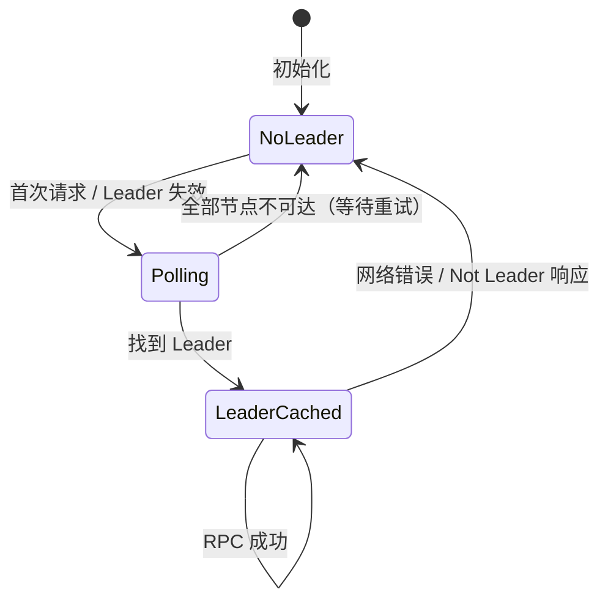

### 5.3 RPC 接口封装

MetaServerClient 封装的 RPC 接口与 MetaServer 设计文档中定义的接口一一对应：

| MetaServerClient 方法 | MetaServer RPC | 是否需要 Raft 共识 |
|---|---|---|
| `CreateFile` | `CreateFile(path, type)` | 是 |
| `OpenFile` | `OpenFile(path)` | 否（纯读） |
| `DeleteFile` | `DeleteFile(path)` | 是 |
| `RenameFile` | `RenameFile(src, dst)` | 是 |
| `AllocateChunk` | `AllocateChunk(file_id, exclude_list)` | 是 |
| `GetChunkInfo` | `GetChunkInfo(chunk_id)` | 否 |
| `BatchGetChunkInfo` | `BatchGetChunkInfo(chunk_ids[])` | 否 |
| `SealChunk` | `SealChunk(chunk_id, size)` | 是 |

### 5.4 请求重试与并发控制

- **重试策略**：RPC 失败后最多重试 `metaserver_max_retry` 次。每次重试前先执行 `pollLeader()` 确保指向正确的 Leader
- **并发控制**：`leader_mutex_` 保护 `pollLeader()` 操作，确保同一时刻只有一个线程执行 Leader 轮询。其他线程等待轮询完成后共享结果
- **超时控制**：每次 RPC 调用设置 `metaserver_rpc_timeout_ms` 超时，避免长时间阻塞

---

## 6. ChunkClient 设计

### 6.1 Chunk 类层次与 ChunkHandle

ChunkClient 通过抽象基类 **Chunk** 和三个子类（ReplicaChunk、ECChunk、LRCChunk）封装不同编码策略的读写差异。**ChunkHandle** 是 Chunk 的具体对象，通过工厂方法创建并持有对应的 Chunk 子类实例：

```cpp
ChunkHandle ChunkHandle::Create(
    const ChunkContext& ctx,
    MetaServerClient* meta_client,
    BlacklistManager* blacklist)
{
    ChunkHandle handle;
    switch (ctx.redundant_type.encode_type) {
        case EncodeType::kReplica:
            handle.chunk_ = std::make_unique<ReplicaChunk>(ctx, meta_client, blacklist);
            break;
        case EncodeType::kEC:
            handle.chunk_ = std::make_unique<ECChunk>(ctx, meta_client, blacklist);
            break;
        case EncodeType::kLRC:
            handle.chunk_ = std::make_unique<LRCChunk>(ctx, meta_client, blacklist);
            break;
    }
    return handle;
}
```

三种 Chunk 类型的核心差异总结：

| | ReplicaChunk | ECChunk | LRCChunk |
|---|---|---|---|
| **写入编码** | 数据复制 N 份 | EC 编码 → k data + m code | LRC 编码 → k data + m code + l local |
| **分片总数** | N (如 3) | k+m (如 4+2=6) | k+m+l (如 4+2+2=8) |
| **正常读取** | 选最优 1 个副本 | 读涉及的 data shard | 读涉及的 data shard |
| **Backup Read** | 切换到其他副本 | 读 code shard + EC 解码 | 先 local shard 局部恢复，不够则全局 EC 解码 |
| **存储开销** | 3x (3副本) | 1.5x (EC 4+2) | ~1.5x (LRC 4+2+2) |

### 6.2 写入流程

所有 Chunk 类型共享相同的写入语义：**全部分片写入成功才算成功**。

#### 通用写入流程

```
Chunk::Write(data, length)
  │
  ├── 1. 根据冗余编码类型对数据进行编码
  │      ├── ReplicaChunk: 数据复制 N 份
  │      ├── ECChunk: EC 编码 → k data shard + m code shard
  │      └── LRCChunk: LRC 编码 → k data shard + m code shard + l local shard
  │
  ├── 2. 向所有分片对应的 ChunkServer 并发发送写入请求
  │      每个请求携带 <chunk_id, shard_index, offset, shard_data, length>
  │
  ├── 3. 等待所有 ChunkServer 返回
  │      ├── 全部成功 → 推进 confirmed_offset += length，返回 kOk
  │      └── 任一失败 → 将失败节点加入写黑名单，返回 kChunkWriteFailed
  │
  └── 4. 上层（FileClient）收到写入失败后:
         ├── Seal 当前 Chunk
         ├── 创建新 Chunk（携带写黑名单 exclude_list）
         └── 在新 Chunk 上重试写入
```

#### 各类型写入差异

**ReplicaChunk 写入**（以 3 副本为例）：

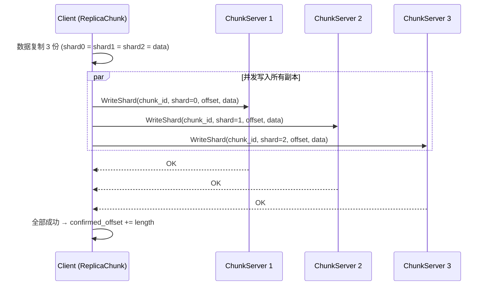

**ECChunk 写入**（以 EC(4,2) 为例）：

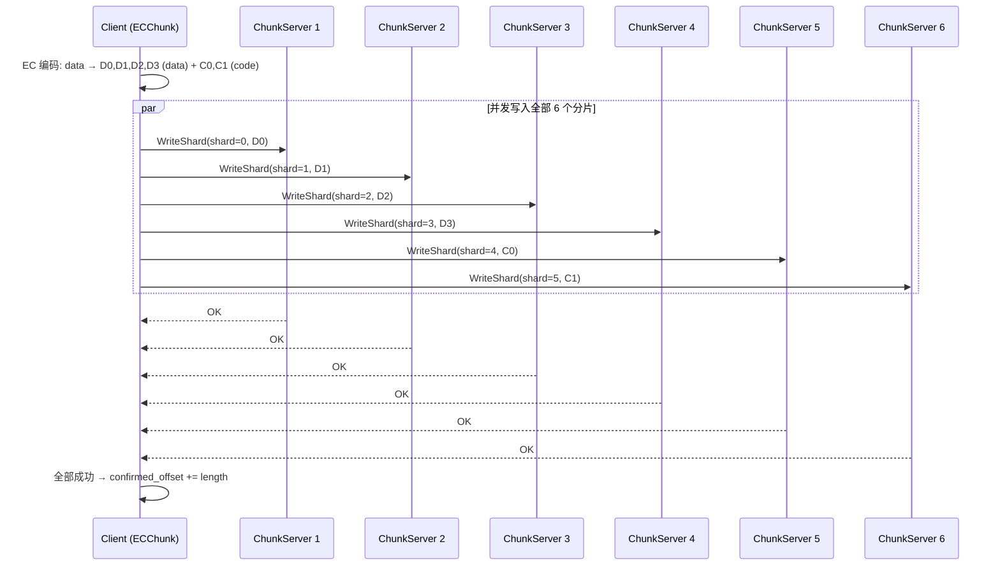

**LRCChunk 写入**（以 LRC(4,2,2) 为例，4 data + 2 global code + 2 local shard）：

写入逻辑与 ECChunk 类似，额外生成 local shard。LRC 将 4 个 data shard 分为 2 组（每组 2 个），每组生成 1 个 local shard 用于快速局部恢复。总计写入 4+2+2=8 个分片。

### 6.3 读取流程与 Backup Read

所有 Chunk 类型的读取都需要容错，采取 **Backup Read** 机制降低尾延迟。

#### 6.3.1 Backup Read 核心机制

当读请求发出后，超过 `backup_read_delay_us` 仍有分片未返回时，Client 向其他可用分片发起备份读请求，取最先返回的结果：

- **触发时机**：shard 响应延迟超过 `backup_read_delay_us`（默认 500μs，可根据磁盘类型和 I/O 大小动态调整）
- **并发限制**：单 Client 同时进行的 Backup Read 数量不超过 `max_backup_read_concurrency`，避免放大系统负载
- **黑名单联动**：Backup Read 目标自动排除读黑名单中的节点

#### 6.3.2 ReplicaChunk 读取

```
ReplicaChunk::Read(offset, length)
  │
  ├── 1. selectBestReplica(): 从 N 个副本中选择最优的
  │      排除读黑名单中的节点，优先选择负载低、网络近的副本
  │
  ├── 2. 向选中副本发送 ReadShard 请求
  │
  ├── 3. 等待响应
  │      ├── 在 backup_read_delay_us 内返回 → 直接返回数据
  │      └── 超时未返回 → 发起 Backup Read
  │
  └── 4. backupRead():
         ├── 选择另一个非黑名单副本
         ├── 发送 ReadShard 请求
         └── 取两个请求中最先返回的成功结果
```

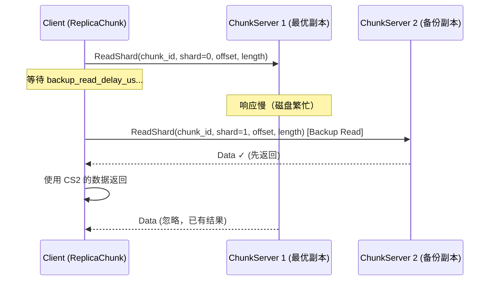

#### 6.3.3 ECChunk 读取

```
ECChunk::Read(offset, length)
  │
  ├── 1. computeShardRange(): 计算逻辑 [offset, offset+length) 涉及哪些 data shard
  │      (EC 模式下数据按 stripe 分散在 k 个 data shard 中)
  │
  ├── 2. 向涉及的 data shard 并发发送 ReadShard 请求
  │
  ├── 3. 等待响应
  │      ├── 全部 data shard 在阈值内返回 → 拼接数据返回
  │      └── 部分 data shard 超时 → 发起 Backup Read
  │
  └── 4. backupRead():
         ├── 向 code shard 发送 ReadShard 请求
         ├── 收集到任意 k 个 shard 的数据（data + code 混合）
         ├── EC 解码恢复缺失的 data shard 数据
         └── 拼接返回
```

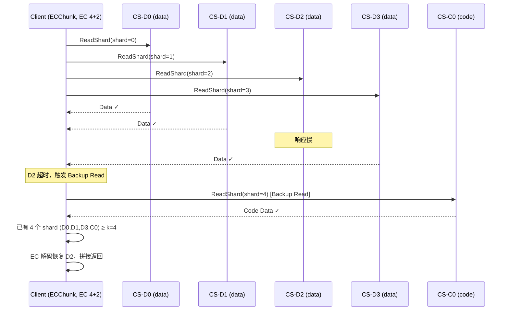

#### 6.3.4 LRCChunk 读取

LRCChunk 的 Backup Read 具有**两层恢复策略**，这是 LRC 相比 EC 的核心优势：

```
LRCChunk::Read(offset, length)
  │
  ├── 1. 与 ECChunk 相同: 计算涉及的 data shard，并发读取
  │
  ├── 2. 部分 data shard 超时 → 发起 Backup Read
  │
  └── 3. backupRead() — 两层恢复:
         │
         ├── Tier 1: localRecovery() — 局部恢复
         │      如果仅 1 个 data shard 缺失，且该 shard 所在分组的
         │      local shard 可用:
         │      ├── 读取同组的其他 data shard + 该组的 local shard
         │      ├── XOR 恢复缺失 shard（只需组内少量分片）
         │      └── 成功 → 返回数据
         │
         └── Tier 2: globalRecovery() — 全局恢复
                如果局部恢复失败（多分片缺失 / local shard 也不可用）:
                ├── 降级到全局 EC 解码
                ├── 需要任意 k 个可用 shard
                └── EC 解码恢复全部缺失数据
```

**LRC 局部恢复示例**（LRC(4,2,2)，Group0 = {D0, D1}, Group1 = {D2, D3}）：

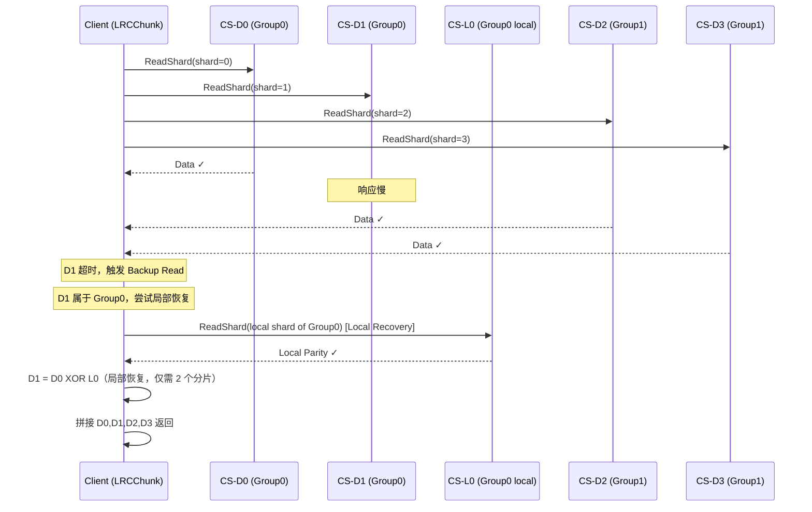

### 6.4 Seal 流程

Seal 将 Chunk 从 **RW** 转为 **Sealed** 状态，阻止后续写入。

```
Chunk::Seal()
  │
  ├── 1. 向所有持有该 Chunk 分片的 ChunkServer 并发发送 SealShard 请求
  │      携带当前 confirmed_offset（已确认的写入长度）
  │
  ├── 2. 各 ChunkServer 将本地分片截断到 confirmed_offset 并标记为 Sealed
  │
  └── 3. 向 MetaServer 发送 SealChunk(chunk_id, confirmed_offset)
         MetaServer 更新 Chunk 状态为 Sealed
```

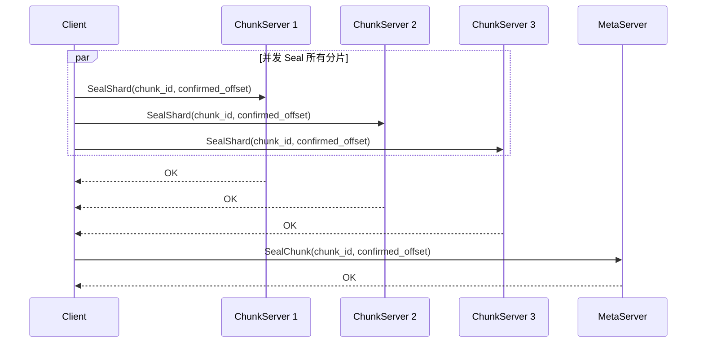

### 6.5 元数据缓存

ChunkClient 通过 **RoutingCache** 缓存 Chunk 路由信息，减少与 MetaServer 的交互：

| 缓存策略 | 说明 |
|----------|------|
| **LRU 淘汰** | 缓存条目数超过 `chunk_routing_cache_size` 时淘汰最久未访问的条目 |
| **TTL 过期** | 条目写入超过 `chunk_routing_cache_ttl_s` 后自动失效 |
| **主动失效** | ChunkServer 通知 Client 缓存过期（如副本迁移）时，调用 `Invalidate()` |
| **批量预取** | 调用 `BatchGetChunkInfo` 时，MetaServer 额外返回相邻 Chunk 的路由信息，批量写入缓存 |

---

## 7. 黑名单机制

### 7.1 读黑名单

读黑名单用于隔离读请求中的异常节点，有两个来源：

#### 来源一：MetaServer 同步

Client 周期性（每 `blacklist_sync_interval_s` 秒）从 MetaServer 拉取全局黑名单。MetaServer 根据 ChunkServer 心跳超时、磁盘故障等信息维护此黑名单。

此部分黑名单的生命周期由 MetaServer 管理，Client 仅做本地缓存。

#### 来源二：读请求错误累计

当向某个 ChunkServer 发送读请求失败（网络错误、超时、CRC 校验失败等）时：

1. 对该节点的错误计数器 +1
2. 错误计数达到 `read_blacklist_error_threshold`（默认 3 次）后，将该节点加入读黑名单
3. 设置超时时间 `read_blacklist_timeout_s`（默认 300 秒，即 5 分钟）
4. 超时后自动从黑名单中移除，给节点恢复的机会

### 7.2 写黑名单

写黑名单主要在创建 Chunk 时使用。当 Client 向 MetaServer 请求 `AllocateChunk` 时，将写黑名单中的节点地址作为 `exclude_list` 参数传递，告诉 MetaServer **尽量不要在这些节点上创建 Chunk 的分片**。

写黑名单的来源：

- 写入请求失败的 ChunkServer 节点
- MetaServer 同步的不可用节点

### 7.3 黑名单生命周期

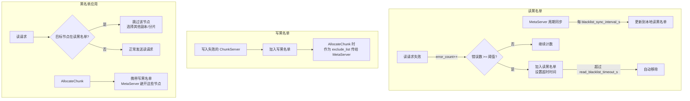

---

## 8. FileClient 设计

### 8.1 FileHandle 数据结构

FileHandle 是 FileClient 的核心数据结构，维护文件与 Chunk 序列之间的映射关系：

```cpp
struct FileHandle {
    uint64_t file_id;                      // 全局唯一文件 ID
    std::string path;                      // 文件路径
    FileStatus status;                     // 文件状态 (RW / SEALED / DELETED)

    // ==================== Chunk 序列 ====================
    struct ChunkEntry {
        uint64_t chunk_id;                 // Chunk ID
        uint64_t chunk_size;               // Sealed chunk 的确定大小; RW chunk 动态增长
        uint64_t offset_in_file;           // 该 chunk 在文件中的起始逻辑偏移

        // 仅当前活跃的 RW chunk 持有 ChunkHandle 对象
        // Sealed chunk 的 handle 为空，读取时按需创建临时 ChunkHandle
        std::unique_ptr<ChunkHandle> handle;
    };
    std::vector<ChunkEntry> chunks;        // 有序 Chunk 序列

    // ==================== 写入状态 ====================
    int active_chunk_index = -1;           // chunks 中当前 RW chunk 的下标
    uint64_t file_write_offset = 0;        // 文件级已写入偏移
};
```

文件与 Chunk 的映射关系示例：

```
FileHandle: "/data/log_20260322.dat"
  file_id = 42
  status = RW
  file_write_offset = 229MB
  active_chunk_index = 3

  chunks[0]: chunk_id=1001, size=64MB, offset_in_file=0,     handle=nullptr  (Sealed)
  chunks[1]: chunk_id=1002, size=64MB, offset_in_file=64MB,  handle=nullptr  (Sealed)
  chunks[2]: chunk_id=1003, size=64MB, offset_in_file=128MB, handle=nullptr  (Sealed)
  chunks[3]: chunk_id=1004, size=37MB, offset_in_file=192MB, handle=active   (RW) ◄── 当前写入点
```

### 8.2 文件写入流程

```
FileClient::Write(handle, data, length)
  │
  ├── 1. 检查 handle->status == RW，否则返回 kFileSealed
  │
  ├── 2. 获取当前活跃 ChunkHandle
  │      handle->chunks[handle->active_chunk_index].handle
  │
  ├── 3. 调用 ChunkHandle::Write(data, length)
  │      ├── 成功 → 更新 file_write_offset += length，返回 kOk
  │      │
  │      └── 失败 (kChunkWriteFailed 或 kChunkFull) → switchChunk()
  │
  └── 4. switchChunk():
         ├── Seal 当前 Chunk
         ├── 更新 chunks[active_chunk_index].chunk_size = confirmed_offset
         ├── 调用 AllocateChunk(file_id, write_blacklist.GetWriteBlacklist())
         ├── 创建新 ChunkHandle (ChunkHandle::Create 工厂方法)
         ├── 追加新 ChunkEntry 到 handle->chunks
         ├── 更新 active_chunk_index
         └── 在新 Chunk 上重试写入
```

### 8.3 文件读取流程

```
FileClient::Read(handle, offset, length)
  │
  ├── 1. 根据 offset 定位起始 Chunk
  │      遍历 handle->chunks，找到满足:
  │        chunk.offset_in_file <= offset < chunk.offset_in_file + chunk.chunk_size
  │      的 ChunkEntry
  │
  ├── 2. 计算读取范围可能跨越多个 Chunk
  │      将 [offset, offset+length) 拆分为多个 Chunk 内部的读取请求:
  │      [(chunk_0, internal_offset_0, len_0),
  │       (chunk_1, internal_offset_1, len_1), ...]
  │
  ├── 3. 对每个涉及的 Chunk:
  │      ├── 从 RoutingCache 获取路由信息（缓存未命中则查 MetaServer）
  │      ├── 创建临时 ChunkHandle（ChunkHandle::Create，或使用活跃 handle）
  │      └── 调用 ChunkHandle.Read(internal_offset, len, buf)
  │          (内部自动处理 Backup Read)
  │
  └── 4. 拼接各 Chunk 返回的数据，写入 buf，返回 kOk
```

### 8.4 文件生命周期管理

```cpp
class FileClient {
public:
    FileClient(const ClientConfig& config);
    ~FileClient();

    // ==================== 文件操作 ====================
    ErrorCode Open(const std::string& path, FileHandle** handle);
    ErrorCode Create(const std::string& path,
                     const RedundantType& type,
                     FileHandle** handle);
    ErrorCode Write(FileHandle* handle, const char* data, uint32_t length);
    ErrorCode Read(FileHandle* handle, uint64_t offset, uint32_t length,
                   char* buf, uint32_t* read_bytes);
    ErrorCode Close(FileHandle* handle);
    ErrorCode Delete(const std::string& path);
    ErrorCode Rename(const std::string& src, const std::string& dst);
    ErrorCode Stat(const std::string& path, FileStat* stat);

private:
    // Seal 当前 Chunk，创建新 Chunk 继续写入
    ErrorCode switchChunk(FileHandle* handle);

    ClientConfig config_;
    std::unique_ptr<MetaServerClient> meta_client_;
    std::unique_ptr<BlacklistManager> blacklist_;
    std::unique_ptr<RoutingCache> routing_cache_;

    // 打开的文件句柄管理
    std::mutex handles_mutex_;
    std::unordered_map<std::string, std::unique_ptr<FileHandle>> open_files_;
};
```

| 操作 | 说明 |
|------|------|
| `Create` | 向 MetaServer 创建文件 → `AllocateChunk` 获取首个 Chunk → 构建 FileHandle |
| `Open` | 向 MetaServer `OpenFile` → 获取 FileNode + 路由信息 → 构建 FileHandle，最后一个 RW Chunk 通过 `ChunkHandle::Create` 创建活跃 ChunkHandle |
| `Write` | 通过活跃 ChunkHandle 追加写入（委托给内部 Chunk 实例），Chunk 写满或失败时自动 `switchChunk` |
| `Read` | 按 offset 映射到 Chunk 序列，通过 ChunkHandle 读取（内部 Chunk 自动处理 Backup Read） |
| `Close` | Seal 活跃 RW Chunk → 通知 MetaServer `SealFile` → 释放 FileHandle |
| `Delete` | 通知 MetaServer 逻辑删除文件（延迟回收） |
| `Rename` | 通知 MetaServer 原子重命名 |
| `Stat` | 查询文件属性（大小、创建时间等） |

### 8.5 FileHandle 状态机

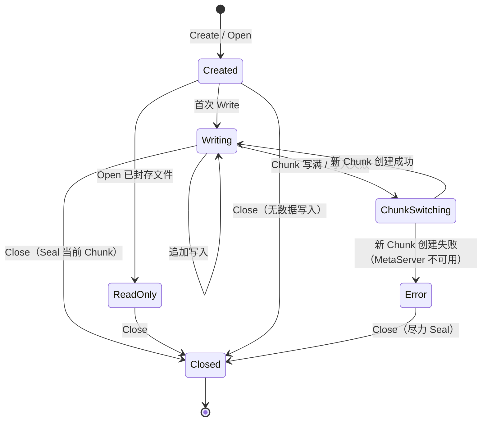

---

## 9. 端到端交互流程

### 9.1 写入全链路

以 EC(4,2) 模式为例，从用户发起写入到数据落盘的完整流程：

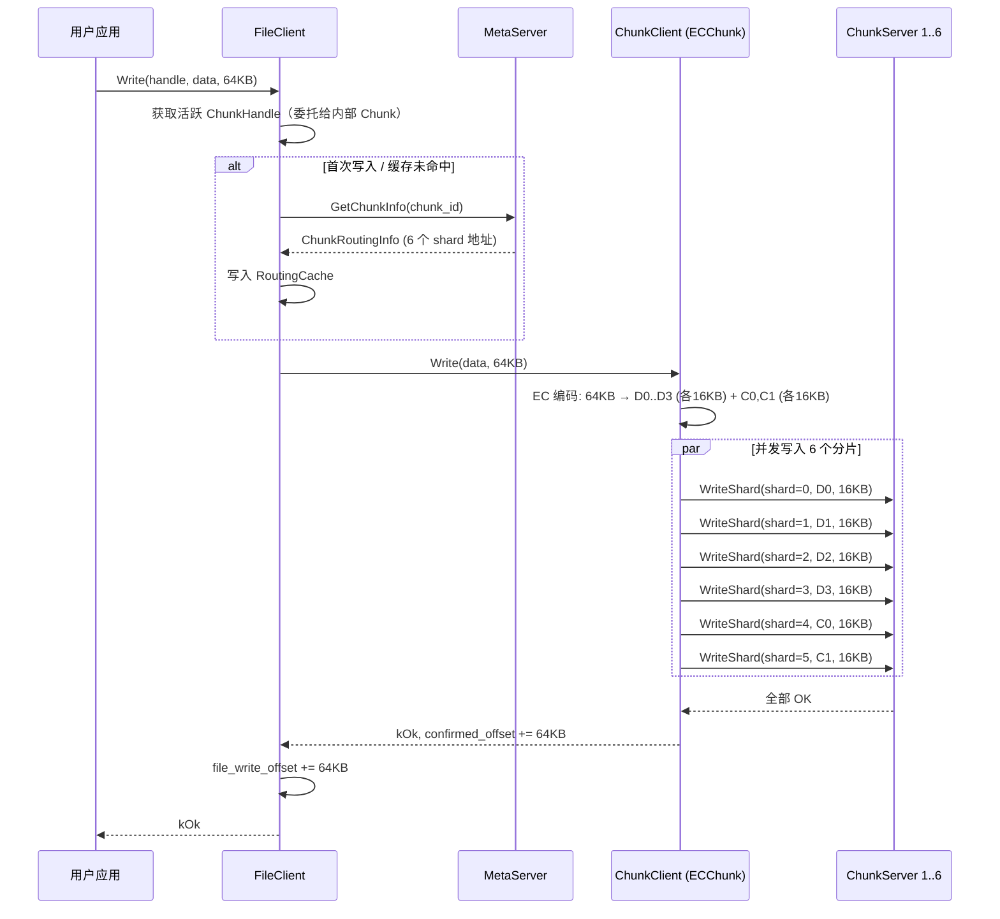

**写入失败场景**：

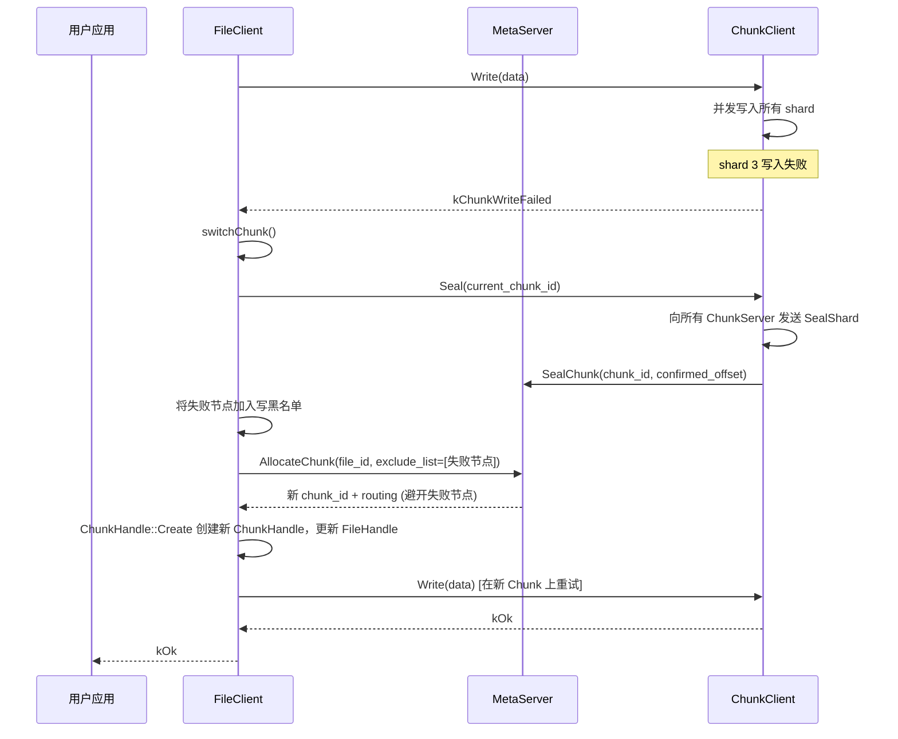

### 9.2 读取全链路

以 3 副本模式为例，含 Backup Read 的完整读取流程：

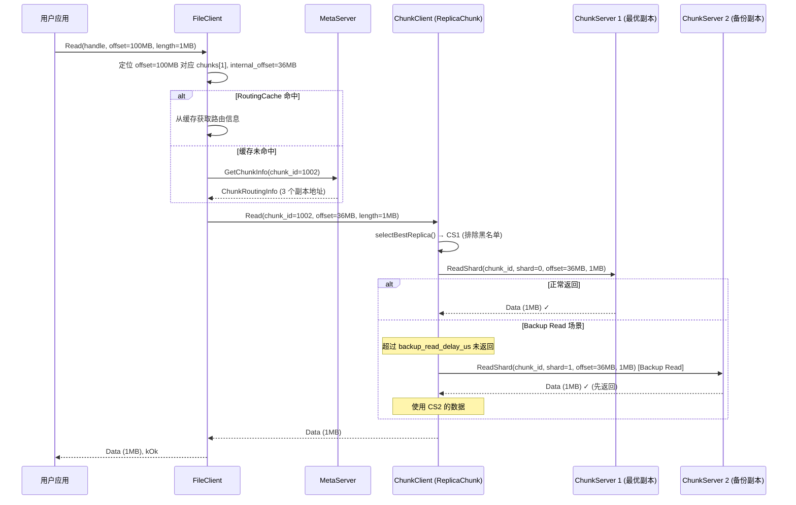

---

## 10. 监控指标

```cpp
struct ClientMetrics {
    // ==================== 写入 ====================
    std::atomic<uint64_t> write_count{0};             // 写入请求总数
    std::atomic<uint64_t> write_bytes{0};              // 写入总字节数
    std::atomic<uint64_t> write_latency_sum_us{0};     // 写入延迟总和 (用于计算均值)
    std::atomic<uint64_t> write_error_count{0};        // 写入错误总数
    std::atomic<uint64_t> chunk_switch_count{0};       // Chunk 切换次数

    // ==================== 读取 ====================
    std::atomic<uint64_t> read_count{0};               // 读取请求总数
    std::atomic<uint64_t> read_bytes{0};               // 读取总字节数
    std::atomic<uint64_t> read_latency_sum_us{0};      // 读取延迟总和
    std::atomic<uint64_t> read_error_count{0};         // 读取错误总数
    std::atomic<uint64_t> backup_read_count{0};        // Backup Read 触发次数
    std::atomic<uint64_t> backup_read_success_count{0};// Backup Read 成功次数

    // ==================== MetaServer 通信 ====================
    std::atomic<uint64_t> meta_rpc_count{0};           // MetaServer RPC 总数
    std::atomic<uint64_t> meta_rpc_error_count{0};     // MetaServer RPC 错误数
    std::atomic<uint64_t> leader_switch_count{0};      // Leader 切换次数
    std::atomic<uint64_t> routing_cache_hit_count{0};  // 路由缓存命中次数
    std::atomic<uint64_t> routing_cache_miss_count{0}; // 路由缓存未命中次数

    // ==================== 黑名单 ====================
    std::atomic<uint64_t> read_blacklist_size{0};      // 当前读黑名单节点数
    std::atomic<uint64_t> write_blacklist_size{0};     // 当前写黑名单节点数
    std::atomic<uint64_t> blacklist_add_count{0};      // 累计加入黑名单次数
    std::atomic<uint64_t> blacklist_remove_count{0};   // 累计移出黑名单次数

    // ==================== EC 编解码 ====================
    std::atomic<uint64_t> ec_encode_count{0};          // EC 编码次数
    std::atomic<uint64_t> ec_decode_count{0};          // EC 解码次数（含 Backup Read 触发）
    std::atomic<uint64_t> lrc_local_recovery_count{0}; // LRC 局部恢复次数
    std::atomic<uint64_t> lrc_global_recovery_count{0};// LRC 全局恢复降级次数
};
```

| 指标类别 | 核心指标 | 告警阈值建议 |
|----------|---------|-------------|
| **写入** | 写入延迟 P99、写入错误率、Chunk 切换频率 | P99 > 10ms、错误率 > 0.1%、切换 > 10次/分钟 |
| **读取** | 读取延迟 P99、Backup Read 比例、读取错误率 | P99 > 5ms、Backup Read > 5%、错误率 > 0.1% |
| **MetaServer** | RPC 错误率、Leader 切换频率、缓存命中率 | 错误率 > 1%、切换 > 5次/分钟、命中率 < 90% |
| **黑名单** | 黑名单节点数、加入频率 | 节点数 > 集群10%、加入 > 20次/分钟 |
| **EC** | LRC 全局恢复降级次数 | 降级 > 10次/分钟 |

---

## 附录 A. 参考文献

1. Sanjay Ghemawat, Howard Gobioff, Shun-Tak Leung. *The Google File System*. SOSP 2003.
2. Qiang Li et al. *More Than Capacity: Performance-Oriented Evolution of Pangu in Alibaba*. FAST 2023.
