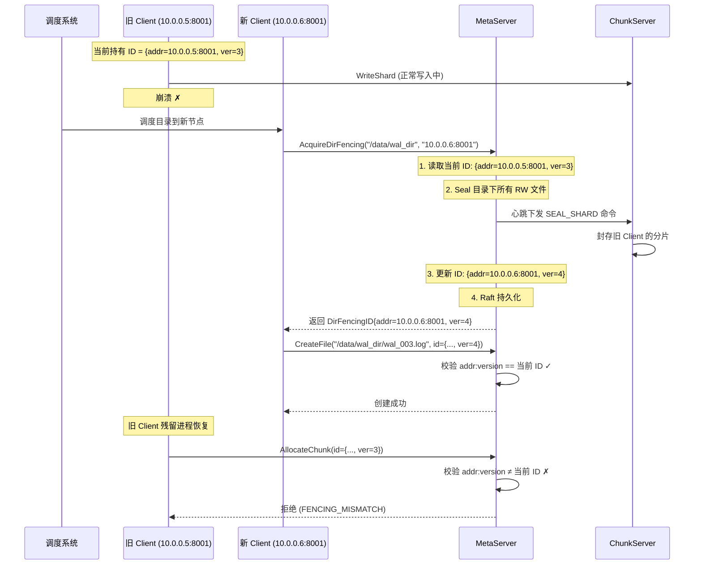

# 基于目录 ID 文件的分布式 Fencing 设计

本文档描述分布式追加写存储系统中，基于目录 ID 文件实现的目录级分布式 Fencing 机制。该机制通过在目录下存放一个轻量的 ID 文件，结合文件 Seal 操作，实现对目录写入操作的互斥控制。

---

## 1. 背景与动机

### 1.1 问题：目录级单写者保证

在分布式追加写存储系统中，许多上层业务场景要求**同一目录在同一时刻只有一个 Client 写入**：

- **WAL（Write-Ahead Log）**：数据库的预写日志目录，同一时刻只有一个数据库实例写入
- **日志流（Log Stream）**：日志收集系统中，每个日志分区目录由一个采集进程独占写入
- **分布式状态机**：Raft/Paxos 的日志存储目录，由当前 Leader 独占写入

这些场景的共同特征是：**目录由调度系统分配给某个计算节点，该节点独占写入；当发生故障切换时，新节点接管该目录的写入权**。

### 1.2 仅靠 Seal 无法实现目录级 Fencing

Seal 操作可以将已有的 RW Chunk 封存为只读，阻止旧 Client 继续向已有 Chunk 写入数据。但 Seal 仅作用于**已存在的 Chunk**，无法约束**目录级别的元数据操作**：

| 场景 | Seal 的覆盖能力 |
|------|----------------|
| 旧 Client 向已有 Chunk 追加写入 | 可防护（Chunk 已 Sealed，写入被拒绝） |
| 旧 Client 在目录下创建新文件 | **无法防护**（MetaServer 无校验依据） |
| 旧 Client 为新文件分配新 Chunk | **无法防护**（新 Chunk 不在 Seal 范围内） |
| 旧 Client 对目录执行 Rename 操作 | **无法防护** |

根本原因在于：Seal 是**数据面**的保护手段，无法阻止旧 Client 通过**控制面**（MetaServer）在目录下产生新的文件和 Chunk，破坏目录的单写者语义。

### 1.3 解决方案：目录 ID 文件

在每个需要互斥写入的目录下引入一个 **ID 文件**，作为目录级别的所有权标记：

```
/data/wal_dir/
├── .fencing_id          ← ID 文件（内联存储在目录 inode 中）
├── wal_00000001.log     ← 业务数据文件
├── wal_00000002.log
└── ...
```

ID 文件记录当前合法写入者的身份标识。MetaServer 在处理该目录下的所有写路径元数据操作时，校验请求方的身份是否与 ID 文件一致，不一致则拒绝。配合文件 Seal 机制，实现完整的目录级 Fencing。

### 1.4 ID 文件 + Seal：控制面与数据面的协同

目录 ID 文件和 Seal 操作分别覆盖**控制面**和**数据面**，共同实现完整的目录级 Fencing：

| | 目录 ID 文件 | Seal 操作 |
|---|---|---|
| **作用层面** | 控制面（MetaServer） | 数据面（ChunkServer） |
| **防护对象** | CreateFile、AllocateChunk 等元数据操作 | WriteShard 等数据写入 |
| **防护方式** | `addr:version` 等值校验，不匹配则拒绝 | Chunk 封存为只读，追加写入被拒绝 |
| **作用范围** | 目录下所有未来操作 | 目录下已有的 RW Chunk |

两者缺一不可：ID 文件阻止旧 Client 产生新资源，Seal 阻止旧 Client 写入已有资源。

---

## 2. ID 文件设计

### 2.1 数据结构

```cpp
struct DirFencingID {
    std::string client_addr;   // 当前所有者的 IP:Port
    uint64_t version;          // 单调递增的版本号
};
```

**语义说明**：

- `client_addr` 和 `version` 作为一个**不可分割的整体**，构成目录的所有权标识（类似 session ID）
- `version` **不具有独立的 fencing 语义**，不存在"新版本优于旧版本"的比较逻辑
- `version` 的作用是区分**同一节点多次获取权限**的不同会话。例如同一个 Client 进程重启后重新获取同一目录的写入权，`client_addr` 不变但 `version` 递增，使得旧会话的请求被识别为无效
- 校验逻辑为**等值匹配**：请求方携带的 `addr:version` 必须与 ID 文件中存储的完全一致

### 2.2 Inode 内联存储

ID 文件的内容极小（`client_addr` 约 21 字节 + `version` 8 字节，合计不到 30 字节），采用 **inode 内联存储**：

```
┌─────────────────────────────────────────────────┐
│              目录 Inode 元数据                     │
│                                                 │
│  inode_id:   10086                              │
│  name:       "wal_dir"                          │
│  type:       DIRECTORY                          │
│  parent_id:  1                                  │
│  ...                                            │
│                                                 │
│  ┌─────────────────────────────────────────┐    │
│  │  内联 ID 文件 (DirFencingID)             │    │
│  │  client_addr: "10.0.0.5:8001"           │    │
│  │  version:     42                         │    │
│  └─────────────────────────────────────────┘    │
└─────────────────────────────────────────────────┘
```

**内联存储的优势**：

- **无数据面开销**：不需要为 ID 文件分配 Chunk 和 Shard，不涉及 ChunkServer，读写完全在 MetaServer 内部完成
- **原子性**：ID 文件的更新与目录元数据的更新可以在同一个 Raft 操作中原子完成
- **低延迟**：读写 ID 文件等同于读写一条元数据记录，微秒级完成

### 2.3 Raft 持久化

ID 文件的创建和更新都通过 MetaServer Raft 共识持久化，确保所有 MetaServer 节点对 ID 文件内容的一致视图：

```
Client                          MetaServer (Leader)              MetaServer (Followers)
  │                                   │                                │
  │  AcquireDirFencing(dir, addr) ──► │                                │
  │                                   │                                │
  │                                   │  封装为 MetaOperation          │
  │                                   │  提交到 Raft Log               │
  │                                   │ ──── Append Entries ─────────► │
  │                                   │ ◄─── Majority ACK ──────────  │
  │                                   │                                │
  │                                   │  on_apply:                     │
  │                                   │   更新目录 inode 中的           │
  │                                   │   DirFencingID                 │
  │                                   │                                │
  │  ◄── DirFencingID{addr, ver} ──  │                                │
```

Raft 持久化保证了：

- **强一致性**：所有节点看到的 ID 文件内容严格一致
- **持久性**：MetaServer 宕机重启后，ID 文件内容通过 Raft Log 恢复
- **Leader 切换安全**：新 Leader 上任后，ID 文件状态完整保留

---

## 3. 分布式 Fencing 协议

### 3.1 强制获取（Acquire）

当目录被调度系统分配给某个 Client 时，该 Client 在打开目录前**强制获取** ID 文件：

```
AcquireDirFencing(dir_path, client_addr):
  │
  ├── 1. Client 向 MetaServer 发送获取请求
  │      携带: dir_path, client_addr
  │
  ├── 2. MetaServer 读取当前目录的 DirFencingID
  │      ├── 不存在（首次获取）→ version = 1
  │      └── 已存在 → version = old_version + 1
  │
  ├── 3. MetaServer Seal 该目录下所有 RW 文件
  │      （详见第 4 节）
  │
  ├── 4. MetaServer 构造新 DirFencingID
  │      new_id = { client_addr, version }
  │      通过 Raft 持久化到目录 inode
  │
  └── 5. 返回 new_id 给 Client
         Client 在后续写操作中携带此 ID
```

**关键设计决策**：

- **获取是强制的**：无论当前是否有其他 Client 持有，获取总是成功。这由调度系统保证正确性——调度系统决定何时将目录从一个节点转移到另一个节点
- **获取前先 Seal**：在更新 ID 文件之前，先 Seal 旧 Client 的所有 RW 文件，确保数据面的安全
- **运行期间不重复获取**：目录对应的逻辑运行中不会尝试获取 ID，获取只发生在目录被调度后打开的时刻
- **无续约、无释放**：不存在租约超时或显式释放机制，所有权仅在下一次强制获取时转移

### 3.2 校验（Validate）

MetaServer 在处理该目录下的**写路径元数据操作**时，校验请求方携带的 `addr:version` 与当前 ID 文件完全一致：

```cpp
bool ValidateDirFencing(const DirFencingID& request_id,
                        const DirFencingID& current_id) {
    return request_id.client_addr == current_id.client_addr
        && request_id.version == current_id.version;
}
```

需要校验的操作包括：

| 操作 | 说明 |
|------|------|
| `CreateFile` | 在目录下创建新文件 |
| `DeleteFile` | 删除目录下的文件 |
| `RenameFile` | 涉及该目录的重命名操作 |
| `AllocateChunk` | 为目录下的文件分配新 Chunk |
| `SealFile` / `SealChunk` | 封存目录下的文件或 Chunk |

**不需要**校验的操作：

| 操作 | 原因 |
|------|------|
| `OpenFile` | 纯读操作，不影响数据完整性 |
| `GetChunkInfo` | 纯读操作 |
| 读取数据（ReadShard） | 数据面读操作，不需要写入互斥 |

ChunkServer **不参与** ID 文件的校验。数据面的写入保护完全依赖 Seal 机制（详见第 4 节）。

### 3.3 完整交互流程

以故障切换场景为例，展示从旧 Client 崩溃到新 Client 接管的完整流程：



---

## 4. 与 Seal 操作的集成

### 4.1 为什么需要 Seal

仅靠 MetaServer 侧的 `addr:version` 校验，无法完全阻止旧 Client 的数据写入。原因在于：

- 旧 Client 可能已经获取了 Chunk 的路由信息并缓存在本地
- 旧 Client 可以直接向 ChunkServer 发送 `WriteShard` 请求，绕过 MetaServer 的校验
- ChunkServer 不感知目录级 ID 文件，无法在数据面进行 version 校验

Seal 操作解决了这个问题：**将旧 Client 已打开的 RW Chunk 封存为只读，ChunkServer 自然拒绝后续的追加写入**。

### 4.2 接管时的 Seal 流程

当新 Client 强制获取 ID 文件时，MetaServer 在更新 ID 文件**之前**执行 Seal：

```
AcquireDirFencing 内部流程:
  │
  ├── 1. 扫描目录下所有文件
  │      从命名空间中列出 dir_path 下的全部 FileNode
  │
  ├── 2. 筛选 RW 状态的文件
  │      过滤出 FileStatus == RW 的文件
  │
  ├── 3. 对每个 RW 文件的最后一个 RW Chunk 执行 Seal
  │      │
  │      ├── 从心跳上报数据获取各分片当前长度
  │      ├── 根据被动定长策略（默认 Min Length）确定 seal_size
  │      ├── 更新 ChunkMeta: status = SEALED, size = seal_size
  │      ├── 更新 FileNode: status = SEALED
  │      └── 通过心跳下发 SEAL_SHARD 到各 ChunkServer
  │
  ├── 4. 将 Seal 操作和 ID 文件更新封装为一个 Raft 操作
  │      保证原子性：要么全部完成，要么全部回滚
  │
  └── 5. Apply 后更新 ID 文件，返回新 DirFencingID
```

### 4.3 Fencing 保证的两层防线

目录 ID 文件 + Seal 构成两层防线，覆盖旧 Client 可能执行的所有写操作：

```
旧 Client 的潜在写操作            防线 1: 控制面            防线 2: 数据面
─────────────────────          ─────────────          ────────────

CreateFile(dir)         ──►   addr:version 不匹配     （不到达数据面）
                              MetaServer 拒绝 ✗

AllocateChunk(file)     ──►   addr:version 不匹配     （不到达数据面）
                              MetaServer 拒绝 ✗

WriteShard(旧 chunk)    ──►   （绕过 MetaServer）  ──►  Chunk 已 Sealed
                                                       ChunkServer 拒绝 ✗

WriteShard(新 chunk)    ──►   不可能发生：旧 Client     （不到达数据面）
                              无法获取新 chunk 的
                              路由信息
```

### 4.4 时序安全性分析

关键的时序保证是：**MetaServer 先 Seal 旧文件，再更新 ID 文件并返回给新 Client**。

```
时间线
──────────────────────────────────────────────────────────►

  旧 Client              MetaServer                  新 Client
  正在写入 Chunk X
       │
       │            收到 Acquire 请求
       │                  │
       │            Seal Chunk X
       │            （Raft 提交）
       │                  │
       ▼            更新 ID 文件
  WriteShard        （Raft 提交）
  到达 ChunkServer        │
       │            返回新 ID
       │                  │               开始使用新 ID
       ▼                                  创建新文件、写入新 Chunk
  ChunkServer 发现
  Chunk X 已 Sealed
  → 拒绝写入 ✗
```

即使旧 Client 的 `WriteShard` 在 Seal 生效前**已经发出**，也存在两种安全结局：

1. **写入在 Seal 之前到达 ChunkServer**：写入成功，但该数据属于旧 Client 的合法写入范围内，不影响正确性。后续写入将被 Sealed 状态阻止
2. **写入在 Seal 之后到达 ChunkServer**：Chunk 已 Sealed，ChunkServer 拒绝写入

无论哪种情况，新 Client 创建的文件和 Chunk 都与旧 Client 的 Chunk 完全隔离，不存在数据交叉写入的可能。

---

## 5. 故障场景分析

### 5.1 Client 崩溃

```
场景：Client A 持有目录写入权时崩溃

时间线:
  Client A: 持有 ID{addr=A, ver=3}
       │
       │  崩溃 ✗
       │
  （无需 MetaServer 主动检测）
       │
  调度系统检测到 A 不可用
  将目录调度给 Client B
       │
  Client B: AcquireDirFencing → MetaServer Seal A 的 RW 文件
                              → ID 更新为 {addr=B, ver=4}
       │
  Client B: 开始正常写入
```

**无需租约超时机制**：系统不依赖 MetaServer 主动检测 Client 存活。故障检测由**调度系统**负责，MetaServer 仅在收到新的 Acquire 请求时被动完成接管。这简化了系统设计，避免了租约相关的复杂性（时钟漂移、超时参数选择等）。

### 5.2 MetaServer Leader 切换

```
场景：Acquire 过程中 MetaServer Leader 宕机

情况 1: Raft 日志已提交（多数派确认）
  → 新 Leader 重放日志，ID 文件更新生效
  → Client 重试请求后获取新 ID（幂等处理）

情况 2: Raft 日志未提交
  → 操作未生效，ID 文件保持旧状态
  → Client 重试请求，由新 Leader 重新执行 Acquire 流程
```

ID 文件作为 MetaServer 状态机的一部分，其持久性和一致性完全由 Raft 保证。Leader 切换不会导致 ID 文件丢失或不一致。

### 5.3 网络分区

```
场景：Client A 与 MetaServer 之间发生网络分区

            ┌─────── 网络分区 ───────┐
            │                        │
  Client A  │   MetaServer           │  Client B
  (旧所有者) │                        │  (新所有者)
            │                        │

Client A 的行为:
  1. 向 MetaServer 发送 CreateFile → 网络不可达，超时失败
  2. 向 MetaServer 发送 AllocateChunk → 网络不可达，超时失败
  3. 向 ChunkServer 发送 WriteShard（使用本地缓存的路由）
     → 如果 Chunk 已 Sealed：ChunkServer 拒绝
     → 如果 Chunk 尚未 Sealed：写入可能成功（见下方分析）

分区恢复后:
  Client A 尝试 MetaServer 操作 → addr:version 不匹配 → 拒绝
  Client A 感知到自己已不是所有者 → 停止写入
```

**分区期间旧 Chunk 的写入问题**：

如果网络分区发生在 Seal 完成之前，旧 Client 可能仍在向未 Sealed 的 Chunk 写入。这在追加写系统中是**安全的**：

- 追加写保证数据不会覆盖，旧 Client 写入的数据追加在 Chunk 尾部
- 新 Client 使用的是**新创建的文件和 Chunk**，与旧 Chunk 完全隔离
- 分区恢复后，旧 Chunk 最终被 Seal（被动定长机制兜底），旧 Client 的残留写入被截断到 Seal 确定的长度

### 5.4 脑裂防护

Raft 协议保证 MetaServer 在任何时刻只有一个 Leader 能够提交写操作。因此：

- ID 文件的更新严格串行化，不可能出现两个 Client 同时获取到同一目录的写入权
- `version` 单调递增，由 Raft Leader 原子地读取旧值并写入新值
- 即使旧 Leader 被网络分区隔离，其未提交的 Acquire 操作不会生效

### 5.5 故障场景总结

| 故障场景 | 控制面保护 | 数据面保护 | 安全性 |
|---------|-----------|-----------|--------|
| Client 崩溃 | 新 Acquire 更新 ID，旧请求 addr:version 不匹配 | Seal 封存旧 Chunk | 安全 |
| MetaServer Leader 切换 | Raft 保证 ID 文件状态一致 | Seal 状态同样由 Raft 保证 | 安全 |
| 网络分区（已 Seal） | 分区恢复后 addr:version 不匹配 | Chunk 已 Sealed，写入被拒绝 | 安全 |
| 网络分区（未 Seal） | 分区恢复后 addr:version 不匹配 | 追加写隔离 + 被动定长兜底 | 安全 |
| 脑裂 | Raft 保证单 Leader 串行化 | 不可能同时发出两份 Seal | 安全 |

---

## 附录 A：设计决策记录

| 决策 | 选项 | 选择 | 理由 |
|------|------|------|------|
| ID 文件存储方式 | 独立文件 vs Inode 内联 | **Inode 内联** | 内容极小，内联避免数据面开销，更新可与元数据操作原子化 |
| 校验方式 | version 大小比较 vs 等值匹配 | **等值匹配** | version 不承担 fencing 语义，仅区分同一节点的不同会话 |
| 所有权生命周期 | 租约制 vs 强制获取 | **强制获取** | 由调度系统保证正确性，避免租约超时的复杂性 |
| ChunkServer 是否校验 | 校验 vs 不校验 | **不校验** | 数据面保护由 Seal 完成，减少 ChunkServer 复杂度 |
| Seal 与 ID 更新的顺序 | 先 Seal 后更新 vs 先更新后 Seal | **先 Seal 后更新** | 确保旧 Client 的 Chunk 在新 ID 生效前已被封存 |
