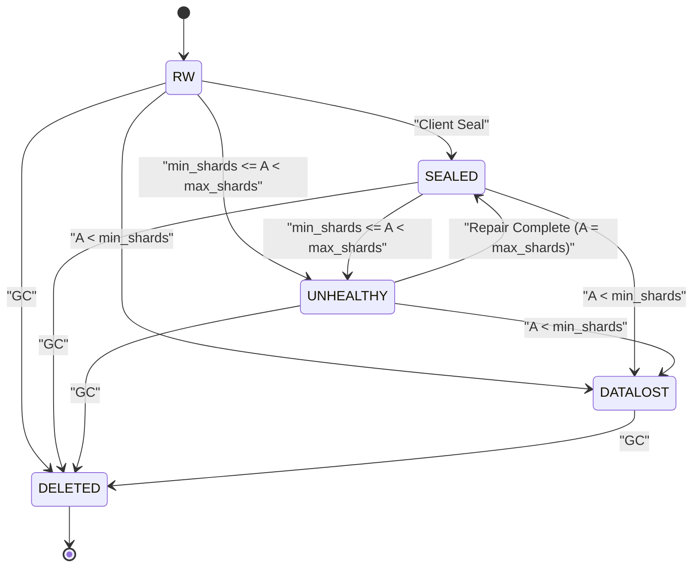
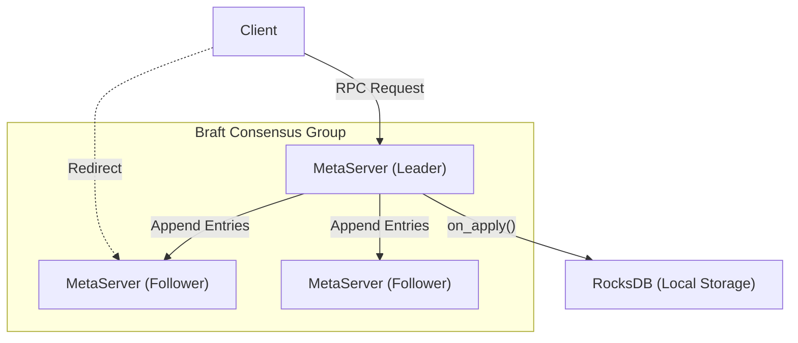
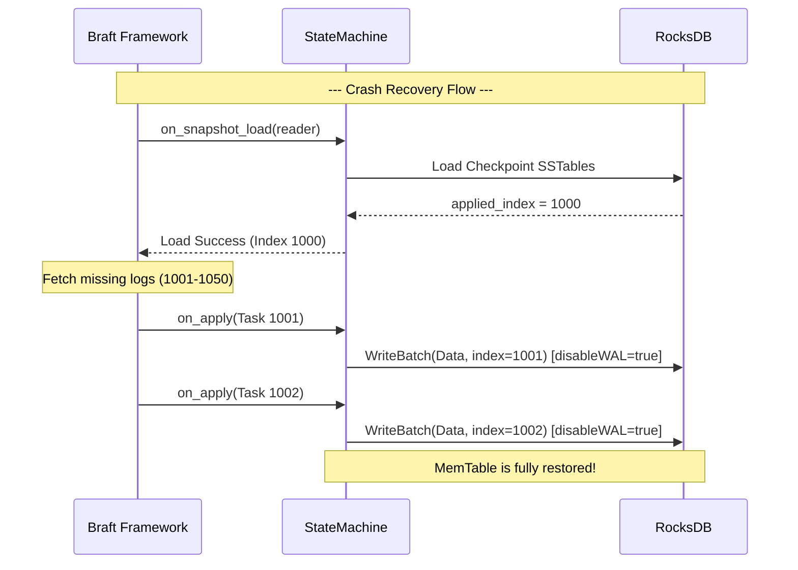
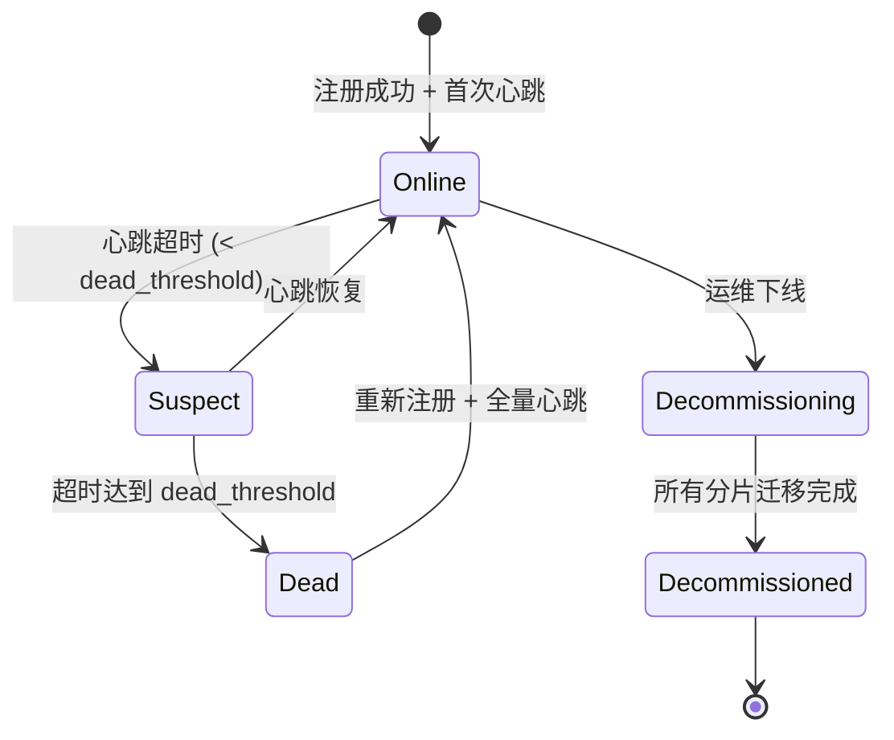
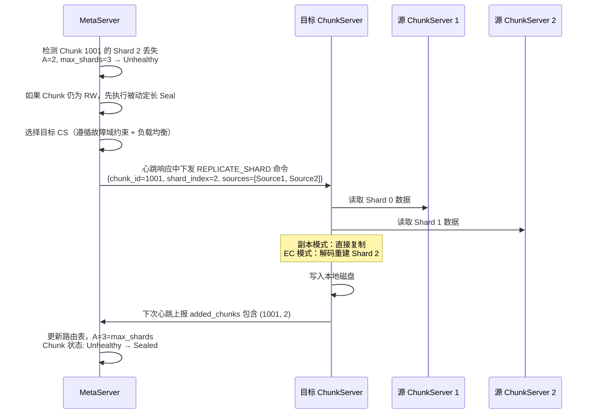

# MetaServer 设计文档

本文档详细描述了分布式追加写存储系统中 MetaServer 的核心架构、元数据模型、存储引擎设计以及集群管理机制。

---

## 1. 元数据模型设计 (Metadata Model)

从逻辑视角看，MetaServer 维护的元数据主要分为三层：**目录解析（Namespace）**、**File 元数据** 和 **Chunk 元数据**。

### 1.1 核心数据结构 (C++ 描述)

```cpp
#include <string>
#include <vector>
#include <unordered_map>

// ==================== 第一层：目录解析（Namespace） ====================
// 负责将用户可见的路径解析为内部 file_id。
// 目录树与文件内容解耦，rename 只需修改目录项，不影响 FileNode。

// 目录项类型
enum class EntryType {
    FILE = 0,
    DIRECTORY = 1
};

// 目录项 (持久化到 RocksDB CF_NAMESPACE)
struct DirEntry {
    std::string name;                // 当前层级的文件/目录名
    EntryType type;                  // 文件 or 目录
    uint64_t file_id;               // type==FILE 时指向 FileNode；type==DIRECTORY 时为目录自身的 inode_id
    uint64_t parent_id;             // 父目录的 inode_id（根目录为 0）
};

// ==================== 第二层：File 元数据（FileNode） ====================
// 通过 file_id 索引，存储文件的实际属性和 Chunk 列表。
// 与路径无关，支持 O(1) rename 和 hardlink 等语义。

// 文件状态
enum class FileStatus {
    RW = 0,       // 文件处于打开并可追加写入的状态
    SEALED = 1,   // 文件已关闭，处于只读状态
    DELETED = 2   // 文件已被逻辑删除，等待后台 GC 物理回收
};

// FileNode (持久化到 RocksDB CF_FILE)
struct FileNode {
    uint64_t file_id;                // 全局唯一的文件标识符
    uint64_t file_size;              // 文件的逻辑总大小
    FileStatus status;               // 文件的当前状态
    std::vector<uint64_t> chunk_list;// 文件所包含的 Chunk ID 列表（有序）
    std::vector<uint64_t> chunk_sizes;// 记录该文件下每个 Chunk 的实际大小
};

// Chunk 状态
enum class ChunkStatus {
    RW = 0,          // 未封存、可追加写；可用分片数 A = max_shards
    SEALED = 1,      // 已封存、只读；可用分片数 A = max_shards
    UNHEALTHY = 2,   // 降级但在冗余可恢复范围内（min_shards <= A < max_shards）
    DATALOST = 3,    // 已无法按策略完成读/重建（A < min_shards）
    DELETED = 4      // 逻辑删除 / GC 终态
};

// Chunk 元数据 (持久化到 RocksDB)
struct ChunkMeta {
    uint64_t chunk_id;               // 全局唯一的 Chunk 标识符
    uint64_t size;                   // 该 Chunk 当前的实际物理大小
    ChunkStatus status;              // Chunk 的状态
};

// Chunk 路由信息 (仅内存维护，由心跳构建，不持久化)
struct ChunkRoutingInfo {
    uint64_t chunk_id;
    std::vector<std::string> locations; // 存储该 Chunk 分片的 ChunkServer 地址 (IP:Port)
};
```

### 1.2 Chunk 状态机流转



---

## 2. 核心架构与共识机制 (Architecture & Consensus)

### 2.1 架构与 Raft 集成

- **Raft 复制组**: MetaServer 使用 `braft` 部署为 3 或 5 节点的集群。
- **Leader 专属服务**: 只有 Raft Leader 对外提供读写服务。Follower 节点将客户端请求重定向给 Leader。
- **状态机**: 实现 `braft::StateMachine`，所有的元数据操作封装为 `OP` 在这里被 Apply。



### 2.2 操作封装与状态机 Apply

所有修改状态的操作被序列化为 Protobuf 结构，经 Raft 达成多数派共识后在各节点的状态机中依次 Apply。

```protobuf
message MetaOperation {
    enum OpType {
        // --- 文件操作 ---
        OP_CREATE_FILE      = 0;   // 创建文件
        OP_DELETE_FILE       = 1;   // 逻辑删除文件（重命名为隐藏名称）
        OP_RENAME_FILE       = 2;   // 原子重命名
        OP_SEAL_FILE         = 3;   // 封存文件（Seal 最后一个 RW Chunk）

        // --- Chunk 生命周期 ---
        OP_ALLOCATE_CHUNK    = 10;  // 创建新 Chunk，分配分片到 ChunkServer
        OP_SEAL_CHUNK        = 11;  // 封存 Chunk（Client 主动 Seal 或异常被动 Seal）
        OP_UPDATE_CHUNK_SIZE = 12;  // 更新 Chunk 的已确认写入长度
        OP_SET_CHUNK_STATUS  = 13;  // 修改 Chunk 状态（Unhealthy / DataLost / Deleted）

        // --- 分布式锁 ---
        OP_ACQUIRE_LOCK      = 20;  // 获取 Fencing 锁
        OP_RELEASE_LOCK      = 21;  // 释放 Fencing 锁
        OP_RENEW_LOCK        = 22;  // 续约 Fencing 锁

        // --- 集群管理 ---
        OP_REGISTER_CS       = 30;  // ChunkServer 注册
        OP_DECOMMISSION_CS   = 31;  // 下线 ChunkServer
        OP_UPDATE_CONFIG     = 32;  // 更新集群配置（默认副本数、EC 参数等）
    }
    OpType type = 1;
    bytes payload = 2;
}
```

**Apply 伪代码**：

```cpp
void MetaStateMachine::on_apply(braft::Iterator& iter) {
    for (; iter.valid(); iter.next()) {
        MetaOperation op;
        op.ParseFromString(iter.data().to_string());

        butil::Status status;
        switch (op.type()) {
            case OP_CREATE_FILE:
                status = ApplyCreateFile(op.payload());
                break;
            case OP_ALLOCATE_CHUNK:
                status = ApplyAllocateChunk(op.payload());
                break;
            case OP_SEAL_CHUNK:
                status = ApplySealChunk(op.payload());
                break;
            // ...
        }

        // 将 raft_log_index 与数据原子写入 RocksDB（disableWAL=true）
        WriteBatch batch;
        batch.Put(CF_META, key, value);
        batch.Put(CF_META, "applied_index", std::to_string(iter.index()));
        rocksdb_->Write(WriteOptions{.disableWAL = true}, &batch);

        // 通过 closure 通知 RPC 线程操作结果
        if (iter.done()) {
            auto* closure = dynamic_cast<MetaClosure*>(iter.done());
            closure->SetStatus(status);
            closure->Run();
        }
    }
}
```

### 2.3 分布式 Fencing 锁

为了支持存算分离，MetaServer 提供带有 `IP:Port + Epoch` 的分布式锁，防止脑裂和僵尸进程。

```cpp
struct FencingToken {
    std::string client_addr; // 客户端的 IP:Port
    uint64_t epoch;          // 单调递增的 epoch
};

// 校验逻辑伪代码 (运行在 ChunkServer 侧)
bool CheckFencingToken(const FencingToken& request_token, const FencingToken& current_token) {
    if (request_token.client_addr != current_token.client_addr) {
        return false; // 跨节点脑裂，拒绝
    }
    if (request_token.epoch < current_token.epoch) {
        return false; // 同节点旧生命周期的僵尸包，拒绝
    }
    return true;
}
```

**Fencing 锁的典型使用场景**：

```
① Client A 向 MetaServer 申请锁（OP_ACQUIRE_LOCK）
   → MetaServer 分配 FencingToken{addr="A:8001", epoch=5}

② Client A 携带 Token 向 ChunkServer 写入数据
   → ChunkServer 记录该 Chunk 的最新 Token

③ Client A 宕机重启，向 MetaServer 重新申请锁
   → MetaServer 分配 FencingToken{addr="A:8001", epoch=6}

④ 旧 Client A（僵尸进程，epoch=5）的残留写入到达 ChunkServer
   → ChunkServer 发现 epoch=5 < current_epoch=6，拒绝写入
```

---

## 3. 存储引擎与状态机恢复 (RocksDB + 零 WAL)

### 3.1 核心设计

- **主存储引擎与无锁并发**: 使用 `RocksDB`。利用其内部的 MemTable（Skiplist）实现"单写多读"的无锁特性。Raft apply 线程单写，RPC 线程并发读。
- **全量元数据缓存**: 配置极大的 `BlockCache`（占用机器 60%-80% 内存），使 File 和 Chunk 元数据常驻内存，基本不淘汰，实现微秒级读取。
- **消除 WAL 双写**: `WriteOptions.disableWAL = true`。元数据操作与 `raft_log_index` 原子写入 MemTable，Raft LogStorage 为唯一真理之源。

### 3.2 RocksDB Key-Value 布局

MetaServer 使用 RocksDB 的 Column Family 对不同类型的元数据进行物理隔离，避免相互干扰。

#### 3.2.1 Column Family 划分

| Column Family | 用途 | Key 编码 | Value |
|---|---|---|---|
| `CF_NAMESPACE` | 目录解析（路径→file_id） | `parent_id`（8 字节 Big-Endian）+ `\0` + `name` | `DirEntry` 的 Protobuf 序列化 |
| `CF_FILE` | FileNode 元数据（file_id→文件属性） | `file_id`（8 字节 Big-Endian） | `FileNode` 的 Protobuf 序列化 |
| `CF_CHUNK` | Chunk 元数据 | `chunk_id`（8 字节 Big-Endian） | `ChunkMeta` 的 Protobuf 序列化 |
| `CF_FILE_CHUNK` | 文件→Chunk 映射 | `file_id`（8 字节 Big-Endian）+ `\0` + `chunk_index`（4 字节 Big-Endian） | `chunk_id`（8 字节） |
| `CF_LOCK` | Fencing 锁 | `lock_key`（由 Chunk 或文件标识） | `FencingToken` 的 Protobuf 序列化 |
| `CF_SYSTEM` | 系统元数据 | `"applied_index"` 等固定字符串 | 各类系统状态 |

#### 3.2.2 Key 编码细节

所有整数 Key 均采用 Big-Endian 编码：RocksDB 默认使用字节序比较，Big-Endian 保证数字大小关系与字节序一致，从而支持高效的范围扫描。

```cpp
// Namespace Key 编码：parent_id + '\0' + name
// 支持按 parent_id 前缀扫描列出目录下所有子项
std::string EncodeNamespaceKey(uint64_t parent_id, const std::string& name) {
    std::string key(8, '\0');
    EncodeFixed64BigEndian(&key[0], parent_id);
    key.push_back('\0');
    key.append(name);
    return key;
}

// File Key 编码
std::string EncodeFileKey(uint64_t file_id) {
    std::string key(8, '\0');
    EncodeFixed64BigEndian(&key[0], file_id);
    return key;
}

// Chunk Key 编码
std::string EncodeChunkKey(uint64_t chunk_id) {
    std::string key(8, '\0');
    EncodeFixed64BigEndian(&key[0], chunk_id);
    return key;
}

// File-Chunk 映射 Key 编码：file_id + '\0' + chunk_index
// 支持按 file_id 前缀扫描获取文件的所有 Chunk（有序）
std::string EncodeFileChunkKey(uint64_t file_id, uint32_t chunk_index) {
    std::string key(8, '\0');
    EncodeFixed64BigEndian(&key[0], file_id);
    key.push_back('\0');
    char buf[4];
    EncodeFixed32BigEndian(buf, chunk_index);
    key.append(buf, 4);
    return key;
}
```

#### 3.2.3 RocksDB 配置要点

```cpp
rocksdb::Options GetMetaServerRocksDBOptions() {
    rocksdb::Options options;
    // 使用大 BlockCache，目标让所有元数据常驻内存
    auto cache = rocksdb::NewLRUCache(GetAvailableMemory() * 0.7);
    rocksdb::BlockBasedTableOptions table_options;
    table_options.block_cache = cache;
    table_options.cache_index_and_filter_blocks = true;
    table_options.pin_l0_filter_and_index_blocks_in_cache = true;
    options.table_factory.reset(rocksdb::NewBlockBasedTableFactory(table_options));

    // 关闭 WAL（由 Raft LogStorage 保证持久性）
    // 注意：此选项在 WriteOptions 中设置，此处仅注释说明

    // Compaction 策略：Level Compaction，减少写放大
    options.compaction_style = rocksdb::kCompactionStyleLevel;
    options.level0_file_num_compaction_trigger = 4;
    options.max_bytes_for_level_base = 256 * 1024 * 1024;  // 256MB

    return options;
}
```

### 3.3 快照与 Crash 恢复机制

- **快照协同**: Braft 触发 `on_snapshot_save` 时，调用 RocksDB `Checkpoint`（强制 Flush）。MemTable 落盘，创建硬链接。Braft 随后安全截断旧 Raft Log。
- **Crash 恢复**: 宕机导致未 Flush 的 MemTable 丢失。重启时，状态回退到上一次 Checkpoint。Braft 自动从 Raft Log 重放缺失的日志补齐 MemTable。



**快照保存流程**：

```cpp
void MetaStateMachine::on_snapshot_save(braft::SnapshotWriter* writer,
                                         braft::Closure* done) {
    // 1. 创建 RocksDB Checkpoint（内部执行 Flush + 硬链接 SSTable）
    rocksdb::Checkpoint* checkpoint;
    rocksdb::Checkpoint::Create(rocksdb_, &checkpoint);
    std::string snapshot_path = writer->get_path() + "/rocksdb_checkpoint";
    checkpoint->CreateCheckpoint(snapshot_path);
    delete checkpoint;

    // 2. 将 Checkpoint 目录注册为 Snapshot 的一部分
    writer->add_file("rocksdb_checkpoint");

    // 3. 通知 Braft 快照完成，Braft 会截断旧日志
    done->Run();
}
```

---

## 4. 集群管理与调度 (Cluster Management & Scheduling)

### 4.1 ChunkServer 生命周期管理

#### 4.1.1 节点注册

ChunkServer 首次启动或 MetaServer Leader 切换后，执行注册握手：

```
ChunkServer                         MetaServer (Leader)
    │                                      │
    │  ── RegisterRequest ──────────────►  │
    │     { cs_id, ip, port,               │
    │       disk_info[], capacity }         │
    │                                      │  验证 cs_id 唯一性
    │                                      │  写入 OP_REGISTER_CS 到 Raft
    │  ◄── RegisterResponse ─────────────  │
    │     { success, config }              │
    │                                      │
    │  ── 首次全量心跳 ─────────────────►  │
    │     { 所有本地 chunk 列表 }           │  重建 ChunkRoutingInfo
    │                                      │
```

**全量上报**：首次注册后，ChunkServer 需要将本地所有分片信息全量上报。MetaServer 据此重建内存中的 `ChunkRoutingInfo`。这一设计参考 GFS：ChunkServer 对自己磁盘上有哪些 Chunk 拥有最终决定权，MetaServer 不持久化分片位置信息。

#### 4.1.2 节点下线 (Decommission)

主动下线流程确保数据安全迁移：

```
1. 运维发起下线指令 → MetaServer 标记节点为 Decommissioning
2. MetaServer 扫描该节点上的所有分片，为每个分片生成迁移任务
3. 迁移任务按优先级排入修复队列（DataLost 风险 > Unhealthy > 正常冗余）
4. 全部迁移完成 → MetaServer 标记节点为 Decommissioned
5. ChunkServer 可安全关机
```

**限速控制**：下线迁移复用修复通道，受全局并发限制约束，避免迁移流量影响前台 I/O。

#### 4.1.3 节点状态机



- **Suspect**：连续 `suspect_threshold`（默认 3）轮心跳未收到。此阶段 MetaServer 不触发修复，避免网络抖动导致的无谓数据搬迁。
- **Dead**：连续 `dead_threshold`（默认 10 分钟）未收到心跳。MetaServer 将该节点上的所有分片从路由表中摘除，同时更新受影响 Chunk 的可用分片数 A，触发修复流程。

### 4.2 心跳协议

心跳是 MetaServer 与 ChunkServer 之间最核心的通信机制，承载节点状态上报和指令下发两个方向的数据流。

#### 4.2.1 心跳请求 (ChunkServer → MetaServer)

```protobuf
message HeartbeatRequest {
    string cs_id = 1;
    string ip = 2;
    uint32 port = 3;

    // 节点级指标
    NodeMetrics node_metrics = 4;

    // 增量 Chunk 上报（正常心跳使用增量模式减少网络开销）
    repeated ChunkReport added_chunks = 5;   // 自上次心跳以来新增的分片
    repeated ChunkReport removed_chunks = 6; // 自上次心跳以来删除的分片
    repeated ChunkReport updated_chunks = 7; // 状态或长度发生变化的分片

    bool is_full_report = 8; // 首次注册或 MetaServer 要求全量时为 true
    repeated ChunkReport all_chunks = 9; // 全量上报时使用
}

message NodeMetrics {
    double cpu_usage_percent = 1;
    uint64 memory_used_bytes = 2;
    uint64 memory_total_bytes = 3;
    repeated DiskMetrics disks = 4;
    uint32 active_connections = 5;
}

message DiskMetrics {
    string disk_id = 1;
    uint64 capacity_bytes = 2;
    uint64 used_bytes = 3;
    uint32 slow_io_count = 4;    // 最近周期内的慢 I/O 次数
    uint32 error_io_count = 5;   // 最近周期内的 I/O 错误次数
    bool is_healthy = 6;
}

message ChunkReport {
    uint64 chunk_id = 1;
    uint32 shard_index = 2;
    uint64 shard_size = 3;       // 分片的物理大小
    bool is_sealed = 4;          // 分片是否已封存
    bool is_corrupted = 5;       // CRC 校验是否失败
    string disk_id = 6;          // 所在磁盘
}
```

#### 4.2.2 心跳响应 (MetaServer → ChunkServer)

MetaServer 利用心跳响应下发各类指令，避免额外的 RPC 交互：

```protobuf
message HeartbeatResponse {
    bool success = 1;

    // 指令下发
    repeated ChunkCommand commands = 2;

    bool need_full_report = 3;  // 要求下次心跳全量上报（通常在 Leader 切换后）
}

message ChunkCommand {
    enum CommandType {
        DELETE_SHARD       = 0;  // 删除本地分片（GC 驱动）
        REPLICATE_SHARD    = 1;  // 复制分片到目标节点（修复）
        SEAL_SHARD         = 2;  // 封存本地分片
    }
    CommandType type = 1;
    uint64 chunk_id = 2;
    uint32 shard_index = 3;
    string target_cs = 4;       // 目标 ChunkServer（用于 REPLICATE_SHARD）
    uint64 seal_size = 5;       // 封存时的目标长度（用于 SEAL_SHARD）
}
```

#### 4.2.3 心跳处理流程（MetaServer 侧）

```
收到 HeartbeatRequest:
  │
  ├── 1. 更新节点心跳时间戳 → 重置 Suspect/Dead 计时器
  │
  ├── 2. 更新节点指标（CPU/内存/磁盘利用率）→ 用于放置策略和负载均衡
  │
  ├── 3. 处理 Chunk 上报（增量或全量）
  │      │
  │      ├── added_chunks: 将 (chunk_id, shard_index) → cs_id 加入路由表
  │      │   如果该 chunk_id 在路由表中已有足够分片但不包含此 cs：
  │      │   → 可能是孤儿分片（CS 侧残留），标记在响应中下发 DELETE_SHARD
  │      │
  │      ├── removed_chunks: 从路由表中移除对应映射
  │      │   重新计算该 Chunk 的可用分片数 A → 更新 Chunk 状态
  │      │
  │      └── updated_chunks: 更新分片的 size/sealed/corrupted 状态
  │          如果 is_corrupted=true → 从路由表摘除，重新计算 A
  │
  ├── 4. 比对路由表与上报列表（全量上报时）
  │      MetaServer 认为该 CS 应该有但 CS 未上报的分片 → 从路由表移除
  │      CS 上报了但 MetaServer 元数据中不存在的分片 → 下发 DELETE_SHARD
  │
  └── 5. 构造响应，附带待执行的 ChunkCommand 列表
```

#### 4.2.4 心跳周期与配置

| 参数 | 默认值 | 说明 |
|---|---|---|
| `heartbeat_interval` | 3s | ChunkServer 上报心跳的周期 |
| `suspect_threshold` | 9s (3 次超时) | 进入 Suspect 状态的阈值 |
| `dead_threshold` | 10min | 进入 Dead 状态的阈值（触发修复） |
| `full_report_interval` | 6h | 周期性全量上报，修正增量累积偏差 |

**dead_threshold 设置为 10 分钟的理由**：参考 GFS 实践，过短的超时会导致网络抖动或 ChunkServer 短暂 GC 暂停被误判为节点死亡，引发大量不必要的修复流量。10 分钟在数据安全性和修复开销之间取得了平衡。

### 4.3 Chunk 分配算法 (Allocation)

当 Client 请求创建新 Chunk 时，MetaServer 需要选择一组 ChunkServer 来放置分片。

#### 4.3.1 放置约束

```cpp
enum class FaultToleranceLevel {
    HOST = 0,   // 分片分散到不同 Host
    RACK = 1,   // 分片分散到不同 Rack
    AZ = 2      // 分片分散到不同 AZ
};

struct PlacementPolicy {
    int replica_count;            // 分片总数（副本数或 EC 的 m+n）
    FaultToleranceLevel level;    // 容错级别
};
```

#### 4.3.2 分配算法详细流程

```
AllocateChunk(placement_policy, exclude_list):
  │
  ├── 1. 构建候选集
  │      从所有 Online 状态的 ChunkServer 中排除：
  │      ├── exclude_list 中的节点（Client 提供的黑名单）
  │      ├── 磁盘利用率 > 95% 的节点（高水位保护）
  │      ├── 标记为 Decommissioning 的节点
  │      └── 近期创建数超过 rate_limit 的节点（写入负载保护）
  │
  ├── 2. 故障域分组
  │      按 placement_policy.level 将候选节点分组：
  │      ├── HOST 级：每个节点为一个独立组
  │      ├── RACK 级：同一机架的节点归为一组
  │      └── AZ 级：同一可用区的节点归为一组
  │
  ├── 3. 故障域选择（严格 Anti-Affinity）
  │      需要 N = placement_policy.replica_count 个分片
  │      → 必须从 N 个不同的故障域中各选一个节点
  │      如果可用故障域数量 < N → 报错（集群拓扑不满足放置策略）
  │
  ├── 4. 域内节点选择（加权随机）
  │      在每个被选中的故障域内，按以下权重选择节点：
  │      │
  │      │  weight = w_space × SpaceScore
  │      │         + w_load  × LoadScore
  │      │         + w_create × CreateScore
  │      │
  │      ├── SpaceScore = 1 - (used_bytes / capacity_bytes)
  │      │   磁盘越空闲，得分越高
  │      │
  │      ├── LoadScore = 1 - (active_connections / max_connections)
  │      │   连接数越少，得分越高
  │      │
  │      └── CreateScore = 1 - (recent_creates / rate_limit)
  │          近期创建越少，得分越高（控制写入流量集中）
  │
  │      使用加权随机而非贪心，避免大量请求集中到同一节点
  │
  └── 5. 返回结果
       chunk_id（全局自增）+ 各分片对应的 ChunkServer 列表
```

#### 4.3.3 分配过程中的原子性

Chunk 分配通过 `OP_ALLOCATE_CHUNK` 操作写入 Raft Log。在 Apply 阶段：

```cpp
Status ApplyAllocateChunk(const AllocateChunkPayload& payload) {
    WriteBatch batch;

    // 1. 写入 Chunk 元数据
    ChunkMeta meta;
    meta.set_chunk_id(payload.chunk_id());
    meta.set_status(ChunkStatus::RW);
    meta.set_size(0);
    batch.Put(CF_CHUNK, EncodeChunkKey(payload.chunk_id()), meta.SerializeAsString());

    // 2. 写入 File-Chunk 映射（如果是文件的新 Chunk）
    if (payload.has_file_path()) {
        batch.Put(CF_FILE_CHUNK,
                  EncodeFileChunkKey(payload.file_path(), payload.chunk_index()),
                  EncodeFixed64(payload.chunk_id()));
    }

    // 3. 原子写入 RocksDB
    return rocksdb_->Write(WriteOptions{.disableWAL = true}, &batch);
    // 注意：分片的路由信息（在哪些 CS 上）不写 RocksDB，
    // 而是在 Apply 后更新内存路由表，等待 CS 心跳确认。
}
```

### 4.4 Chunk 定长机制 (Seal & Size Determination)

Chunk 定长是追加写系统中的关键操作，决定了 Chunk 的最终物理大小。只有完成定长的 Chunk 才能进入 Sealed 状态，后续才能被修复、EC 转码或 GC 回收。

#### 4.4.1 Client 主动定长（正常路径）

当 Client 正常完成写入后（文件关闭、Chunk 写满、Non-Stop Write 切换），由 Client 发起 Seal：

```
Client                       MetaServer                  ChunkServer 1/2/3
  │                              │                              │
  │  ── SealChunkRequest ──────► │                              │
  │     { chunk_id,              │                              │
  │       confirmed_size=64MB }  │                              │
  │                              │                              │
  │                              │  写入 OP_SEAL_CHUNK 到 Raft  │
  │                              │  Apply:                      │
  │                              │   ChunkMeta.status = SEALED  │
  │                              │   ChunkMeta.size = 64MB      │
  │                              │                              │
  │  ◄── SealChunkResponse ────  │                              │
  │     { success }              │                              │
  │                              │                              │
  │                              │  （下次心跳响应中下发）          │
  │                              │  ── SEAL_SHARD command ────► │
  │                              │     { chunk_id, seal_size=64MB }
  │                              │                              │
  │                              │                              │  截断本地分片到 64MB
  │                              │                              │  标记为 Sealed
```

**关键点**：Client 上报的 `confirmed_size` 是 Client 视角下所有分片都已确认写入的长度（强一致性写入保证）。

#### 4.4.2 异常被动定长（MetaServer 主导）

当 Client 崩溃或长时间失联，留下处于 RW 状态的 Chunk 未 Seal。MetaServer 需要主动介入完成定长。

**触发条件**：

- Client 持有的 Fencing 锁过期且未续约（检测到 Client 崩溃）
- Chunk 处于 RW 状态超过 `max_rw_duration`（默认 1 小时）且无活跃写入
- Chunk 状态变为 Unhealthy 且需要修复（修复前必须先 Seal）

**定长流程**：

```
MetaServer 检测到 RW Chunk 需要被动定长:
  │
  ├── 1. 收集各分片长度
  │      从内存路由表中获取持有该 Chunk 分片的所有 ChunkServer
  │      通过心跳上报数据或主动查询获取各分片的 shard_size
  │
  │      假设 3 副本场景：
  │      ├── CS1: shard_size = 64MB
  │      ├── CS2: shard_size = 64MB
  │      └── CS3: shard_size = 63.5MB（最后 0.5MB 尚未写入完成）
  │
  ├── 2. 根据定长策略计算最终长度
  │      │
  │      ├── Max Length 策略:
  │      │   seal_size = max(64MB, 64MB, 63.5MB) = 64MB
  │      │   特点：不丢数据，但可能包含部分分片上的脏数据（CS3 的 63.5-64MB 区间）
  │      │   适用：可容忍脏数据的场景（上层有 CRC 校验能力）
  │      │
  │      ├── Min Length 策略:
  │      │   seal_size = min(64MB, 64MB, 63.5MB) = 63.5MB
  │      │   特点：严格一致，所有分片截断到最短长度，丢弃 CS1/CS2 多出的 0.5MB
  │      │   适用：要求强一致的场景
  │      │
  │      └── Authoritative Length 策略:
  │          核心思想：以"多数分片"一致的长度为准（多数 = 超过总分片数一半）
  │
  │          统一公式：阈值 = max(⌊total/2⌋+1, min_shards)
  │            • ⌊total/2⌋+1 ── 多数原则：超过半数分片达成一致才可信
  │            • min_shards ──── 重建下限：至少需要这么多分片才能恢复数据
  │            两者取大值，同时满足"可信"和"可重建"
  │
  │          ▸ 副本模式（N 副本，total=N，min_shards=1）:
  │            阈值 = max(⌊N/2⌋+1, 1) = ⌊N/2⌋+1（多数原则主导）
  │            示例：3 副本, CS1=64MB, CS2=64MB, CS3=63.5MB
  │            → 64MB 出现 2 次 ≥ ⌊3/2⌋+1=2，seal_size = 64MB
  │
  │          ▸ EC(m,n) 模式（m data + n code，total=m+n，min_shards=m）:
  │            阈值 = max(⌊(m+n)/2⌋+1, m)
  │
  │            当 n ≥ m 时，多数原则主导（⌊(m+n)/2⌋+1 > m）：
  │              示例：EC(3,3), total=6, 阈值 = max(4, 3) = 4
  │              分片长度 = [16, 16, 15.5, 16, 16, 15.5] MB
  │              → 16MB 出现 4 次 ≥ 4 ✓，per_shard_seal_size = 16MB
  │
  │            当 n < m 时，重建下限主导（m > ⌊(m+n)/2⌋+1）：
  │              示例：EC(6,3), total=9, 阈值 = max(5, 6) = 6
  │              分片长度 = [16, 16, 16, 16, 16, 15.5, 16, 15.5, 15.5] MB
  │              → 16MB 出现 6 次 ≥ 6 ✓，per_shard_seal_size = 16MB
  │
  │            当 n = m−1 或 n = m−2 时，两者恰好相等：
  │              示例：EC(4,2), total=6, 阈值 = max(4, 4) = 4
  │
  │          特点：以"多数派"的长度为准，少数派截断或补齐
  │          适用：兼顾数据完整性（不像 Min 会截断多数派已确认的数据）
  │                和一致性（不像 Max 可能包含不足多数的脏数据）
  │
  ├── 3. 写入 OP_SEAL_CHUNK 到 Raft
  │      payload = { chunk_id, seal_size, seal_reason=PASSIVE }
  │
  ├── 4. Apply 阶段
  │      ChunkMeta.status = SEALED
  │      ChunkMeta.size = seal_size
  │
  └── 5. 通过心跳下发 SEAL_SHARD 指令到各 ChunkServer
         各 CS 将本地分片截断到 seal_size 并标记为 Sealed
```

#### 4.4.3 定长策略选择的工程考量

| 策略 | 一致性 | 数据完整性 | 适用场景 |
|---|---|---|---|
| **Max Length** | 弱（各分片 [min, max] 区间可能不一致） | 最大保留 | 上层有 record 级 CRC 校验，能识别并跳过脏数据 |
| **Min Length** | 强（截断到统一长度） | 可能丢失 | 要求所有分片字节一致的场景 |
| **Authoritative** | 较强（以多数分片一致长度为准） | 较好（不丢弃多数派已确认数据） | 副本和 EC 通用；阈值 = max(⌊total/2⌋+1, min_shards) |

**推荐默认策略**：**Min Length**。原因：
- 追加写系统中，Client 的 `confirmed_size` 保证了已确认写入的数据在所有分片上一致
- 超出 `confirmed_size` 的数据是 Client 未确认的（可能只写入了部分分片），丢弃不影响数据正确性
- 上层 FileClient 会重试未确认的写入到新的 Chunk 中

#### 4.4.4 定长与修复的顺序约束

**修复前必须先 Seal**。原因：

1. 修复操作需要读取源分片数据来重建目标分片。如果源分片仍在被写入（RW 状态），读取到的数据可能不完整
2. 修复后的分片长度必须与源分片一致。只有 Sealed 后长度才确定
3. EC 编解码要求所有数据分片长度一致

因此状态机中 **Unhealthy → Sealed** 是唯一回到健康状态的路径，不存在 **Unhealthy → RW** 的转换。

#### 4.4.5 EC 场景下的定长特殊处理

EC(m,n) 编码的 Chunk 由 m 个 data shard 和 n 个 code shard 组成（共 m+n 个分片）。定长时需要额外考虑：

```
EC(4,2) 场景（m=4 data + n=2 code = 6 分片）：

正常写入完成时各分片长度：
├── Data Shard 0: 16MB
├── Data Shard 1: 16MB
├── Data Shard 2: 16MB
├── Data Shard 3: 15.5MB  ← 最后一个 data shard 可能未写满
├── Code Shard 0: 16MB    ← code shard 长度 = max(data shard 长度)
└── Code Shard 1: 16MB

通用定长流程：
1. 对 data shards 按选定策略确定逻辑 Chunk 长度
   逻辑长度 = sum(data shard 定长后的长度)
2. Code shard 长度 = max(data shard 定长后的长度)
   如果某个 data shard 短于此长度，需要 zero-padding 后重新计算 EC
3. 所有 shard 截断/补齐到各自的目标长度
```

**Authoritative 策略在 EC 下的定义**：

EC 中每个分片内容不同（不像副本有 N 份相同数据），不能直接像副本那样对数据内容投票。但 EC 的 stripe 结构保证：**同一个已完成 stripe 内，所有 m+n 个分片的长度一致**。分歧仅出现在最后一个未完成的 stripe——部分分片收到了数据（较长），部分未收到（较短）。

EC 下 Authoritative 同样遵循统一公式：**阈值 = max(⌊(m+n)/2⌋+1, m)**。"多数"判定的是分片的长度是否一致（即最后一个 stripe 是否被多数分片接收），而非数据内容。

```
Authoritative Length 在 EC(m,n) 下的判定：

  阈值 = max(⌊(m+n)/2⌋+1, m)

  收集所有 m+n 个分片上报的 per-shard 长度：
  │
  ├── 情况 A：≥ 阈值 个分片报告较长长度
  │   → per_shard_seal_size = 较长长度
  │   → 多数分片已接收最后一个 stripe，且 ≥ m 个分片可 EC 解码重建
  │     seal 后通过修复流程补齐其余较短分片
  │
  │   示例 1（n ≥ m，多数原则主导）：
  │     EC(3,3), total=9 → 阈值 = max(4, 3) = 4
  │     分片长度 = [16, 16, 15.5, 16, 16, 15.5] MB
  │     → 16MB 出现 4 次 ≥ 4 ✓，per_shard_seal_size = 16MB
  │
  │   示例 2（n < m，重建下限主导）：
  │     EC(6,3), total=9 → 阈值 = max(5, 6) = 6
  │     分片长度 = [16, 16, 16, 16, 16, 15.5, 16, 15.5, 15.5] MB
  │     → 16MB 出现 6 次 ≥ 6 ✓，per_shard_seal_size = 16MB
  │
  └── 情况 B：< 阈值 个分片报告较长长度
      → per_shard_seal_size = 较短长度（截断到上一个完整 stripe 边界）
      → 不满足多数或不足以重建，数据不可恢复，必须丢弃

      示例：EC(4,2), total=6 → 阈值 = max(4, 4) = 4
      分片长度 = [16, 16, 15.5, 15.5, 16, 15.5] MB
      → 16MB 出现 3 次 < 4 ✗
      → per_shard_seal_size = 15.5MB，截断较长的分片
```

**统一阈值公式一览**：

| 模式 | total | min_shards | 多数(⌊total/2⌋+1) | 阈值 = max(多数, min_shards) | 主导因素 |
|---|---|---|---|---|---|
| **3 副本** | 3 | 1 | 2 | **2** | 多数原则 |
| **5 副本** | 5 | 1 | 3 | **3** | 多数原则 |
| **EC(3,3)** | 6 | 3 | 4 | **4** | 多数原则 |
| **EC(4,2)** | 6 | 4 | 4 | **4** | 两者相等 |
| **EC(6,3)** | 9 | 6 | 5 | **6** | 重建下限 |
| **EC(8,4)** | 12 | 8 | 7 | **8** | 重建下限 |

### 4.5 修复调度 (Repair Scheduling)

当 Chunk 的可用分片数 A 不满足 `A = max_shards` 时，MetaServer 发起修复。

#### 4.5.1 修复任务模型

```cpp
struct RepairTask {
    uint64_t chunk_id;
    uint32_t missing_shard_index;    // 需要修复的分片序号
    std::string target_cs;           // 修复目标 ChunkServer
    std::vector<std::string> source_cs_list; // 可用源 ChunkServer

    int priority;                    // 修复优先级（数值越小越优先）
    int64_t create_time;             // 任务创建时间
    RepairStatus status;             // PENDING / RUNNING / DONE / FAILED
};
```

#### 4.5.2 优先级计算

```
Priority(chunk) =
    P_base(loss_count)        // 基础优先级：丢失分片越多越紧急
  + P_access(is_accessed)     // 访问热度：正在被 Client 访问的 Chunk 优先
  + P_age(time_since_loss)    // 时间衰减：丢失时间越长优先级越高

其中:
  P_base:
    loss_count = max_shards - A
    if loss_count >= max_shards - min_shards:  // 即将 DataLost
        P_base = 0 (最高优先级)
    elif loss_count == 1:
        P_base = 100
    else:
        P_base = 50

  P_access:
    如果最近 5 分钟内有 Client 读/写该 Chunk → P_access = -20
    否则 → P_access = 0

  P_age:
    P_age = -min(minutes_since_loss, 60)
    丢失时间越长，优先级越高（值越小越优先）
```

参考 GFS 的设计：丢失 2 个副本的 Chunk 比丢失 1 个副本的 Chunk 优先修复；属于活跃文件的 Chunk 比已删除文件的 Chunk 优先修复。

#### 4.5.3 并发控制

| 参数 | 默认值 | 说明 |
|---|---|---|
| `max_cluster_repairs` | 200 | 集群级别最大并发修复任务数 |
| `max_cs_repairs` | 5 | 单个 ChunkServer 作为源或目标的最大并发修复数 |
| `repair_bandwidth_limit` | 50 MB/s | 单个修复任务的带宽上限 |

**限速设计的理由**（参考 GFS Section 4.3）：修复流量必须与前台业务流量隔离。不限制的修复流量会：
1. 占用 ChunkServer 的磁盘 I/O 带宽，增加正常读写延迟
2. 占用网络带宽，影响 Client 的数据传输
3. 增加 CPU 负载（EC 解码计算）

#### 4.5.4 修复执行流程



### 4.6 垃圾回收 (GC) 机制

采用"元数据先行，心跳驱动"的异步回收机制，参考 GFS 的延迟删除策略。

#### 4.6.1 完整 GC 流程

```
Phase 1: 逻辑删除（立即执行）
─────────────────────────────
  Client 请求删除文件 "/data/log_old.dat"
    → MetaServer 执行 OP_DELETE_FILE:
      1. 将文件重命名为 "/.trash/log_old.dat.1711094400"（附带删除时间戳）
      2. FileMeta.status = DELETED
      3. 文件的所有 Chunk 状态暂不改变
    → 返回 Client 删除成功

Phase 2: 保留期内可恢复（默认 3 天）
─────────────────────────────
  /.trash/ 下的文件可通过特殊接口恢复：
    → MetaServer 将文件重命名回原路径
    → FileMeta.status = SEALED

Phase 3: 真正删除元数据（后台扫描）
─────────────────────────────
  MetaServer 后台线程周期性扫描 /.trash/ 目录：
    if (now - delete_timestamp > retention_period):
      对文件的每个 Chunk:
        1. 从 CF_CHUNK 删除 ChunkMeta
        2. 从 CF_FILE_CHUNK 删除映射
        3. 从内存路由表中标记该 Chunk 为待清理
      从 CF_FILE 删除 FileMeta
      所有操作封装为一个 OP 原子执行

Phase 4: 物理删除分片（心跳驱动）
─────────────────────────────
  ChunkServer 心跳上报分片列表时：
    MetaServer 发现 chunk_id 在元数据中不存在
    → 在心跳响应中下发 DELETE_SHARD 命令
    → ChunkServer 收到后物理删除本地分片文件
```

#### 4.6.2 孤儿分片清理

除了正常 GC 路径，还存在"孤儿分片"——ChunkServer 上存在但 MetaServer 不知道的分片。产生原因：

- Chunk 创建过程中 MetaServer 宕机，部分 ChunkServer 已创建分片但 Raft Log 未提交
- 网络分区恢复后，ChunkServer 上报了 MetaServer 已删除的 Chunk

**清理方式**：心跳全量上报时，MetaServer 比对路由表，将未知的分片通过 DELETE_SHARD 命令清理。这与 GFS 的设计一致：ChunkServer 上报的 Chunk 如果在 Master 的元数据中找不到，即为"垃圾"。

### 4.7 拓扑感知的数据放置策略

#### 4.7.1 拓扑模型

```
AZ-1 (可用区 1)
├── Rack-1 (机架 1)
│   ├── Host-1 [ChunkServer, Disk×12]
│   ├── Host-2 [ChunkServer, Disk×12]
│   └── Host-3 [ChunkServer, Disk×12]
├── Rack-2 (机架 2)
│   ├── Host-4 [ChunkServer, Disk×12]
│   └── Host-5 [ChunkServer, Disk×12]
AZ-2 (可用区 2)
├── Rack-3
│   ├── Host-6 [ChunkServer, Disk×12]
│   └── ...
```

MetaServer 在内存中维护完整的拓扑树，由 ChunkServer 注册时上报的拓扑信息构建：

```cpp
struct TopologyNode {
    std::string id;              // 节点标识
    TopologyLevel level;         // AZ / RACK / HOST / DISK
    TopologyNode* parent;
    std::vector<TopologyNode*> children;
    // HOST 级别的聚合指标
    uint64_t total_capacity;
    uint64_t used_capacity;
    int online_cs_count;
};
```

#### 4.7.2 严格分散 (Anti-Affinity)

以 3 副本 Rack 级容错为例：

```
需求: 3 个分片必须分布在 3 个不同的 Rack 上

步骤:
1. 获取所有可用 Rack 列表 → [Rack-1, Rack-2, Rack-3, ...]
2. 排除分片数不足的 Rack（所有 Host 都不可用或磁盘已满）
3. 随机选择 3 个 Rack
4. 在每个 Rack 内按 4.3.2 的加权随机选择具体 Host
```

如果可用 Rack 数量不足（例如只有 2 个 Rack 但需要 3 副本 Rack 级容错），MetaServer 拒绝创建 Chunk 并返回错误，而不是降级放置。降级放置会在机架级故障时导致数据丢失，违反配置的容错承诺。

### 4.8 负载均衡 (Balancer)

#### 4.8.1 均衡算法

参考 HDFS Balancer 的迭代式均衡设计：

```
每轮 Rebalance 迭代:
  │
  ├── 1. 计算集群平均利用率
  │      avg_utilization = sum(used_i) / sum(capacity_i)  对所有节点
  │
  ├── 2. 分类节点
  │      过载节点 (Over-Utilized):
  │        utilization_i > avg_utilization + threshold (默认 10%)
  │      欠载节点 (Under-Utilized):
  │        utilization_i < avg_utilization - threshold
  │      正常节点: 其余
  │
  ├── 3. 生成迁移计划
  │      for each 过载节点 src:
  │        target_usage = avg_utilization × capacity_src
  │        bytes_to_move = used_src - target_usage
  │        选择 src 上的 Sealed Chunk（不迁移 RW Chunk）
  │        for each selected_chunk:
  │          从欠载节点中选择目标 dst（满足故障域约束）
  │          生成迁移任务: (chunk_id, shard_index, src → dst)
  │          bytes_to_move -= chunk_size
  │          if bytes_to_move <= 0: break
  │
  ├── 4. 限速执行
  │      迁移任务进入低优先级队列（优先级低于修复任务）
  │      受 max_balance_bandwidth 限制
  │      单节点同时作为源/目标的迁移任务数受限
  │
  └── 5. 迭代终止
       当所有节点利用率在 [avg - threshold, avg + threshold] 范围内
       或达到最大迭代次数
```

#### 4.8.2 均衡触发条件

| 触发方式 | 说明 |
|---|---|
| **定时触发** | 每 `balance_interval`（默认 1 小时）执行一次 |
| **事件触发** | 新节点上线时触发（GFS: 逐步填充新节点而非瞬间灌满） |
| **手动触发** | 运维通过管理接口手动触发 |

#### 4.8.3 迁移与前台流量隔离

参考 Pangu 的前后台流量隔离设计：

- 白天业务高峰期：降低后台迁移带宽上限
- 夜间低峰期：提高迁移带宽，加速均衡
- 动态调整：根据实时前台流量指标自动调节

---

## 5. 命名空间管理 (Namespace Management)

### 5.1 命名空间设计

参考 GFS 的设计，MetaServer 使用**全路径到元数据的查找表（Lookup Table）**而非传统的目录树结构。每个文件和目录的全路径名是其唯一标识。

```
逻辑视角                        物理存储（RocksDB CF_FILE）
─────────                       ────────────────────────────
/data/                          Key: "/data/"        → DirMeta{...}
/data/logs/                     Key: "/data/logs/"   → DirMeta{...}
/data/logs/app.log              Key: "/data/logs/app.log" → FileMeta{...}
/data/logs/sys.log              Key: "/data/logs/sys.log" → FileMeta{...}
```

优势：
- 不需要维护 inode 等复杂数据结构
- 利用前缀压缩高效存储（参考 GFS Section 2.6.1：每个文件平均不到 64 字节元数据）
- 支持高效的前缀扫描（列出目录下所有文件）

### 5.2 命名空间锁

参考 GFS Section 4.1 的命名空间锁设计，支持同一目录下的并发操作。

对路径 `/d1/d2/.../dn/leaf` 的操作需要获取以下锁：

- 对 `/d1`、`/d1/d2`、...、`/d1/d2/.../dn` 获取**读锁**
- 对 `/d1/d2/.../dn/leaf` 获取**读锁**或**写锁**（取决于操作类型）

```
示例：并发创建 /home/user/foo 和 /home/user/bar

操作 1: Create /home/user/foo
  → 读锁: /home, /home/user
  → 写锁: /home/user/foo

操作 2: Create /home/user/bar
  → 读锁: /home, /home/user
  → 写锁: /home/user/bar

两个操作可以并发执行，因为写锁互不冲突。
```

```
示例：创建 /home/user/foo 与快照 /home/user → /save/user 的冲突

快照操作:
  → 读锁: /home, /save
  → 写锁: /home/user, /save/user

创建操作:
  → 读锁: /home, /home/user
  → 写锁: /home/user/foo

两者在 /home/user 上冲突（写锁 vs 读锁），被正确串行化。
```

**死锁预防**：锁按路径层级排序获取（先父后子），同层级按字典序。

### 5.3 元数据扩展性

两层元数据服务（命名空间服务 + Chunk 路由服务）的分离参考 Pangu 的设计经验。当单组 Raft 无法支撑元数据规模时，可演进为多组 Raft：

```
演进路径:
单组 Raft（当前设计）
  → 命名空间和 Chunk 路由在同一 Raft 组
  → 适用于中等规模集群（PB 级，通过限制 Chunk 最小 512MB 控制元数据量）

多组 Raft（未来扩展）
  → 命名空间服务：按目录树分区 + 哈希二次分区
  → Chunk 路由服务：按 chunk_id 范围分区
  → 跨 Raft 组操作需要分布式事务
  → 适用于超大规模集群（百亿文件，EB 级）
```

---

## 6. 关键 RPC 接口设计

### 6.1 Client → MetaServer 接口

| 接口 | 描述 | 是否走 Raft |
|---|---|---|
| `CreateFile(path, options)` | 创建文件，返回首个 Chunk 路由信息 | 是（写操作） |
| `OpenFile(path)` | 打开文件，返回 Chunk 序列和路由信息 | 否（纯读） |
| `DeleteFile(path)` | 逻辑删除文件 | 是 |
| `RenameFile(src, dst)` | 原子重命名 | 是 |
| `AllocateChunk(file, exclude_list)` | 为文件分配新 Chunk | 是 |
| `SealChunk(chunk_id, size)` | 封存 Chunk | 是 |
| `GetChunkInfo(chunk_id)` | 获取 Chunk 路由和状态 | 否 |
| `BatchGetChunkInfo(chunk_ids[])` | 批量获取 Chunk 信息 | 否 |
| `AcquireLock(key, client_addr)` | 获取 Fencing 锁 | 是 |
| `RenewLock(key, token)` | 续约锁 | 是 |
| `ReleaseLock(key, token)` | 释放锁 | 是 |

**读写分离**：纯读操作（GetChunkInfo、OpenFile 等）可以通过配置直接在 Leader 本地 RocksDB 上读取，不需要走 Raft 共识流程。写操作必须经过 Raft。

**批量查询 + 预取**（参考 Pangu Section 3.1.4）：`BatchGetChunkInfo` 支持聚合多个 Chunk 查询请求。MetaServer 在返回请求结果时，额外返回相邻 Chunk 的元数据（Speculative Prefetching），减少后续请求。

### 6.2 ChunkServer → MetaServer 接口

| 接口 | 描述 |
|---|---|
| `Register(cs_id, ip, port, disk_info)` | 节点注册 |
| `Heartbeat(cs_id, metrics, chunk_reports)` | 周期心跳，上报状态并接收指令 |

### 6.3 管理接口（运维）

| 接口 | 描述 |
|---|---|
| `DecommissionCS(cs_id)` | 下线节点 |
| `GetClusterStatus()` | 查询集群状态（节点数、Chunk 统计、修复队列深度等） |
| `TriggerRebalance()` | 手动触发负载均衡 |
| `UpdateConfig(key, value)` | 更新集群配置 |
| `UndeleteFile(path)` | 恢复逻辑删除的文件（保留期内） |

---

## 7. 后台线程模型

MetaServer 的后台任务由独立线程池驱动，避免影响前台 RPC 处理：

```
MetaServer 线程模型
──────────────────

[前台线程]
├── RPC Server 线程池 (处理 Client/CS 的 RPC 请求)
├── Raft 线程 (braft 内部: Leader 选举、日志复制、Apply)
│
[后台线程]
├── HeartbeatChecker 线程
│   └── 周期检查所有 CS 心跳时间戳，识别 Suspect/Dead 节点
│
├── RepairScheduler 线程
│   └── 扫描 Unhealthy/DataLost Chunk，生成修复任务，调度执行
│
├── GCScanner 线程
│   └── 扫描 /.trash/ 目录，清理过期的逻辑删除文件
│
├── PassiveSealScanner 线程
│   └── 扫描长时间 RW 的 Chunk，触发被动定长
│
├── Balancer 线程
│   └── 定期评估节点利用率，生成迁移计划
│
└── SnapshotWorker 线程
    └── 执行 RocksDB Checkpoint（由 braft 触发）
```

---

## 8. 容错与异常处理

### 8.1 MetaServer Leader 切换

```
Leader 宕机:
  │
  ├── 1. Follower 检测到心跳超时，发起选举
  │
  ├── 2. 新 Leader 当选（秒级）
  │
  ├── 3. 新 Leader 重放 Raft Log 到状态机
  │      （如果有未 Apply 的日志）
  │
  ├── 4. 新 Leader 向所有 CS 发送 need_full_report=true
  │      （因为新 Leader 内存中的路由表为空）
  │
  ├── 5. CS 在下次心跳时全量上报 → 重建路由表
  │
  └── 6. 路由表重建完成前，GetChunkInfo 请求返回不完整
         Client 收到错误后重试（参考 GFS: 启动后 30-60 秒内恢复）
```

### 8.2 Shadow MetaServer（只读副本）

参考 GFS Section 5.1.3 的 Shadow Master 设计：

- Follower 节点可配置为 Shadow 模式，提供只读元数据查询
- Shadow 通过重放 Raft Log 保持与 Leader 接近同步（通常延迟在毫秒级）
- 在 Leader 故障期间，Shadow 可继续服务读请求，维持读可用性
- Client 发现 Leader 不可用时，自动 fallback 到 Shadow 节点

### 8.3 脑裂防护

Raft 协议本身保证了不会出现双 Leader。但网络分区场景下的额外防护：

- 旧 Leader 被分区后，新 Leader 当选，旧 Leader 的写入不会被多数派接受
- Fencing 锁机制确保旧 Client 的写入被 ChunkServer 拒绝（epoch 检查）
- ChunkServer 只接受与 MetaServer 最新心跳中一致的操作

---

## 附录 A：配置参数汇总

| 参数 | 默认值 | 说明 |
|---|---|---|
| `heartbeat_interval` | 3s | 心跳上报周期 |
| `suspect_threshold` | 9s | CS 进入 Suspect 的阈值 |
| `dead_threshold` | 10min | CS 进入 Dead 的阈值 |
| `full_report_interval` | 6h | 全量心跳周期 |
| `gc_retention_period` | 3 天 | 逻辑删除文件的保留期 |
| `gc_scan_interval` | 1h | GC 扫描周期 |
| `max_rw_duration` | 1h | RW Chunk 最大存活时间（超时被动定长） |
| `max_cluster_repairs` | 200 | 集群最大并发修复数 |
| `max_cs_repairs` | 5 | 单 CS 最大并发修复数 |
| `repair_bandwidth_limit` | 50 MB/s | 单修复任务带宽上限 |
| `balance_threshold` | 10% | 均衡触发阈值（偏离平均利用率） |
| `balance_interval` | 1h | 均衡扫描周期 |
| `disk_high_watermark` | 95% | 磁盘利用率高水位（停止分配） |
| `seal_strategy` | Min Length | 被动定长默认策略 |
| `rocksdb_block_cache_ratio` | 0.7 | BlockCache 占可用内存比例 |
