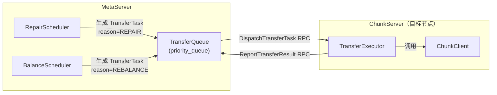
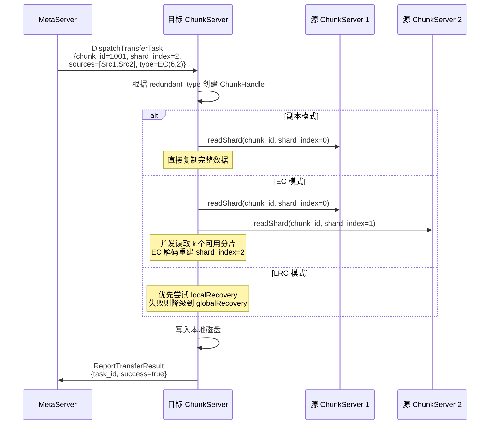
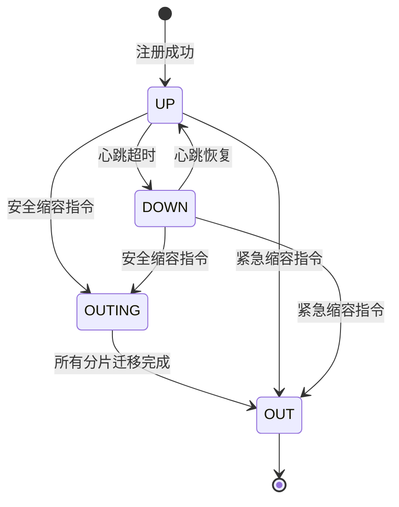
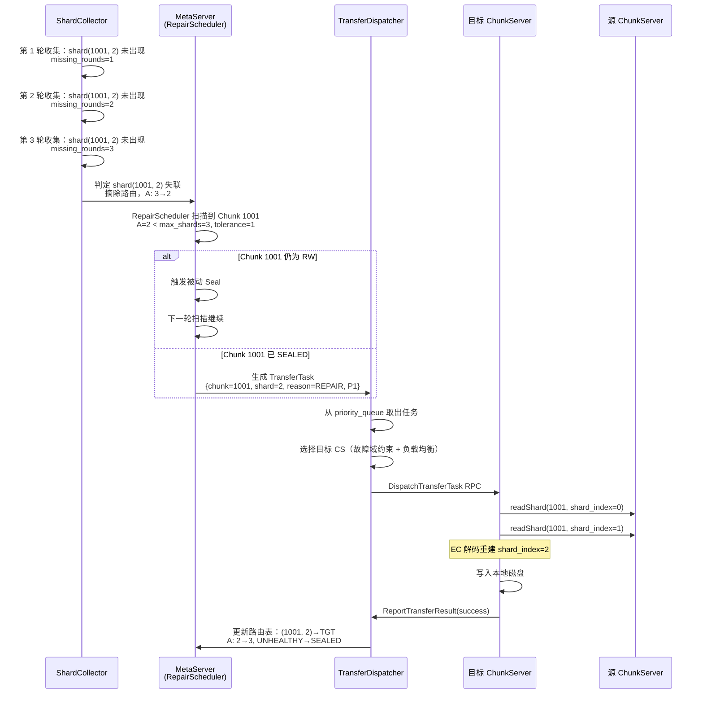
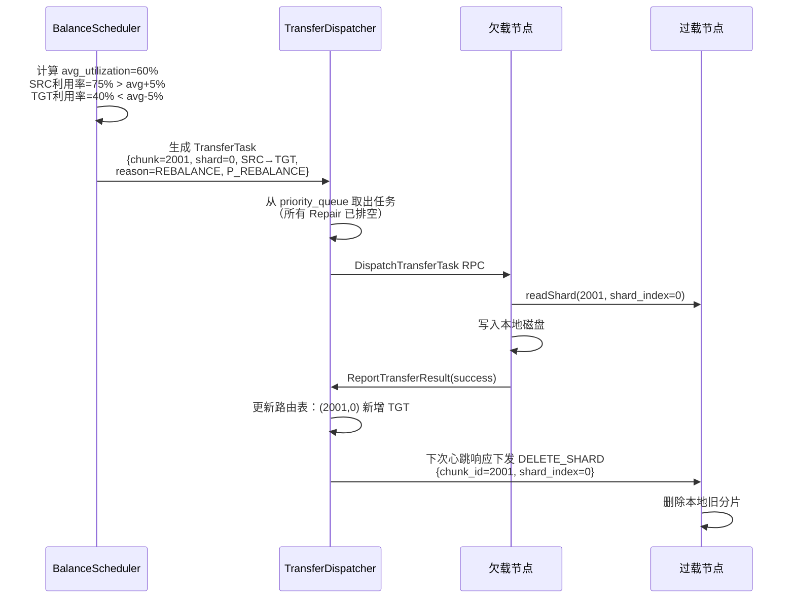

# Chunk 修复与均衡设计文档

本文档详细描述 MetaServer 中 Chunk 分片修复（Repair）和集群数据均衡（Rebalance）子系统的完整设计。两者统一抽象为 **Transfer** 概念，共享任务模型和执行通道，由 MetaServer 按优先级统一调度。

---

## 1. 概述与设计目标

### 1.1 修复（Repair）

当 Chunk 的可用分片数 `A` 低于 `max_shards` 时，数据冗余度下降。修复的目标是在健康节点上重建丢失的分片，将 `A` 恢复到 `max_shards`，保障数据安全。

### 1.2 均衡（Rebalance）

集群各节点的存储利用率随写入和删除持续变化。均衡的目标是将 Sealed Chunk 的分片在节点间迁移，使所有节点的利用率趋近集群平均水位，避免局部热点或磁盘耗尽。

### 1.3 优先级关系

**修复的优先级严格高于均衡**。修复保障数据不丢失，均衡优化资源分布。两者在同一个 `priority_queue` 中统一调度，所有 Repair 类任务排在 Rebalance 类任务之前。

### 1.4 统一抽象：Transfer

修复和均衡在 ChunkServer 侧的执行逻辑相同——从源节点读取分片数据，在本地重建并写入磁盘。因此两者复用同一任务结构 `TransferTask`，ChunkServer 不区分任务来源，统一调用 ChunkClient 完成数据搬迁。

---

## 2. 分片收集协议

### 2.1 设计决策：与心跳解耦

分片信息收集作为独立协议运行，不复用 ChunkServer 的探活心跳。

| 维度 | 心跳 | 分片收集 |
|---|---|---|
| **目的** | 节点存活探测 + 指标上报 | 构建/维护分片路由表，驱动失联检测 |
| **数据量** | 轻量（节点级指标） | 重量（单节点可能持有数万分片） |
| **周期** | 3s | 5~10min（默认 5min） |
| **及时性要求** | 高（影响前台流量切换） | 中（分钟级延迟可接受） |

混入心跳会导致：心跳包体膨胀、序列化/反序列化延迟增大、探活及时性下降。

### 2.2 CollectShards RPC 协议

MetaServer 新增 **ShardCollector** 后台线程，周期性向所有 UP 状态的 ChunkServer 发起 `CollectShards` RPC，主动拉取分片信息。

```protobuf
message CollectShardsRequest {
    string cs_id = 1;
    uint64 marker_chunk_id = 2;  // 分页游标：从该 chunk_id（不含）开始返回，0 表示从头开始
    uint32 page_size = 3;        // 单页最大返回分片数（默认 10000）
}

message ShardInfo {
    uint64 chunk_id = 1;
    uint32 shard_index = 2;
    uint64 shard_size = 3;
    bool is_sealed = 4;
    bool is_corrupted = 5;
    string disk_id = 6;
}

message CollectShardsResponse {
    bool success = 1;
    repeated ShardInfo shards = 2;
    bool has_more = 3;           // 是否还有后续页
    uint64 next_marker = 4;      // 下一页的起始 chunk_id
}
```

### 2.3 分页拉取机制

ChunkServer 按 `chunk_id` 有序维护分片元数据（RocksDB 的 key 天然有序）。分页流程：

```
MetaServer                              ChunkServer
    │                                       │
    │  CollectShardsRequest                 │
    │  { marker=0, page_size=10000 }        │
    │ ────────────────────────────────────► │
    │                                       │  从 chunk_id=0 开始顺序扫描
    │  CollectShardsResponse                │  返回前 10000 条
    │  { shards=[...], has_more=true,       │
    │    next_marker=50231 }                │
    │ ◄──────────────────────────────────── │
    │                                       │
    │  CollectShardsRequest                 │
    │  { marker=50231, page_size=10000 }    │
    │ ────────────────────────────────────► │
    │                                       │  从 chunk_id>50231 继续扫描
    │  CollectShardsResponse                │
    │  { shards=[...], has_more=false }     │
    │ ◄──────────────────────────────────── │
    │                                       │
    │  本轮该节点收集完毕                      │
```

### 2.4 全量收集策略

**每轮收集都是全量拉取**，不做增量。原因：

1. **失联检测依赖全量**：三轮确认机制需要判断"某分片在本轮未出现"，只有全量才能准确判断
2. **实现简单，状态无歧义**：无需维护增量基线、无需处理增量丢失或乱序问题
3. **分钟级周期可接受**：5min 周期下，全量拉取的网络和 CPU 开销在可控范围内

### 2.5 收集流程

```
ShardCollector 后台线程（每 shard_collect_interval 执行一轮）:
  │
  ├── 1. 获取所有 UP 状态的 ChunkServer 列表
  │
  ├── 2. 并发向各 ChunkServer 发起 CollectShards RPC（分页拉取）
  │      每个 CS 独立完成全量收集
  │
  ├── 3. 汇总本轮收集结果
  │      对每个 (chunk_id, shard_index, cs_id) 三元组：
  │      ├── 本轮出现 → missing_counter 清零
  │      └── 本轮未出现 → missing_counter += 1
  │
  ├── 4. 更新内存路由表
  │      根据收集结果刷新 ChunkRoutingInfo
  │
  └── 5. 触发失联检测（见第 3 节）
```

---

## 3. 分片失联检测机制

### 3.1 三轮确认机制

MetaServer 为每个已知的 `(chunk_id, shard_index, cs_id)` 三元组维护一个 `ShardLiveness` 结构：

```cpp
struct ShardLiveness {
    uint64_t chunk_id;
    uint32_t shard_index;
    std::string cs_id;

    uint32_t missing_rounds = 0;    // 连续未出现的收集轮次
    int64_t last_seen_time = 0;     // 最后一次出现的时间戳 (us)
};
```

判定逻辑：

```
每轮分片收集完成后，扫描所有 ShardLiveness:
  │
  ├── missing_rounds < 3
  │   → 暂不处理，继续观察
  │
  └── missing_rounds >= 3
      → 判定该分片失联
      → 从路由表中摘除该 (chunk_id, shard_index) → cs_id 的映射
      → 重新计算该 Chunk 的可用分片数 A
      → 根据 A 更新 Chunk 状态（SEALED → UNHEALTHY，或 UNHEALTHY → DATALOST）
      → 如果 A < max_shards，生成修复任务（见第 6 节）
```

**为什么是 3 轮**：以默认 `shard_collect_interval = 5min` 计算，3 轮确认约 15 分钟。这个时间窗口能过滤掉绝大多数网络抖动和 ChunkServer 短暂 GC 暂停（通常秒级恢复），同时保证在真正丢失时及时触发修复。

### 3.2 与节点 DOWN 状态的解耦

节点 DOWN 的判定阈值较低（心跳超时数秒），主要目的是快速切走前台读写流量，**不代表数据永久丢失**。常见场景：

- 网络抖动导致数秒心跳丢失 → 节点标记 DOWN → 网络恢复 → 节点回到 UP
- ChunkServer 进程重启 → 短暂 DOWN → 重新注册 → UP

如果 DOWN 立即触发修复，会导致大量不必要的数据搬迁（修复完成前节点可能已恢复）。因此：

- **DOWN 状态**：仅影响前台流量路由，不触发修复
- **修复决策**：完全基于分片收集的三轮确认结果，独立于节点状态

当节点长时间 DOWN 时，其上的分片自然会在分片收集中持续缺失（DOWN 节点上的 `CollectShards` RPC 会超时或失败），最终触发三轮确认 → 修复。

### 3.3 分片恢复（重新出现）

如果一个分片在 `missing_rounds < 3` 时重新出现（例如节点从 DOWN 恢复），计数器清零，不触发任何修复动作。这避免了"刚开始修复、原节点又恢复"的资源浪费。

---

## 4. Seal 约束

修复和均衡都要求目标 Chunk 处于 SEALED 状态（参考 `metaserver_design.md` 4.4.4 节）。原因：

1. 修复需要读取源分片数据重建目标分片，RW 状态下源分片仍在被写入，读取到的数据可能不完整
2. 修复后的分片长度必须与源分片一致，只有 Sealed 后长度才确定
3. EC 编解码要求所有数据分片长度一致

### 4.1 修复与均衡的差异化处理

遇到未 Seal 的 Chunk 时，修复和均衡的处理策略不同：

| 场景 | 修复（Repair） | 均衡（Rebalance） |
|---|---|---|
| Chunk 已 SEALED | 正常生成 TransferTask | 正常生成 TransferTask |
| Chunk 未 SEALED（RW） | 主动触发被动定长 Seal，本轮不生成任务；下一轮扫描时 Chunk 已 Sealed，再触发修复 | 直接跳过，选择其他已 Sealed 的 Chunk |

**修复不跳过**：数据安全是硬约束，即使需要额外一轮等待 Seal 完成，也必须确保修复最终执行。

**均衡跳过**：均衡是优化行为，未 Seal 的 Chunk 仍在写入中，搬迁没有意义（写入完成后分片数据还会变化）。集群中有大量已 Sealed 的 Chunk 可供选择。

### 4.2 修复触发 Seal 的流程

```
RepairScheduler 扫描到 Chunk 需要修复:
  │
  ├── Chunk.status == SEALED 或 UNHEALTHY
  │   → 直接生成 TransferTask，进入队列
  │
  └── Chunk.status == RW
      → 发起被动定长请求（写入 OP_SEAL_CHUNK 到 Raft）
      → 通过心跳下发 SEAL_SHARD 指令到各 ChunkServer
      → 本轮不生成修复任务
      → 下一轮 RepairScheduler 扫描时：
         Chunk.status 已变为 SEALED → 正常生成 TransferTask
```

---

## 5. 修复优先级模型

### 5.1 核心指标：剩余容忍度（Remaining Tolerance）

优先级的核心依据是 **还能再承受几个分片丢失**：

```
tolerance = A - min_shards
```

- `A`：当前可用分片数
- `min_shards`：该编码模式下能恢复数据的最少分片数
  - 副本模式：`min_shards = 1`
  - EC(k,m)：`min_shards = k`（至少需要 k 个分片才能 EC 解码）
  - LRC：`min_shards = data_shards`

`tolerance` 直接映射为优先级等级（数值越小越优先）：

| tolerance | 优先级 | 含义 |
|---|---|---|
| 0 | **P0**（最高） | 再丢一个分片即 DataLost，不可恢复 |
| 1 | **P1** | 距离不可恢复还差 1 个分片 |
| 2 | **P2** | 距离不可恢复还差 2 个分片 |
| ... | ... | ... |

### 5.2 场景举例

| 编码模式 | max_shards | min_shards | 丢失分片数 | A | tolerance | 优先级 |
|---|---|---|---|---|---|---|
| 3 副本 | 3 | 1 | 2 | 1 | **0** | **P0** |
| EC(6,2) | 8 | 6 | 2 | 6 | **0** | **P0** |
| EC(6,2) | 8 | 6 | 1 | 7 | **1** | **P1** |
| 3 副本 | 3 | 1 | 1 | 2 | **1** | **P1** |
| 5 副本 | 5 | 1 | 1 | 4 | **3** | **P3** |
| EC(6,3) | 9 | 6 | 1 | 8 | **2** | **P2** |
| LRC(4,2,2) | 8 | 4 | 2 | 6 | **2** | **P2** |

### 5.3 附加因子（同 tolerance 下的子排序）

当多个 Chunk 的 `tolerance` 相同时，使用附加因子决定子优先级（数值越小越优先）：

```
SubPriority(chunk) =
    S_access(is_accessed)         // 访问热度
  + S_age(time_since_loss)        // 丢失持续时间

其中:
  S_access:
    最近 5 分钟内有 Client 读/写该 Chunk → S_access = -20
    否则 → S_access = 0

  S_age:
    S_age = -min(minutes_since_loss, 60)
    丢失时间越长，sub_priority 越小（越优先）
```

### 5.4 Rebalance 任务的优先级

所有 Rebalance 任务的优先级固定为 `P_REBALANCE`，其值大于任何 Repair 的优先级。保证在 `priority_queue` 中，所有 Repair 任务排空后才会调度 Rebalance 任务。

```
优先级排序（数值越小越优先）:
  P0 (Repair, tolerance=0) < P1 < P2 < ... < P_REBALANCE
```

---

## 6. 统一任务模型：TransferTask

### 6.1 数据结构

```cpp
enum class TransferReason {
    REPAIR = 0,      // 修复：重建丢失的分片
    REBALANCE = 1    // 均衡：迁移分片以平衡水位
};

enum class TransferStatus {
    PENDING = 0,     // 等待调度
    DISPATCHED = 1,  // 已下发到 ChunkServer
    RUNNING = 2,     // ChunkServer 正在执行
    DONE = 3,        // 执行成功
    FAILED = 4       // 执行失败
};

struct TransferTask {
    uint64_t task_id;                        // 全局唯一任务 ID
    uint64_t chunk_id;                       // 目标 Chunk
    uint32_t shard_index;                    // 需要重建/迁移的分片序号

    std::string target_cs;                   // 目标 ChunkServer（新分片写入的位置）
    std::vector<std::string> source_cs_list; // 可用的源 ChunkServer（提供读取数据）
    RedundantType redundant_type;            // 编码参数（Replica/EC/LRC）
    uint64_t chunk_size;                     // Chunk 的 Sealed 大小

    TransferReason reason;                   // 任务来源：REPAIR 或 REBALANCE
    int priority;                            // 调度优先级（数值越小越优先）
    int64_t create_time;                     // 任务创建时间
    TransferStatus status;                   // 任务状态
};
```

### 6.2 MetaServer 与 ChunkServer 的职责分工



- **MetaServer**：区分 Repair/Rebalance 来源，计算优先级，统一入队调度
- **ChunkServer**：不区分 Repair 和 Rebalance，收到 `TransferTask` 后统一调用 ChunkClient 完成数据搬迁

---

## 7. Transfer 任务调度与执行

### 7.1 RPC 接口

任务下发和结果上报使用独立的 RPC 接口，不复用心跳通道：

```protobuf
// MetaServer → ChunkServer：下发 Transfer 任务
message DispatchTransferTaskRequest {
    uint64 task_id = 1;
    uint64 chunk_id = 2;
    uint32 shard_index = 3;
    repeated string source_cs_list = 4;     // 源 ChunkServer 地址列表
    RedundantType redundant_type = 5;       // 编码参数
    uint64 chunk_size = 6;                  // Sealed 后的 Chunk 大小
}

message DispatchTransferTaskResponse {
    bool accepted = 1;                      // 是否接受（ChunkServer 可因负载过高拒绝）
    string reject_reason = 2;
}

// ChunkServer → MetaServer：上报 Transfer 结果
message ReportTransferResultRequest {
    uint64 task_id = 1;
    uint64 chunk_id = 2;
    uint32 shard_index = 3;
    bool success = 4;
    string error_message = 5;               // 失败时的错误信息
    uint64 shard_size = 6;                  // 成功时新分片的大小
}

message ReportTransferResultResponse {
    bool success = 1;
}
```

**为什么不复用心跳下发**：

1. 任务携带完整的源分片列表、编码参数等信息，数据量较大
2. 修复任务需要即时下发，不应等待下一次心跳周期（3s 延迟 vs 即时）
3. 职责分离：心跳保持轻量，Transfer 通道独立演进

### 7.2 调度流程（MetaServer 侧）

```
TransferScheduler 线程（持续运行）:
  │
  ├── 1. 从 priority_queue 取出最高优先级的 TransferTask
  │
  ├── 2. 并发控制检查
  │      ├── 集群级：当前 DISPATCHED + RUNNING 的任务数 < max_cluster_transfers
  │      ├── 目标 CS 级：该 CS 当前任务数 < max_cs_transfers
  │      └── 不满足 → 等待，稍后重试
  │
  ├── 3. 选择目标 ChunkServer（如果尚未指定）
  │      ├── 从 UP 状态节点中筛选候选集
  │      ├── 排除：已持有该 Chunk 其他分片的节点（故障域约束）
  │      ├── 排除：磁盘利用率 > 95% 的节点
  │      ├── 排除：当前 Transfer 任务数已达上限的节点
  │      └── 在候选集中加权随机选择（权重考虑剩余空间和负载）
  │
  ├── 4. 发送 DispatchTransferTask RPC 到目标 CS
  │      ├── 接受 → task.status = DISPATCHED
  │      └── 拒绝 → 重新选择目标 CS 或延迟重试
  │
  └── 5. 等待 ReportTransferResult
         ├── 成功 → 更新路由表和 Chunk 状态（见 7.4）
         ├── 失败 → task.status = FAILED，稍后重试（重新入队或选择新目标）
         └── 超时 → 标记失败，重试
```

### 7.3 执行流程（ChunkServer 侧）

目标 ChunkServer 收到 `DispatchTransferTask` 后，统一调用 ChunkClient 完成数据搬迁：



ChunkClient 的编码恢复逻辑根据 `redundant_type.encode_type` 分派：

| 编码类型 | 恢复方式 | 需要的源分片数 |
|---|---|---|
| Replica | 从任一副本直接复制 | 1 |
| EC(k,m) | 读取任意 k 个可用分片，EC 解码重建目标分片 | k |
| LRC | 优先用 local shard + 同组分片局部恢复；不足时全局 EC 解码 | 局部: 组内分片数; 全局: k |

### 7.4 任务完成后的路由更新

```
MetaServer 收到 ReportTransferResult(success=true):
  │
  ├── 1. 更新路由表
  │      将 (chunk_id, shard_index) → target_cs 加入 ChunkRoutingInfo
  │
  ├── 2. 重新计算可用分片数 A
  │
  ├── 3. 更新 Chunk 状态
  │      ├── A == max_shards → UNHEALTHY → SEALED（修复完成）
  │      └── A < max_shards → 保持 UNHEALTHY，等待其他分片修复
  │
  ├── 4. 对于 Rebalance 任务
  │      迁移成功后，还需从源节点删除旧分片：
  │      在下次心跳响应中向源 CS 下发 DELETE_SHARD 命令
  │
  └── 5. 写入 Raft Log（持久化 Chunk 状态变更）
```

**修复 vs 均衡的完成处理差异**：

- **修复**：目标节点新增分片，路由表增加一条映射，`A` 增加
- **均衡**：分片从源节点搬到目标节点，路由表先增后删，`A` 不变

### 7.5 并发控制

| 参数 | 默认值 | 说明 |
|---|---|---|
| `max_cluster_transfers` | 200 | 集群级别最大并发 Transfer 任务数 |
| `max_cs_transfers` | 5 | 单个 ChunkServer 作为源或目标的最大并发数 |
| `transfer_bandwidth_limit` | 50 MB/s | 单个 Transfer 任务的带宽上限 |
| `transfer_timeout` | 30min | 单个任务的超时时间 |
| `max_retry_count` | 3 | 任务失败后的最大重试次数 |

**限速设计理由**（参考 GFS Section 4.3）：Transfer 流量必须与前台业务流量隔离，不限制的后台流量会增加正常读写延迟、占用网络带宽、增加 EC 解码的 CPU 负载。

---

## 8. 均衡（Rebalance）策略

### 8.1 水位模型

以集群平均存储利用率为基准，上下浮动 `balance_threshold`（默认 5%）定义死区：

```
avg_utilization = sum(used_i) / sum(capacity_i)    对所有 UP 状态节点

对每个节点 i:
  ├── utilization_i > avg + balance_threshold  → 过载节点（搬出源）
  ├── utilization_i < avg - balance_threshold  → 欠载节点（搬入目标）
  └── 其余                                      → 正常节点（不参与均衡）
```

```
                    ┌──────── 过载区（搬出） ────────┐
                    │                               │
  ──────────────────┤ avg + 5% ─────────────────────┤───────────
                    │                               │
                    │         死区（不参与）          │
                    │                               │
  ──────────────────┤ avg - 5% ─────────────────────┤───────────
                    │                               │
                    └──────── 欠载区（搬入） ────────┘
```

### 8.2 均衡迭代流程

```
BalanceScheduler 线程（每 balance_interval 执行一轮，或事件触发）:
  │
  ├── 1. 检查前置条件
  │      ├── 当前无 Repair 任务在队列中（或 Repair 任务数低于阈值）
  │      └── 不满足 → 跳过本轮，等待下一轮
  │
  ├── 2. 计算集群平均利用率 avg_utilization
  │
  ├── 3. 分类节点
  │      ├── 过载节点列表 over_utilized[]
  │      ├── 欠载节点列表 under_utilized[]
  │      └── 正常节点（跳过）
  │
  ├── 4. 生成迁移计划
  │      for each 过载节点 src:
  │        target_usage = avg_utilization × capacity_src
  │        bytes_to_move = used_src - target_usage
  │        for each Sealed Chunk on src:
  │          ├── Chunk.status != SEALED → 跳过（不迁移 RW 和 UNHEALTHY Chunk）
  │          ├── 从 under_utilized 中选择目标 dst
  │          │   （满足故障域约束 + dst 容量充足）
  │          ├── 生成 TransferTask:
  │          │   { chunk_id, shard_index, src→dst,
  │          │     reason=REBALANCE, priority=P_REBALANCE }
  │          ├── bytes_to_move -= chunk_size
  │          └── if bytes_to_move <= 0: break
  │
  ├── 5. 将迁移任务批量入队 TransferQueue
  │      （优先级 = P_REBALANCE，排在所有 Repair 之后）
  │
  └── 6. 迭代终止条件
         ├── 所有节点利用率在 [avg - threshold, avg + threshold] 范围内
         ├── 达到单轮最大迁移任务数
         └── 或没有可迁移的 Sealed Chunk
```

### 8.3 均衡触发条件

| 触发方式 | 说明 |
|---|---|
| **定时触发** | 每 `balance_interval`（默认 1 小时）执行一次 |
| **事件触发** | 新节点上线时触发（逐步填充新节点） |
| **手动触发** | 运维通过 `TriggerRebalance` 管理接口手动触发 |

### 8.4 前后台流量隔离

参考 Pangu 的前后台流量隔离设计：

- 白天业务高峰期：降低 `transfer_bandwidth_limit`
- 夜间低峰期：提高迁移带宽，加速均衡
- 可配置动态调整策略，根据实时前台流量指标自动调节

---

## 9. 扩缩容与 Rebalance 的结合

### 9.1 节点状态机



| 状态 | 含义 | 前台流量 | 作为 Transfer 数据源 | 参与分片收集 |
|---|---|---|---|---|
| **UP** | 正常服务 | 可读可写 | 是 | 是 |
| **DOWN** | 心跳超时，切走流量 | 不可读写 | 否 | 是（会超时，分片 missing_rounds 递增） |
| **OUTING** | 安全缩容中 | 不分配新 Chunk | 是（作为源读取） | 是 |
| **OUT** | 已下线 | 不可用 | 否 | 否 |

### 9.2 扩容

新节点注册后标记为 UP，存储利用率为 0，远低于集群平均水位，自动成为 Rebalance 的搬入目标。

```
新节点上线:
  → Register → 标记 UP
  → 利用率 0% << avg - 5%
  → BalanceScheduler 在下一轮迭代中将其纳入 under_utilized 列表
  → 从过载节点迁移 Sealed Chunk 到新节点
  → 随着迁移进行，新节点利用率逐步趋近 avg
```

无需专门的"扩容任务"，Rebalance 机制自然完成数据填充。

### 9.3 安全缩容

运维标记节点为 OUTING 后，MetaServer 将该节点上的所有分片生成 Rebalance 类型的 TransferTask，迁移到其他 UP 状态节点：

```
安全缩容流程:
  │
  ├── 1. 运维执行 DecommissionCS(cs_id)
  │      → MetaServer 标记节点状态为 OUTING
  │      → 停止向该节点分配新 Chunk
  │
  ├── 2. MetaServer 扫描 OUTING 节点上的所有分片
  │      for each (chunk_id, shard_index) on OUTING node:
  │        生成 TransferTask:
  │          { reason=REBALANCE, source=[OUTING_node],
  │            target=从 UP 节点中选择 }
  │
  ├── 3. 迁移任务进入 TransferQueue
  │      优先级 = P_REBALANCE（低于所有 Repair）
  │      OUTING 节点仍可作为 Transfer 数据源
  │
  ├── 4. 所有分片迁移完成
  │      → MetaServer 标记节点为 OUT
  │
  └── 5. 节点可安全关机
```

OUTING 期间，如果有 Repair 任务需要该节点上的数据作为源，仍可正常读取（节点还在运行）。

### 9.4 紧急缩容

直接标记节点为 OUT，跳过分片迁移。适用于硬件故障需立即下线的场景：

- 节点立即变为不可用
- 其上的分片等同于直接丢失
- 由分片收集的三轮确认机制检测到失联
- 触发 Repair 逻辑恢复数据冗余

**风险**：如果该节点上存在某些 Chunk 的最后 `min_shards` 个分片之一，紧急缩容可能导致数据不可恢复（DataLost）。运维应在紧急缩容前评估数据风险。

---

## 10. 后台线程模型

修复和均衡涉及的后台线程与现有 MetaServer 线程模型集成：

```
MetaServer 线程模型（扩展）
──────────────────────────

[前台线程]
├── RPC Server 线程池 (处理 Client/CS 的 RPC 请求)
├── Raft 线程 (braft 内部: Leader 选举、日志复制、Apply)
│
[后台线程 - 已有]
├── HeartbeatChecker 线程
│   └── 周期检查所有 CS 心跳时间戳，识别 DOWN 节点
├── PassiveSealScanner 线程
│   └── 扫描长时间 RW 的 Chunk，触发被动定长
├── GCScanner 线程
│   └── 扫描 /.trash/，清理过期的逻辑删除文件
├── SnapshotWorker 线程
│   └── 执行 RocksDB Checkpoint
│
[后台线程 - 新增]
├── ShardCollector 线程
│   └── 周期性全量收集所有 UP 节点的分片信息（CollectShards RPC）
│       更新路由表，驱动失联检测
│
├── RepairScheduler 线程
│   └── 扫描 UNHEALTHY/DATALOST Chunk
│       处理 Seal 约束（未 Seal 则触发定长）
│       生成 TransferTask（reason=REPAIR），按 tolerance 设置优先级
│       入队 TransferQueue
│
├── BalanceScheduler 线程
│   └── 定期评估节点利用率，识别过载/欠载节点
│       生成 TransferTask（reason=REBALANCE），优先级 = P_REBALANCE
│       入队 TransferQueue
│
└── TransferDispatcher 线程
    └── 从 TransferQueue（priority_queue）取任务
        执行并发控制检查
        发送 DispatchTransferTask RPC
        接收 ReportTransferResult，更新路由表和 Chunk 状态
```

---

## 11. 完整流程：从失联到恢复

### 11.1 修复全链路流程



### 11.2 均衡全链路流程



---

## 12. 配置参数汇总

| 参数 | 默认值 | 说明 |
|---|---|---|
| `shard_collect_interval` | 5min | 分片收集周期 |
| `collect_page_size` | 10000 | 单次 CollectShards 的分页大小 |
| `collect_timeout` | 60s | 单次 CollectShards RPC 超时 |
| `missing_rounds_threshold` | 3 | 连续未出现轮次阈值，达到后判定失联 |
| `max_cluster_transfers` | 200 | 集群最大并发 Transfer 任务数 |
| `max_cs_transfers` | 5 | 单 CS 最大并发 Transfer 数（含源和目标） |
| `transfer_bandwidth_limit` | 50 MB/s | 单个 Transfer 任务带宽上限 |
| `transfer_timeout` | 30min | 单个 Transfer 任务超时 |
| `max_retry_count` | 3 | Transfer 失败最大重试次数 |
| `balance_threshold` | 5% | 均衡死区阈值（偏离 avg 的百分比） |
| `balance_interval` | 1h | 均衡扫描周期 |
| `balance_max_tasks_per_round` | 100 | 单轮均衡最大生成任务数 |

---

## 13. 异常处理

### 13.1 Transfer 任务失败

| 失败场景 | 处理方式 |
|---|---|
| 目标 CS 拒绝（负载过高） | 重新选择目标 CS，重试 |
| 源 CS 不可达 | 从 source_cs_list 中移除该源，选择其他源；若可用源不足，延迟重试 |
| EC 解码失败（数据损坏） | 标记损坏分片，重新评估是否可修复；若 A < min_shards，标记 DATALOST |
| 目标 CS 磁盘写满 | 重新选择目标 CS |
| 任务超时 | 标记 FAILED，重新入队重试 |
| 重试次数耗尽 | 任务标记为永久失败，记录告警日志 |

### 13.2 MetaServer Leader 切换

Leader 切换后，内存中的 `TransferQueue` 和 `ShardLiveness` 信息丢失：

```
新 Leader 恢复流程:
  │
  ├── 1. Raft Log 重放 → 恢复 RocksDB 中的 ChunkMeta（含状态）
  │
  ├── 2. ShardCollector 立即触发一轮全量收集
  │      → 重建内存路由表和 ShardLiveness
  │      → 首轮收集后 missing_rounds 从 0 开始计数
  │
  ├── 3. RepairScheduler 扫描 UNHEALTHY/DATALOST Chunk
  │      → 重新生成 TransferTask
  │
  └── 4. 正在执行的 Transfer 任务
         ├── ChunkServer 侧继续执行（不依赖 MetaServer 在线）
         ├── 完成后 ReportTransferResult 到新 Leader
         └── 新 Leader 如果不认识该 task_id，忽略并等待下一轮扫描重新调度
```

### 13.3 分片收集超时

单个 ChunkServer 的 `CollectShards` RPC 超时时：

- 该节点本轮视为"收集失败"，其上所有分片的 `missing_rounds` 递增
- 如果连续 3 轮超时，效果等同于分片失联，触发修复
- 这与节点真正宕机的行为一致，确保了修复逻辑的正确性
