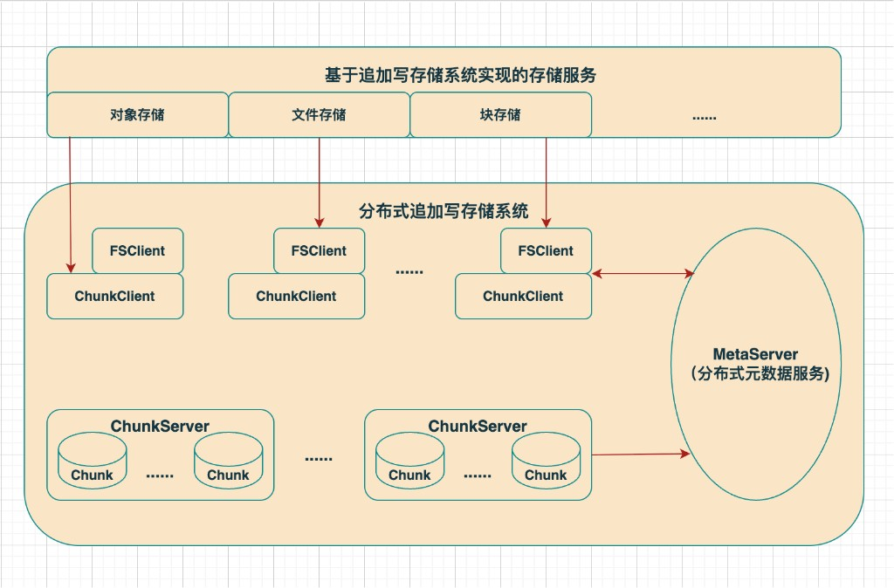

# 分布式追加写存储系统设计文档

## 1. 背景与设计目标

### 1.1 为什么选择追加写

在分布式存储系统中，追加写（Append-Only）和覆盖写（Overwrite）是两种截然不同的数据写入范式。追加写存储系统具有以下优势：

- **数据一致性协议实现简单**：追加写的写入位置由系统确定且单调递增，不存在同一位置多个写入的冲突问题，大幅简化了多副本/EC 编码下的一致性管理
- **存储成本更低**：天然支持 EC（Erasure Coding）和 LRC（Local Reconstruction Code）等高级编码，以 1.375x 甚至更低的存储成本实现等价于 3 副本的容错能力
- **对 SSD 友好**：顺序追加写入完全匹配 SSD 的写入特性，可获得高吞吐和低延迟，同时延长 SSD 使用寿命
- **多版本和快照实现简单**：数据不被原地覆盖，天然支持历史版本保留

追加写存储系统的主要代价包括：集群网络带宽放大（GC 回收无效数据产生额外 I/O）、读取路径相对复杂（需要维护用户逻辑空间到存储物理空间的映射）。但随着网络带宽不断增长、大内存的普及以及 SSD 自身也存在内部 GC 的现实，追加写已经成为现代分布式存储系统的主流选择。

### 1.2 设计目标

本系统参考 GFS（SOSP 2003）和 Pangu（FAST 2023）的设计思想，构建一个面向大规模数据处理的分布式追加写存储系统，核心目标如下：

1. **追加写语义**：所有数据写入均为顺序追加，不支持随机覆盖
2. **强一致性**：同一 Chunk 的所有副本/分片在相同 offset 处数据完全一致
3. **高可用**：通过多副本/EC 编码、故障检测与自动修复，实现 7×24 不间断服务
4. **低延迟**：面向 SSD 和 RDMA 网络优化，追求 100μs 级别 I/O 延迟
5. **高吞吐**：充分利用存储介质和网络带宽，支持大规模并发读写
6. **可扩展**：支持 PB 级存储容量，万亿级文件数量

### 1.3 核心设计原则

| 原则 | 说明 |
|------|------|
| 单写者（Single Writer） | 每个 Chunk 在任意时刻只允许一个 Client 写入，简化并发控制 |
| 数据与控制分离 | Client 与 MetaServer 交互获取元数据，数据读写直接与 ChunkServer 通信 |
| 重客户端（Heavyweight Client） | Client 承担副本/EC 编解码、一致性写入、故障重试等核心逻辑 |
| 自包含 Chunk | Chunk 的数据和元数据存储在同一物理单元中，一次 I/O 完成写入 |
| 统一追加写持久层 | 所有上层服务共享同一个 FlatLogFile 追加写接口，简化系统架构 |

---

## 2. 系统架构

### 2.1 架构总览

系统由三大组件构成：



### 2.2 组件职责

| 组件 | 职责 |
|------|------|
| **MetaServer** | 维护全局元数据，包括 Chunk 路由信息（Chunk 分片位置、状态）和文件到 Chunk 的映射信息（目录树、命名空间）；管理 Chunk 生命周期；调度副本放置与修复任务 |
| **ChunkServer** | 存储 Chunk 数据分片；执行追加写入和读取；维护本地数据完整性（CRC 校验）；执行分片修复；向 MetaServer 周期性上报心跳 |
| **Client** | 分为 ChunkClient 和 FileClient 两层。ChunkClient 负责单个 Chunk 的多分片读写、EC 编解码、一致性保证；FileClient 在 ChunkClient 之上提供文件语义，管理文件到 Chunk 序列的映射 |

### 2.3 数据流与控制流分离

参考 GFS 的核心设计，系统将控制流（元数据操作）与数据流（读写操作）严格分离：

```
                    ① 请求 Chunk 位置信息
    Client ──────────────────────────────► MetaServer
       │   ◄──────────────────────────────
       │          ② 返回 Chunk 路由
       │
       │  ③ 直接读写数据（不经过 MetaServer）
       │
       ├──────────────────────► ChunkServer 1
       ├──────────────────────► ChunkServer 2
       └──────────────────────► ChunkServer 3
```

- Client 向 MetaServer 请求 Chunk 的路由信息（分片分布在哪些 ChunkServer 上）
- Client 缓存路由信息，后续读写直接与 ChunkServer 通信
- 当缓存失效（ChunkServer 报告元数据过期、副本迁移等）时，Client 重新向 MetaServer 请求最新路由

---

## 3. 核心概念

### 3.1 Chunk

Chunk 是系统的基本数据存储单元。每个 Chunk 由 MetaServer 在创建时分配一个全局唯一的 64 位 ID（`chunk_id`），具有以下特征：

- **可变长度**：Chunk 大小范围从 1MB 到 2GB，大 Chunk 减少元数据量、降低 Client 与 MetaServer 的交互频次、延长 SSD 寿命
- **追加写语义**：Chunk 只支持从尾部追加写入数据，数据一旦写入不可修改
- **单写者**：每个 Chunk 在任意时刻只允许一个 Client 写入
- **多副本/EC 编码**：每个 Chunk 根据冗余策略分成多个分片（Shard），分布在不同的 ChunkServer 上

### 3.2 Chunk 生命周期

```
    CreateChunk()
        │
        ▼
   ┌──────────┐
   │  Created  │
   └─────┬─────┘
         │ 首次写入
         ▼
   ┌──────────┐
   │  Writing  │ ◄── 追加写入（单写者）
   └─────┬─────┘
         │
    ┌────┴──────────────┐
    │                   │
    ▼                   ▼
┌──────────┐     ┌───────────┐
│  Sealed  │     │ Corrupted │
└─────┬────┘     └─────┬─────┘
      │                │
      ▼                ▼
┌──────────┐     ┌───────────┐
│ Deleting │     │ Deleting  │
└─────┬────┘     └─────┬─────┘
      ▼                ▼
   (删除完成)        (删除完成)
```

| 状态 | 说明 |
|------|------|
| **Created** | 刚创建，元数据已分配，尚未写入数据 |
| **Writing** | 正在接受追加写入，此时 Chunk 属于某个特定的 Client |
| **Sealed** | 已封存，不再接受写入，变为只读状态 |
| **Corrupted** | 数据校验失败或 I/O 错误，需要修复 |
| **Deleting** | 正在删除（异步清理中） |

状态转换规则：

- **Created → Writing**：Client 首次向该 Chunk 发起写入
- **Writing → Sealed**：Client 主动封存（Chunk 写满、文件关闭、写入失败切换新 Chunk）
- **Writing → Corrupted**：CRC 校验失败或 I/O 错误
- **Sealed/Corrupted → Deleting**：MetaServer 下发删除指令（GC 回收）

### 3.3 Chunk 冗余编码

系统支持三种冗余编码策略：

| 编码类型 | 说明 | 存储开销 | 容错能力 |
|----------|------|----------|----------|
| **Replica（副本）** | 完整复制 N 份，通常 N=3 | 3x | 容忍任意 2 个分片丢失 |
| **EC（Erasure Coding）** | 如 EC(4,2)，4 个数据分片 + 2 个校验分片 | 1.5x | 容忍任意 2 个分片丢失 |
| **LRC（Local Reconstruction Code）** | EC 的改进，增加本地校验分片，加速单分片修复 | 略高于 EC | 容忍多分片丢失，单分片修复更快 |

在系统演进中，通常先使用 3 副本保证写入低延迟，Chunk 封存后由后台 GC Worker 将其转换为 EC 编码以降低存储成本（参考 Pangu 的实践）。

### 3.4 文件（File）

文件是 Client 对外提供的逻辑抽象，由一个有序的 Chunk 序列构成。文件到 Chunk 的映射关系由 MetaServer 的命名空间服务维护。

```
File "/data/log_20260322.dat"
  │
  ├── Chunk 0: chunk_id=1001, size=64MB, status=Sealed
  ├── Chunk 1: chunk_id=1002, size=64MB, status=Sealed
  ├── Chunk 2: chunk_id=1003, size=64MB, status=Sealed
  └── Chunk 3: chunk_id=1004, size=37MB, status=Writing  ◄── 当前写入点
```

---

## 4. MetaServer 设计

MetaServer 是系统的元数据管理中心，维护全局状态并协调各组件的工作。

### 4.1 两层元数据架构

MetaServer 的元数据分为两层独立的服务，便于水平扩展和灵活管理：

```
┌────────────────────────────────────────────────┐
│                   MetaServer                    │
│                                                │
│  ┌─────────────────────┐  ┌──────────────────┐ │
│  │  命名空间服务         │  │  Chunk 路由服务   │ │
│  │  (Namespace Service) │  │ (Chunk Service)  │ │
│  │                     │  │                  │ │
│  │  • 目录树管理        │  │  • ChunkInfo     │ │
│  │  • 文件→Chunk映射    │  │    (状态/长度/编码)│ │
│  │  • 权限与配额        │  │  • 分片路由信息   │ │
│  │                     │  │    (分片→CS映射)  │ │
│  └─────────────────────┘  │  • ChunkServer   │ │
│                           │    节点信息        │ │
│                           │  • 集群配置信息    │ │
│                           └──────────────────┘ │
└────────────────────────────────────────────────┘
```

**第一层：Chunk 路由服务**

管理 Chunk 级别的元数据，核心数据结构如下：

| 元数据类型 | 描述 |
|-----------|------|
| **ChunkInfo** | Chunk 的基本信息：chunk_id、状态（Writing/Sealed/Corrupted）、已写入长度、冗余编码类型、各分片所在 ChunkServer 列表 |
| **ChunkServerInfo** | ChunkServer 节点信息：节点 ID、IP、端口、健康状态、磁盘容量/用量、负载指标 |
| **ConfigInfo** | 集群配置信息：默认副本数、EC 参数、Chunk 大小上限等 |

**第二层：命名空间服务**

管理文件级别的元数据：

| 元数据类型 | 描述 |
|-----------|------|
| **文件目录树** | 层级化的目录/文件命名空间，使用全路径名到元数据的映射表（参考 GFS 的 Lookup Table 设计） |
| **文件→Chunk映射** | 每个文件对应的有序 Chunk 序列，记录文件内每个 Chunk 的 chunk_id 和在文件中的逻辑偏移范围 |
| **文件属性** | 创建时间、修改时间、文件大小、所有者、权限等 |

两层服务的分离参考 Pangu 的设计经验。命名空间服务和 Chunk 路由服务先按目录树分区实现元数据局部性，再通过哈希进一步分区实现负载均衡，从而支持百亿级文件规模。

### 4.2 元数据一致性

MetaServer 采用 Raft 协议保证元数据的强一致性：

- **单组 Raft**：适用于中等规模集群。元数据规模受单机处理能力限制，但跨操作的原子性实现简单。通过限制单个 Chunk 最小容量（如 512MB），可支持单集群 PB 级存储
- **多组 Raft**：适用于超大规模集群。元数据不受单机限制，但跨 Raft 组的原子性需要分布式事务支持

MetaServer 通过 Operation Log（操作日志）持久化元数据变更，定期生成 Checkpoint 加速故障恢复。参考 GFS 的设计，Operation Log 在本地和远端机器上同步刷盘后才向 Client 确认操作完成。

### 4.3 Chunk 位置信息管理

参考 GFS 的设计，MetaServer **不持久化** Chunk 分片的位置信息，而是：

1. MetaServer 启动时，通过向所有 ChunkServer 轮询来重建 Chunk 分片位置信息
2. 运行期间，ChunkServer 周期性通过心跳上报自身持有的 Chunk 列表
3. MetaServer 通过心跳检测 ChunkServer 健康状态，超过若干轮未收到心跳即认为节点失联

这种设计消除了 MetaServer 与 ChunkServer 之间位置信息的同步难题——ChunkServer 对自己磁盘上有哪些 Chunk 拥有最终决定权。

### 4.4 数据放置策略

MetaServer 在创建 Chunk 时，根据以下因素选择分片的放置位置：

1. **故障域隔离**：根据配置的故障阈值（Host / Rack / AZ 级别），将同一 Chunk 的不同分片放置在不同的故障域中，确保单个故障域失效不会丢失数据
2. **磁盘空间均衡**：优先选择磁盘利用率低于平均水平的 ChunkServer
3. **负载均衡**：限制单个 ChunkServer 上的"近期创建"数量，因为新创建的 Chunk 预示着即将到来的密集写入流量
4. **网络拓扑感知**：综合考虑机架间带宽，平衡数据可靠性与写入性能

### 4.5 Chunk 分片保活与修复

MetaServer 周期性收集 ChunkServer 上的 Chunk 分片信息。当发现某个 Chunk 的可用分片数低于冗余策略要求时，立即发起修复：

1. MetaServer 选择一个目标 ChunkServer 作为修复执行者
2. 目标 ChunkServer 复用 ChunkClient 的读取逻辑，从其他健康分片读取数据
3. 通过 EC/Replica 的解码逻辑恢复丢失分片的数据
4. 将恢复的数据写入目标 ChunkServer 的本地磁盘

修复任务按优先级排序：丢失分片越多的 Chunk 优先修复；正在被 Client 访问的 Chunk 优先修复。同时限制集群和单节点的并发修复数量，避免修复流量影响正常业务。

### 4.6 垃圾回收

参考 GFS 的延迟删除策略，文件删除后不立即回收物理空间：

1. 文件删除时，MetaServer 将文件重命名为带删除时间戳的隐藏名称
2. 超过保留期（可配置，默认 3 天）后，MetaServer 在后台扫描时真正删除文件元数据
3. MetaServer 通过心跳告知 ChunkServer 哪些 Chunk 已不再需要，ChunkServer 自行清理
4. 保留期内文件可通过特殊接口恢复（防止误删）

---

## 5. ChunkServer 设计

ChunkServer 是数据存储节点，负责 Chunk 分片的实际读写和本地数据管理。

### 5.1 整体架构

每个 ChunkServer 管理一台机器上的多块磁盘，每块磁盘对应一个 ChunkStore 实例：

```
┌──────────────────────────────────────────────────┐
│                  ChunkServer                      │
│                                                  │
│  ┌──────────┐  ┌──────────┐  ┌──────────┐       │
│  │ChunkStore│  │ChunkStore│  │ChunkStore│  ...   │
│  │ (disk 0) │  │ (disk 1) │  │ (disk 2) │       │
│  └────┬─────┘  └────┬─────┘  └────┬─────┘       │
│       │              │              │             │
│  ┌────▼─────┐  ┌────▼─────┐  ┌────▼─────┐       │
│  │ChunkEngine│ │ChunkEngine│ │ChunkEngine│       │
│  │ (I/O引擎) │ │ (I/O引擎) │ │ (I/O引擎) │       │
│  └──────────┘  └──────────┘  └──────────┘       │
│                                                  │
│  ┌─────────────────────────────────────────────┐ │
│  │       RPC Server (接收 Client 请求)          │ │
│  └─────────────────────────────────────────────┘ │
│  ┌─────────────────────────────────────────────┐ │
│  │       心跳上报 (→ MetaServer)                │ │
│  └─────────────────────────────────────────────┘ │
└──────────────────────────────────────────────────┘
```

### 5.2 自包含 Chunk 布局

参考 Pangu 的自包含 Chunk 布局（Self-Contained Chunk Layout），每个 Chunk 的数据和元数据存储在同一个文件中，一次 I/O 即可完成写入，减少写入延迟并延长 SSD 寿命。

```
┌──────────────────────────────────────────────────────┐
│                    Chunk 文件布局                      │
│                                                      │
│  ┌──────────────┐                                    │
│  │ ChunkHeader  │  4KB, 包含 chunk_id, 状态, 长度,    │
│  │  (文件头)     │  冗余编码信息, committed_size, CRC   │
│  ├──────────────┤                                    │
│  │  Sector 0    │  4KB = 用户数据(4072B) + Footer(24B) │
│  ├──────────────┤                                    │
│  │  Sector 1    │  4KB = 用户数据(4072B) + Footer(24B) │
│  ├──────────────┤                                    │
│  │  Sector 2    │  4KB = 用户数据(4072B) + Footer(24B) │
│  ├──────────────┤                                    │
│  │    ...       │                                    │
│  ├──────────────┤                                    │
│  │  Sector N    │  最后一个 Sector (可能部分填充)       │
│  └──────────────┘                                    │
└──────────────────────────────────────────────────────┘
```

**ChunkHeader（4KB 文件头）**：存储 Chunk 的全部元数据，包括 magic number、格式版本、chunk_id、已写入数据大小、Chunk 状态、冗余编码信息、创建/修改/封存时间戳以及 Header 自身的 CRC32 校验。

**SectorFooter（每 4KB 尾部 24B）**：每个 4KB Sector 尾部嵌入校验信息，包括所属 chunk_id（防止 misdirected write）、sector 序号、上一笔/当前笔写入边界标记（prev_size/curr_size）以及本 Sector 的 CRC32。这种设计使得 Chunk 数据具备自校验能力，ChunkServer 可以独立从故障中恢复。

### 5.3 写入流程

ChunkServer 收到 Client 下发的写入请求后，执行以下流程：

```
收到 WriteRequest(chunk_id, offset, data, length)
  │
  ├── 1. 定位 ChunkHandle（每个活跃 Chunk 对应一个 Handle）
  │
  ├── 2. 校验 offset == Chunk 当前长度（committed_offset）
  │      ├── offset > committed_offset → 请求 pending，等待前序请求到来
  │      ├── offset < committed_offset → 拒绝（重复写入）
  │      └── offset == committed_offset → 执行写入
  │
  ├── 3. 串行写入磁盘（同一 Chunk 同一时刻最多一笔写入在执行）
  │      │
  │      ├── 计算涉及的 Sector 范围
  │      ├── 逐 Sector 构造数据 + SectorFooter
  │      ├── 计算每个 Sector 的 CRC32
  │      └── 写入磁盘
  │
  ├── 4. 写入成功 → 推进 committed_offset += length
  │
  └── 5. 返回结果给 Client
```

**关键设计点：**

- **串行写入**：每个 Chunk 的写入请求必须串行执行。前一笔数据写入成功后，才可以写入下一笔。这是追加写系统的核心约束
- **异步串行**：串行与同步无耦合。实际系统中采用异步串行写入——请求到达后进入有序队列，由独立线程按 offset 顺序执行
- **空洞处理**：如果请求的 offset 超过当前 Chunk 长度（请求乱序到达），请求进入 pending 队列等待前序写入完成

### 5.4 读取流程

```
收到 ReadRequest(chunk_id, offset, length)
  │
  ├── 1. 确定可读范围: [0, committed_offset)
  │      offset >= committed_offset → 返回错误
  │
  ├── 2. 计算涉及的 Sector 范围
  │
  ├── 3. 逐 Sector 读取并校验:
  │      ├── 读取完整 4KB Sector
  │      ├── 校验 chunk_id 匹配（防止 misdirected read）
  │      ├── 校验 sector 序号匹配
  │      ├── 计算 CRC32 并与 Footer 中的 CRC 比对
  │      ├── 校验通过 → 提取用户数据
  │      └── 校验失败 → 标记 Chunk 为 Corrupted，上报 MetaServer
  │
  └── 4. 返回数据给 Client
```

**读写并发控制：**

- 读取不需要获取写入锁，通过原子变量 `committed_offset` 判断可读边界
- 多个读取可以并发执行（pread 是线程安全的）
- Sealed 状态的 Chunk 可以直接读取全部数据，无需经过 ChunkHandle

### 5.5 本地存储引擎

ChunkServer 的本地存储引擎负责管理磁盘上的 Chunk 文件，支持三种实现方式：

| 方式 | 说明 | 适用场景 |
|------|------|----------|
| **基于本地文件系统** | 使用 Linux 文件系统（如 Ext4）管理 Chunk 文件，每个 Chunk 对应一个文件 | 开发简单、兼容性好 |
| **基于裸盘（HDD）** | 绕过文件系统，直接管理 HDD 裸设备 | HDD 场景下减少文件系统开销 |
| **基于裸盘（SPDK + SSD）** | 用户态存储栈，利用 SPDK 和轮询模式直接操作 NVMe SSD | 追求极致低延迟和高 IOPS |

参考 Pangu 的 USSFS（User-Space Storage File System）设计，对于 SSD 场景：

- 利用自包含 Chunk 布局避免 page cache 和 journal 的开销
- 不建立 inode 与目录层级关系，所有操作记录到日志，挂载时重放日志重建元数据
- 使用轮询模式替代中断通知，最大化 SSD 性能
- 最小空间分配粒度设为 1MB，平衡元数据内存消耗和空间利用率

对于基于本地文件系统的实现，采用目录散列避免单目录 inode 瓶颈：

```
/mnt/disk0/
├── 0/
│   ├── 0x00000000001F0400    # chunk_id % 1024 == 0
│   └── ...
├── 1/
│   └── ...
├── ...
└── 1023/
    └── ...
```

### 5.6 崩溃恢复

ChunkServer 崩溃重启后，对每个处于 Writing 状态的 Chunk 执行恢复：

1. **定位扫描起点**：读取 ChunkHeader 中定期持久化的 `committed_size` 字段，作为正向扫描起点
2. **正向扫描**：从 `committed_size` 对应的 Sector 开始，逐 Sector 校验 CRC。CRC 通过则继续，CRC 失败或遇到全零 Sector 则停止
3. **反向定位边界**：从最后一个有效 Sector 往回查找 `curr_size >= 0` 的 Sector（即某笔写入的结束位置），确定最后一笔完整写入的精确边界
4. **截断与恢复**：将 Chunk 截断到最后一笔完整写入的位置，更新 Header

为加速崩溃恢复，ChunkServer 后台定时（默认每 5 秒）将内存中的 `committed_offset` 持久化到 ChunkHeader 的 `committed_size` 字段。这意味着恢复时最多需要扫描 5 秒内写入的数据量。

### 5.7 数据完整性保障

参考 GFS Section 5.2 和 Pangu 的 CRC 实践：

- **读路径校验**：每次读取前校验涉及 Sector 的 CRC，不向 Client 传播损坏数据
- **后台扫描**：空闲时段周期性扫描 Sealed Chunk 的全部 Sector，检测静默数据损坏。发现损坏后标记 Chunk 为 Corrupted，上报 MetaServer 触发修复
- **端到端 CRC**：数据从 Client 到 ChunkServer 全链路携带 CRC，防止网络传输中的数据损坏

### 5.8 心跳上报

ChunkServer 周期性向 MetaServer 发送心跳，包含以下信息：

- 节点健康状态（CPU、内存、磁盘利用率）
- 持有的 Chunk 分片列表及其状态
- 磁盘可用空间

MetaServer 通过心跳回复向 ChunkServer 下达指令，如删除不再需要的 Chunk 副本、执行修复任务等。

### 5.9 磁盘健康监控

参考 Pangu 的黑名单机制：

- 记录每次 I/O 操作耗时，超过阈值（如 500ms）计入慢 I/O
- 累计慢 I/O 次数超过阈值后上报 MetaServer
- MetaServer 可据此将磁盘从调度列表中降权或摘除

---

## 6. Client 设计

Client 采用重客户端（Heavyweight Client）设计，分为两层：

```
┌─────────────────────────────────────────┐
│             上层服务 / 用户应用            │
├─────────────────────────────────────────┤
│                FileClient                │
│  • 文件语义（Open/Close/Read/Write）      │
│  • 文件→Chunk序列管理                     │
│  • Chunk切换（写满自动创建新Chunk）         │
│  • 命名空间操作（Create/Delete/Rename）    │
├─────────────────────────────────────────┤
│               ChunkClient                │
│  • 单Chunk多分片读写                      │
│  • EC/Replica 编解码                     │
│  • 一致性写入保证                         │
│  • Seal封存                             │
│  • 故障重试与黑名单                       │
│  • 元数据缓存                            │
├─────────────────────────────────────────┤
│            MetaServer 通信层              │
│  • Chunk路由查询与缓存                    │
│  • 命名空间操作                           │
└─────────────────────────────────────────┘
```

### 6.1 ChunkClient 设计

ChunkClient 负责单个 Chunk 粒度的读写操作，是系统数据一致性的核心保证者。

#### 6.1.1 写入逻辑

ChunkClient 对一个 Chunk 的写入流程如下：

```
ChunkClient::Write(chunk_id, data, length)
  │
  ├── 1. 从本地缓存或 MetaServer 获取 Chunk 路由信息
  │      (chunk_id → 分片列表 + 各分片所在 ChunkServer)
  │
  ├── 2. 根据冗余编码类型对数据进行编码
  │      ├── Replica 模式: 数据复制 N 份
  │      └── EC 模式: 对数据执行 EC 编码，生成数据分片 + 校验分片
  │
  ├── 3. 向所有分片对应的 ChunkServer 并发发送写入请求
  │      每个请求携带 <chunk_id, offset, shard_data, length>
  │
  ├── 4. 等待所有 ChunkServer 返回成功
  │      ├── 全部成功 → 返回成功，推进本地 offset
  │      └── 部分失败 → 进入写入失败处理
  │
  └── 5. 写入失败处理:
         ├── Seal 当前 Chunk（封存已成功写入的部分）
         ├── 向 MetaServer 创建新 Chunk 继续写入（Non-Stop Write）
         └── 创建新 Chunk 时将失败节点 IP 携带给 MetaServer 以避免
```

**强一致性写入**：Chunk 所有分片都写入成功才算成功。这保证了在任何时刻，所有健康分片在相同 offset 处的数据完全一致。

**Non-Stop Write（不停写）**：参考 Pangu 设计，当某个分片写入失败时，Client 不会阻塞等待，而是立即封存当前 Chunk 并切换到新 Chunk 继续写入。已封存 Chunk 中可能缺失的分片由 MetaServer 后台调度修复。

#### 6.1.2 读取逻辑

```
ChunkClient::Read(chunk_id, offset, length)
  │
  ├── 1. 获取 Chunk 路由信息
  │
  ├── 2. 根据编码类型和 <offset, length> 计算需要读取的分片
  │      ├── Replica 模式: 选择一个最优副本读取
  │      └── EC 模式: 计算数据分散在哪些分片，向对应 ChunkServer 发起读取
  │
  ├── 3. 等待数据返回
  │      ├── 全部返回 → 解码后返回用户
  │      └── 超过 RTT 阈值部分分片未返回 → 发起 Backup Read
  │
  └── 4. Backup Read:
         ├── 向校验分片对应的 ChunkServer 发送读取请求
         ├── 通过 EC Decode 恢复缺失数据
         └── 返回用户
```

**Backup Read（备份读）**：参考 Pangu 设计，当读请求超过预期延迟仍未返回时，Client 向其他副本/校验分片发起备份读。系统根据磁盘类型和 I/O 大小动态调整发起备份读的时机，并限制备份读的数量以控制系统负载。

#### 6.1.3 封存逻辑（Seal）

Seal 操作将 Chunk 从 Writing 状态转为 Sealed 状态，阻止后续写入。触发 Seal 的场景：

1. Chunk 写满（达到容量上限）
2. 文件关闭
3. 写入失败，需要切换到新 Chunk

Seal 流程：

```
ChunkClient::Seal(chunk_id)
  │
  ├── 1. 向所有持有该 Chunk 分片的 ChunkServer 发送 Seal 请求
  │      携带当前已确认的成功写入长度
  │
  ├── 2. 各 ChunkServer 将本地分片截断到指定长度并标记为 Sealed
  │
  └── 3. 向 MetaServer 上报 Seal 结果
         包括最终确认的 Chunk 长度
```

#### 6.1.4 Chasing 机制

参考 Pangu 的 Chasing 设计，在多副本场景下优化写入尾延迟：

配置参数 MinCopy（最少确认副本数，满足 2 × MinCopy > MaxCopy）。当 MinCopy 个副本写入成功后，Client 即可向上层返回成功，同时在内存中保留数据等待剩余副本完成。

```
示例: MaxCopy=3, MinCopy=2

ChunkServer 1: 写入成功 ✓
ChunkServer 2: 写入成功 ✓  → Client 返回成功（2 ≥ MinCopy）
ChunkServer 3: 写入中...   → Client 在后台等待 t 时间

if ChunkServer 3 在 t 内成功 → 释放内存中的数据
if ChunkServer 3 在 t 内未完成且未完成量 < 阈值 k → 重试
if ChunkServer 3 在 t 内未完成且未完成量 ≥ 阈值 k → Seal 该分片，通知 MetaServer 补副本
```

此机制在不增加数据丢失风险的前提下，显著降低写入尾延迟。Pangu 部署超过十年未因 Chasing 导致数据丢失。

#### 6.1.5 黑名单

Client 维护本地黑名单以快速隔离异常节点：

- **确定性黑名单**：ChunkServer 确认不可服务（如 SSD 损坏）时加入
- **概率性黑名单**：ChunkServer 延迟超过阈值时按概率加入，延迟越高概率越大

黑名单的应用：

- 读请求发现数据分片所在节点在黑名单中，直接发起校验分片的读取
- 创建新 Chunk 时，将黑名单中的 IP 携带给 MetaServer，避免在这些节点上放置新分片

Client 周期性向黑名单中的节点发送探测请求，根据响应情况决定是否移除。

#### 6.1.6 元数据缓存

Client 维护本地元数据缓存池（LRU 策略），减少与 MetaServer 的交互：

- **Chunk 路由缓存**：缓存 chunk_id 到分片位置的映射
- **缓存失效**：当 ChunkServer 通知 Client 缓存过期（如副本迁移）时主动刷新
- **批量查询**：聚合多个元数据请求批量发送给 MetaServer
- **预取**：MetaServer 在返回请求结果时，额外返回相邻 Chunk 的元数据，减少后续请求

### 6.2 FileClient 设计

FileClient 在 ChunkClient 之上提供文件级别的读写接口，供对象存储、块存储、文件存储等上层服务使用。

#### 6.2.1 文件写入

```
FileClient::Write(filename, data, length)
  │
  ├── 1. 查找文件对应的当前写入 Chunk
  │      ├── 文件不存在 → 向 MetaServer 创建文件，获取首个 Chunk
  │      └── 文件存在 → 获取最后一个 Chunk（状态为 Writing）
  │
  ├── 2. 通过 ChunkClient 向当前 Chunk 追加写入
  │      ├── 写入成功 → 返回成功
  │      └── Chunk 写满 / 写入失败 → Seal 当前 Chunk
  │
  └── 3. Chunk 切换
         ├── 向 MetaServer 创建新 Chunk
         ├── 将新 Chunk 追加到文件的 Chunk 序列中
         └── 将剩余数据写入新 Chunk（可能递归触发多次 Chunk 切换）
```

#### 6.2.2 文件读取

```
FileClient::Read(filename, offset, length)
  │
  ├── 1. 从 MetaServer 获取文件的 Chunk 序列
  │      (使用缓存，仅在缓存失效时重新请求)
  │
  ├── 2. 根据文件内 offset 和 length 计算涉及的 Chunk 范围
  │      file_offset → (chunk_index, chunk_internal_offset)
  │
  ├── 3. 对涉及的每个 Chunk:
  │      通过 ChunkClient 读取对应范围的数据
  │
  └── 4. 拼接各 Chunk 的数据返回给上层
```

#### 6.2.3 文件操作

FileClient 向 MetaServer 发起的文件级操作：

| 操作 | 说明 |
|------|------|
| Create | 创建文件，在命名空间服务中注册 |
| Open | 打开文件，获取文件元数据和 Chunk 序列 |
| Close | 关闭文件，Seal 当前 Writing Chunk |
| Delete | 删除文件（延迟回收） |
| Rename | 原子重命名 |
| Stat | 获取文件属性（大小、创建时间等） |

---

## 7. 系统交互流程

### 7.1 完整写入流程

以 3 副本模式为例，从用户发起写入到数据落盘的完整流程：

```
   User App              FileClient            MetaServer          ChunkClient         ChunkServer1/2/3
     │                      │                      │                    │                    │
     │  Write(file, data)   │                      │                    │                    │
     ├─────────────────────►│                      │                    │                    │
     │                      │  GetChunkInfo(file)  │                    │                    │
     │                      ├─────────────────────►│                    │                    │
     │                      │  返回 chunk_id +     │                    │                    │
     │                      │◄─────────────────────┤                    │                    │
     │                      │  分片路由             │                    │                    │
     │                      │                      │                    │                    │
     │                      │  Write(chunk_id,     │                    │                    │
     │                      │        offset, data) │                    │                    │
     │                      ├──────────────────────────────────────────►│                    │
     │                      │                      │                    │  Write(shard1)     │
     │                      │                      │                    ├───────────────────►│ CS1
     │                      │                      │                    │  Write(shard2)     │
     │                      │                      │                    ├───────────────────►│ CS2
     │                      │                      │                    │  Write(shard3)     │
     │                      │                      │                    ├───────────────────►│ CS3
     │                      │                      │                    │                    │
     │                      │                      │                    │  All ACK           │
     │                      │                      │                    │◄───────────────────┤
     │                      │         ACK          │                    │                    │
     │                      │◄─────────────────────────────────────────┤                    │
     │        ACK           │                      │                    │                    │
     │◄─────────────────────┤                      │                    │                    │
```

### 7.2 完整读取流程

```
   User App              FileClient            MetaServer          ChunkClient          ChunkServer
     │                      │                      │                    │                    │
     │  Read(file, off, len)│                      │                    │                    │
     ├─────────────────────►│                      │                    │                    │
     │                      │  (缓存命中，跳过)      │                    │                    │
     │                      │  或 GetChunkInfo     │                    │                    │
     │                      ├─────────────────────►│                    │                    │
     │                      │◄─────────────────────┤                    │                    │
     │                      │                      │                    │                    │
     │                      │  Read(chunk_id,      │                    │                    │
     │                      │       offset, len)   │                    │                    │
     │                      ├──────────────────────────────────────────►│                    │
     │                      │                      │                    │  Read(shard)       │
     │                      │                      │                    ├───────────────────►│
     │                      │                      │                    │  Data              │
     │                      │                      │                    │◄───────────────────┤
     │                      │        Data          │                    │                    │
     │                      │◄─────────────────────────────────────────┤                    │
     │       Data           │                      │                    │                    │
     │◄─────────────────────┤                      │                    │                    │
```

---

## 8. 高可用与容错

### 8.1 MetaServer 高可用

- 基于 Raft 协议的多副本状态机，Operation Log 在多节点同步刷盘后才确认操作
- Shadow MetaServer 可提供只读元数据查询，在主节点故障期间维持读可用性
- 定期 Checkpoint 加速故障恢复，启动时加载最新 Checkpoint 后仅需重放少量增量日志

### 8.2 ChunkServer 故障处理

| 故障类型 | 检测方式 | 处理策略 |
|----------|----------|----------|
| 节点宕机 | MetaServer 心跳超时 | 自动触发受影响 Chunk 的副本补充/EC 修复 |
| 磁盘故障 | ChunkServer 本地检测 + 慢 I/O 统计 | 将磁盘从服务列表摘除，上报 MetaServer |
| 静默数据损坏 | CRC 校验（读取时 + 后台扫描） | 标记 Chunk 为 Corrupted，MetaServer 调度修复 |
| 网络分区 | 心跳超时 | 等待恢复后重新汇报 Chunk 列表 |

### 8.3 Client 故障处理

- **写入超时重试**：ChunkClient 内置重试机制，写入失败后自动 Seal 并切换新 Chunk
- **读取 Backup Read**：读取超时后自动向其他副本/校验分片发起备份读
- **黑名单隔离**：快速隔离异常节点，避免后续请求发往故障节点
- **Chasing**：在多副本模式下，部分副本超时不阻塞写入返回

### 8.4 数据持久性保证

- 3 副本或 EC 编码跨故障域分布，容忍多个分片同时失效
- 端到端 CRC 校验，从 Client 到 ChunkServer 全链路保护
- 后台完整性扫描，主动发现并修复静默损坏
- 延迟垃圾回收，防止误删数据不可恢复

---

## 9. 性能优化

### 9.1 写入路径优化

| 优化策略 | 说明 |
|----------|------|
| **数据 Piggybacking** | Client 首次写入时将 Chunk 创建请求和数据合并为一个请求发送，减少一个 RTT（参考 Pangu） |
| **自包含 Chunk 布局** | 数据和元数据一次 I/O 写入，避免分两次写入带来的额外延迟和 SSD 磨损 |
| **Lazy Space Allocation** | Chunk 文件按需增长，不预分配空间，避免浪费（参考 GFS） |
| **fd 缓存** | LRU 缓存打开的文件描述符，避免频繁 open/close 系统调用 |

### 9.2 读取路径优化

| 优化策略 | 说明 |
|----------|------|
| **元数据缓存** | Client 本地缓存 Chunk 路由信息，减少与 MetaServer 的交互 |
| **批量查询 + 预取** | 聚合多个元数据请求批量发送；MetaServer 主动返回相邻 Chunk 的元数据 |
| **Backup Read** | 动态调整备份读时机，降低读取尾延迟 |
| **读写并发** | 读取不阻塞写入，通过原子变量判断可读边界 |

### 9.3 网络流量优化

参考 Pangu 的流量优化实践：

- **EC 替代全副本**：写入路径使用 EC(4,2) 替代 3 副本，流量放大比从 3x 降至 1.5x
- **数据压缩**：使用 LZ4 等高效压缩算法，平均可达 50% 压缩率
- **前后台流量隔离**：动态调整 GC 等后台流量的带宽上限，保障前台业务 SLA

### 9.4 CPU 优化

- **Hybrid RPC**：数据路径使用 FlatBuffer 等零拷贝序列化，控制路径继续使用 Protobuf
- **硬件卸载**：CRC 计算卸载到 RDMA NIC，数据压缩卸载到 FPGA
- **用户态存储栈**：绕过内核，减少系统调用和上下文切换开销

---

## 10. 监控与运维

### 10.1 核心监控指标

| 类别 | 指标 |
|------|------|
| **写入** | 写入 QPS、写入吞吐量(MB/s)、写入延迟（均值/P99/P999）、写入错误率 |
| **读取** | 读取 QPS、读取吞吐量(MB/s)、读取延迟（均值/P99/P999）、读取错误率 |
| **数据完整性** | CRC 校验失败次数、Corrupted Chunk 数量 |
| **磁盘健康** | 慢 I/O 次数、I/O 错误次数、磁盘利用率 |
| **Chunk 统计** | 总 Chunk 数、Writing/Sealed/Corrupted 各状态 Chunk 数 |
| **元数据** | MetaServer 请求 QPS、元数据缓存命中率 |
| **集群** | 节点在线率、修复任务队列深度、网络带宽利用率 |

### 10.2 运维最佳实践

- 监控时间粒度从秒级提升到亚秒级，支持按单次文件操作的全链路 Tracing
- 利用 AI 辅助根因分析，将异常事件与根因建立因果关系
- 新版本灰度发布，逐集群滚动升级
- 定期进行容灾演练，验证故障自动修复机制的有效性

---

## 附录 A. 参考文献

1. Sanjay Ghemawat, Howard Gobioff, Shun-Tak Leung. *The Google File System*. SOSP 2003.
2. Qiang Li et al. *More Than Capacity: Performance-oriented Evolution of Pangu in Alibaba*. FAST 2023.
