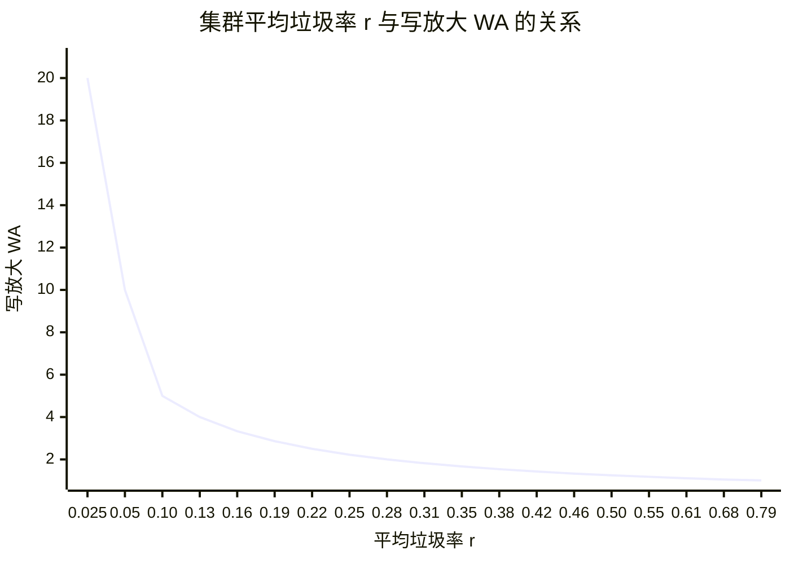

# 分布式追加写存储系统的写放大模型

## 1. 概述

在分布式追加写存储系统（如 RabbitStore）中，数据以追加方式写入 Chunk。当文件被删除或数据失效时，Chunk 中会积累垃圾数据。垃圾回收（GC）需要将 Chunk 中的有效数据迁移到新 Chunk，再回收旧 Chunk 的空间。这一过程产生的额外 I/O 称为**写放大**（Write Amplification, WA）。

写放大是影响集群性能与网络带宽消耗的关键因素。本文借鉴 SSD 写放大建模的方法论（Dayan et al., *Modelling and Managing SSD Write-amplification*, 2015），建立集群**平均垃圾率**与**写放大**之间的数学模型。

核心思路：SSD 的擦除块 GC 过程与分布式存储的 Chunk GC 过程在数学上高度同构，可以直接类比迁移。

## 2. SSD 与分布式存储的类比映射

| SSD 概念 | 分布式存储概念 | 说明 |
|---------|------------|------|
| 擦除块（Erase Block） | Chunk | GC 的基本单元 |
| 每块页数 $B$ | Chunk 容量 $C$（字节） | 每个 GC 单元包含的数据量 |
| SSD 块数 $K$ | 集群 Chunk 总数 $N$ | GC 单元总数 |
| SSD 物理容量 $PBA$ | 集群总容量 $P = N \cdot C$ | 所有 Chunk 大小的总和 |
| SSD 逻辑容量 $LBA$ | 集群有效数据量 $L$ | 所有 Chunk 有效数据大小的总和 |
| Over-Provisioning $OP = PBA - LBA$ | 垃圾数据总量 $P - L$ | 可通过 GC 回收的空间 |
| OP 比率 $1 - \frac{LBA}{PBA}$ | 平均垃圾率 $r = \frac{P - L}{P}$ | 垃圾占总容量的比例 |
| $\delta$（GC 时块中活跃页比例） | $\delta$（GC 时 Chunk 中有效数据比例） | 每次 GC 需要迁移的数据比例 |
| $WA = \frac{1}{1 - \delta}$ | $WA = \frac{1}{1 - \delta}$ | 写放大倍数 |

## 3. 系统模型

### 符号定义

| 符号 | 含义 |
|------|------|
| $C$ | 单个 Chunk 的容量（字节） |
| $N$ | 集群中 Chunk 的总数 |
| $P = N \cdot C$ | 集群总容量（所有 Chunk 大小的总和） |
| $L$ | 集群有效数据总量（所有 Chunk 有效数据大小的总和） |
| $r = \frac{P - L}{P}$ | 集群平均垃圾率 |
| $\delta$ | GC 回收一个 Chunk 时，其中有效数据占比（需迁移的比例） |
| $WA$ | 写放大倍数：实际物理写入量 / 应用逻辑写入量 |

### 基本假设

1. 所有 Chunk 大小相同，均为 $C$
2. 数据失效（删除/覆盖）在逻辑地址空间上**均匀随机**分布
3. 系统处于**稳态**（steady state）：写入速率与 GC 回收速率平衡
4. $L \gg C$，即集群有效数据量远大于单个 Chunk 容量

## 4. Chunk 生命周期模型

### 问题

一个 Chunk 刚写满后，所有 $C$ 字节数据均有效。随着时间推移，集群中不断有数据失效（文件删除、数据覆盖等）。经过 $X$ 次数据失效操作后，该 Chunk 中预期还剩多少有效数据 $G$？

### 推导

由于数据失效在逻辑地址空间上均匀分布，任意一次失效操作命中该 Chunk 中某字节的概率为 $\frac{C}{L}$（此处以 Chunk 容量粒度的逻辑单元计算）。

Chunk 中第 1 个数据单元被失效的期望等待次数为 $\frac{L}{C}$，此后剩余 $C - 1$ 个有效单元；第 2 个被失效的期望等待次数为 $\frac{L}{C - 1}$，依此类推。

从 $C$ 个有效单元衰减到 $G$ 个有效单元，经过的失效操作次数期望为：

$$X = \sum_{i=G+1}^{C} \frac{L}{i} = L \sum_{i=G+1}^{C} \frac{1}{i} = L \left( \sum_{i=1}^{C} \frac{1}{i} - \sum_{i=1}^{G} \frac{1}{i} \right)$$

利用调和级数的 Euler 近似 $\sum_{i=1}^{n} \frac{1}{i} \approx \ln(n) + \gamma$（$\gamma$ 为 Euler-Mascheroni 常数）：

$$X \approx L \cdot \ln\left(\frac{C}{G}\right) \tag{1}$$

反解 $G$：

$$\boxed{G = C \cdot e^{-X/L}} \tag{2}$$

**含义**：Chunk 中有效数据随失效操作次数呈**指数衰减**，衰减速率由集群有效数据量 $L$ 决定。

## 5. 稳态分析

### 问题

在稳态下，集群平均垃圾率 $r$ 与 GC 时 Chunk 有效数据比例 $\delta$ 之间是什么关系？

### 推导

在稳态条件下，考虑同一个 Chunk 两次被 GC 回收之间发生了什么：

- 假设 GC 策略为 greedy（优先回收垃圾最多的 Chunk）或 LRU（最久未回收的 Chunk），在稳态下，两次回收同一个 Chunk 之间，平均经过 $N$ 次 GC 操作（即集群中所有 Chunk 各被回收一次）。
- 每次 GC 操作回收一个 Chunk：迁移其中 $C \cdot \delta$ 的有效数据，释放 $C \cdot (1 - \delta)$ 的空间用于新写入。
- 因此，两次回收同一 Chunk 之间，集群共发生 $N \cdot C \cdot (1 - \delta)$ 次应用写入（即失效操作次数 $X$）。

将 $X = N \cdot C \cdot (1 - \delta)$ 代入公式 (1)，其中 GC 时有效数据 $G = C \cdot \delta$：

$$L \cdot \ln\left(\frac{C}{C \cdot \delta}\right) = N \cdot C \cdot (1 - \delta)$$

$$L \cdot \ln\left(\frac{1}{\delta}\right) = P \cdot (1 - \delta) \quad \text{（因为 } N \cdot C = P \text{）}$$

$$-L \cdot \ln(\delta) = P \cdot (1 - \delta)$$

整理得：

$$\boxed{\frac{L}{P} = \frac{\delta - 1}{\ln(\delta)}} \tag{3}$$

由于 $r = \frac{P - L}{P} = 1 - \frac{L}{P}$，等价地：

$$\boxed{1 - r = \frac{\delta - 1}{\ln(\delta)}} \tag{4}$$

## 6. 写放大公式

### WA 与 δ 的关系

每次 GC 操作回收一个 Chunk，迁移 $C \cdot \delta$ 字节有效数据，释放 $C \cdot (1 - \delta)$ 字节空间。这意味着：为了完成 $C \cdot (1 - \delta)$ 字节的净写入，实际发生了 $C$ 字节的物理写入（$C \cdot (1 - \delta)$ 来自应用 + $C \cdot \delta$ 来自 GC 迁移）。

$$\boxed{WA = \frac{1}{1 - \delta}} \tag{5}$$

### r、δ、WA 三者关系

综合公式 (4) 和 (5)：

$$1 - r = \frac{\delta - 1}{\ln(\delta)}, \quad WA = \frac{1}{1 - \delta}$$

将 $\delta = 1 - \frac{1}{WA}$ 代入公式 (4)：

$$1 - r = \frac{-\frac{1}{WA}}{\ln\left(1 - \frac{1}{WA}\right)}$$

即：

$$r = 1 + \frac{1}{WA \cdot \ln\left(1 - \frac{1}{WA}\right)} \tag{6}$$

公式 (6) 给出了 $r$ 关于 $WA$ 的显式表达，但反过来 $WA$ 关于 $r$ 的关系是**超越方程**，**无法用初等函数给出闭式解**。实际使用中，可通过**枚举 $\delta$** 同时计算 $r$ 和 $WA$，建立二者的数量关系。

## 7. 数值分析

### 计算方法

枚举 $\delta \in (0, 1)$，对每个 $\delta$ 值：
- $r = 1 - \frac{\delta - 1}{\ln(\delta)}$
- $WA = \frac{1}{1 - \delta}$

### 数值对照表

| $\delta$ | $r$（平均垃圾率） | $WA$（写放大） |
|:--------:|:--------------:|:------------:|
| 0.01 | 0.785 | 1.01 |
| 0.05 | 0.683 | 1.05 |
| 0.10 | 0.609 | 1.11 |
| 0.15 | 0.552 | 1.18 |
| 0.20 | 0.503 | 1.25 |
| 0.25 | 0.459 | 1.33 |
| 0.30 | 0.419 | 1.43 |
| 0.35 | 0.381 | 1.54 |
| 0.40 | 0.345 | 1.67 |
| 0.45 | 0.311 | 1.82 |
| 0.50 | 0.279 | 2.00 |
| 0.55 | 0.247 | 2.22 |
| 0.60 | 0.217 | 2.50 |
| 0.65 | 0.188 | 2.86 |
| 0.70 | 0.159 | 3.33 |
| 0.75 | 0.131 | 4.00 |
| 0.80 | 0.104 | 5.00 |
| 0.85 | 0.077 | 6.67 |
| 0.90 | 0.051 | 10.00 |
| 0.95 | 0.025 | 20.00 |
| 0.99 | 0.005 | 100.00 |

**典型值速查**：

| 平均垃圾率 $r$ | $\delta$ | 写放大 $WA$ |
|:------------:|:--------:|:----------:|
| 50% | 0.203 | 1.26 |
| 40% | 0.324 | 1.48 |
| 30% | 0.467 | 1.88 |
| 20% | 0.629 | 2.69 |
| 10% | 0.807 | 5.18 |

### 关系图

**关键观察**：

- 当 $r > 0.3$（垃圾超过 30%）时，$WA < 2$，GC 开销可控
- 当 $r < 0.2$（垃圾不足 20%）时，$WA$ 急剧上升，GC 成为性能瓶颈
- 当 $r < 0.1$（垃圾不足 10%）时，$WA > 5$，GC 代价极高
- 曲线呈现明显的**非线性**特征：垃圾率越低，写放大增长越快

## 8. 对 RabbitStore 的启示

### 8.1 垃圾率是集群性能的核心指标

模型表明，集群平均垃圾率 $r$ 直接决定 GC 写放大倍数。对于 RabbitStore：

- **监控**：应将平均垃圾率作为核心监控指标，设置告警阈值（建议 $r < 0.15$ 时告警）
- **容量规划**：在规划集群容量时，需要为 GC 预留足够的垃圾空间。如果希望 $WA \leq 2$，则集群平均垃圾率需保持在 $r \geq 0.28$ 以上

### 8.2 GC 策略优化

论文指出，Greedy 策略（优先回收垃圾最多的 Chunk）在大多数场景下优于 LRU 策略。对于 RabbitStore：

- 应优先回收有效数据比例最低的 Chunk，而非最久未回收的 Chunk
- 可以将 Chunk 按垃圾率分组（冷/热分离），对不同组分配不同的 GC 预算（类似论文中的 Wolf 方案）

### 8.3 冷热分离降低写放大

论文的核心贡献之一是证明：将不同更新频率的数据分离到不同的 Chunk 组中，可以显著降低整体写放大。对于 RabbitStore：

- 高频更新的数据（热数据）和低频更新的数据（冷数据）应尽量写入不同的 Chunk
- 热数据 Chunk 分配更多的"垃圾空间预算"，冷数据 Chunk 分配较少
- 整体写放大为各组写放大的加权和：$WA = \sum_{i=1}^{n} p_i \cdot WA(s_i, OP_i)$

### 8.4 实际限制

本模型基于**均匀随机失效**假设，实际系统中数据失效模式可能高度不均匀（例如批量删除、时间序列过期等）。非均匀场景下：

- 若删除集中在少数 Chunk，这些 Chunk 垃圾率高，GC 效率反而更好
- 若删除均匀分散，最接近本模型的假设，GC 压力最大
- 因此，本模型给出的是**最坏情况**的写放大估计

## 参考文献

- Niv Dayan, Luc Bouganim, Philippe Bonnet. *Modelling and Managing SSD Write-amplification*. arXiv:1504.00229, 2015.
